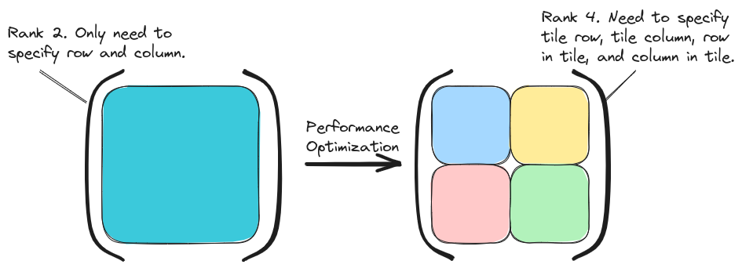

########################################################
Logical Versus Physical: Understanding the Tensor Layout
########################################################

Most tensor libraries conceptually support what we call physical and logical
layouts; however, they often do not distinguish among them. The point of this
page is to introduce the logical vs. physical concept, provide some examples,
and explain why the explicit distinction is important.

**********
Motivation
**********

Ideally, users of a tensor library should only have to specify the properties
of the tensor as they relate to the problem being modeled. Roughly speaking,
this amounts to the literal values of the tensor, the symmetry of the tensor,
and the sparsity of the tensor. The literal implementation may need additional
structure, for example tiling and distribution. This additional structure
effectively changes the properties of the tensor (vide infra), and moreover 
this additional structure may only appear on certain hardware.

In an effort to distinguish the problem-specific structure from the 
implementation-/hardware-specific structure we term the former the "logical"
structure and the latter the "physical" structure. Generally speaking, the
physical structure will describe how the tensor is actually structured, whereas
the logical structure describes how the user thinks the tensor is structured.

********
Examples
********

.. _fig_logical_v_physical:

   Illustration of how tiling a tensor effectively changes its rank.

The motivation for introducing the logical vs. physical distinction is tiling
of a tensor. :numref:`fig_logical_v_physical` illustrates this process for a
matrix. The left side of :numref:`fig_logical_v_physical` shows the logical view
of the matrix. This is how the end-user thinks of the tensor, *i.e.*, it's some
number of rows by some number of columns. When the user interacts with this
tensor they expect to give two indices, one for the row and one for the column.
All interactions of the end-user with the tensor should behave like the tensor
is a matrix.

The right side of :numref:`fig_logical_v_physical` shows how TensorWrapper
"physically" lays out a tiled matrix, namely a matrix of matrices. Row and
column offsets in the outer matrix are used to select a tile. Row and column
offsets in a tile are used to select an element. In turn, when interacting with
the physical tensor a user needs to provide four indices. Clearly the logical
and physical views are not compatible without knowing the mapping.

*******
Summary
*******

- Ideally users will interact with tensors in a manner dictated by the problem
  being modeled. This "logical" interaction will ideally be performance 
  portable.
- Ideally, TensorWrapper will automatically map the logical view to a
  "physical" performant representation.
- Generally speaking, the physical representation will not be the same as the
  logical representation.
- In practice, TensorWrapper is unlikely to automate the logical to physical
  mapping anytime soon so users will likely need to consider both the logical
  and physical representations.
- By distinguishing between logical and physical views and writing TensorWrapper
  infrastructure in terms of the physical views we can move towards ideality by
  having the logical views dispatch to the physical views.
