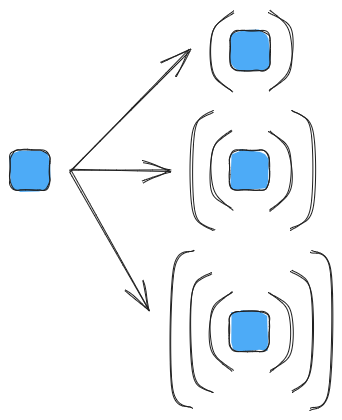

.. _nested_tensors:

############################
Understanding Nested Tensors
############################

Mathematically tensors can be very confusing objects because of the many
:ref:`term_isomorphism`\ s that exist among them. While mathematics may be fine
treating isomorphic structures as equivalent, most tensor libraries are not. By
introducing the computer-science concept of a nested tensor we are better able
to distinguish among mathematical ambiguities which arise because of the
isomorphic nature of the structures.

**********
Background
**********

.. |A| replace:: :math:`A`

.. _fig_rank0_v_rank123:

   Illustration of a scalar (the blue square), can equivalently be thought of
   as a vector, a matrix, and a rank 3 tensor.

Consider a tensor |A| with a single element in it. |A| is arguably best
represented as a scalar (rank 0 tensor); however, if we wanted to, we could
also represent |A| as a single element vector (rank 1 tensor), or a
single element matrix (rank 2 tensor), or a single element rank 3 tensor, etc.
This scenario is shown pictorially in :numref:`fig_rank0_v_rank123`.

Because these representations are related by an isomorphism, math says that all
of these representations of |A| behave similarly. For better or worse, most
tensor libraries are rather pedantic about representation, *e.g.*, if |A| is
declared as a vector, the user will need to provide one offset to access the
single element. Put another way, to avoid ambiguity tensor libraries require you
to explicitly declare the rank of the tensor, so that the tensor library knows
how many indices to expect.

Unfortunately, specifying the rank alone is not sufficient to remove all of the
ambiguity. Another point of ambiguity comes from
