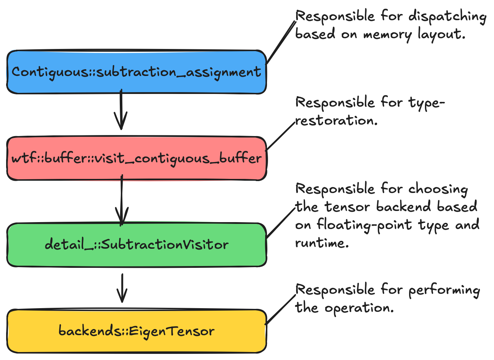

.. Copyright 2023 NWChemEx-Project
..
.. Licensed under the Apache License, Version 2.0 (the "License");
.. you may not use this file except in compliance with the License.
.. You may obtain a copy of the License at
..
.. http://www.apache.org/licenses/LICENSE-2.0
..
.. Unless required by applicable law or agreed to in writing, software
.. distributed under the License is distributed on an "AS IS" BASIS,
.. WITHOUT WARRANTIES OR CONDITIONS OF ANY KIND, either express or implied.
.. See the License for the specific language governing permissions and
.. limitations under the License.

###############################
Adding Operations to Contiguous
###############################

The ``Contiguous`` class is the workhorse of most tensor operations because it
provides the kernels that non-contiguous tensors are built on. As such, we may
need to add operations to it from time to time. This document describes how to
do that.

**********************************
Understanding How Contiguous Works
**********************************

   Control flow for an operation resulting in a ``Contiguous`` buffer object.

For concreteness, we'll trace how ``subtraction_assignment`` is implemented.
Other binary operations are implemented nearly identically and the
implementation of unary operations is extremely similar.

1. The input objects, ``lhs`` and ``rhs`` are converted to ``Contiguous``
   objects. N.b., we should eventually use performance models to decide whether
   the time to convert to ``Contiguous`` objects is worth it, or if we should
   rely on algorithms which do not require contiguous data.
2. We work out the shape of the output tensor.
3. A visitor for the desired operation is created. For
   ``subtraction_assignment``, this is ``detail_::SubtractionVisitor``.

   - Visitor definitions live in ``wtf/src/tensorwrapper/buffer/detail_/``.

5. Control enters ``wtf::buffer::visit_contiguous_buffer`` to restore floating-
   point types.
6. ``lhs`` and ``rhs`` are converted to ``std::span`` objects.
7. Control enters the visitor.
8. With types known, the output tensor can be initialized (and is).
9. The visitor converts the ``std::span`` objects into the tensor backend's
   tensor objects.

   - Backend implementations live in ``wtf/src/tensorwrapper/backends/``.

10. The backend's implementation of the operation is invoked.

**********************
Adding a New Operation
**********************

1. Verify that one of the backends supports the desired operation. If not, add
   it to a backend first.
2. Create a visitor for it.
3. Add the operation to ``wtf::buffer::Contiguous``.
