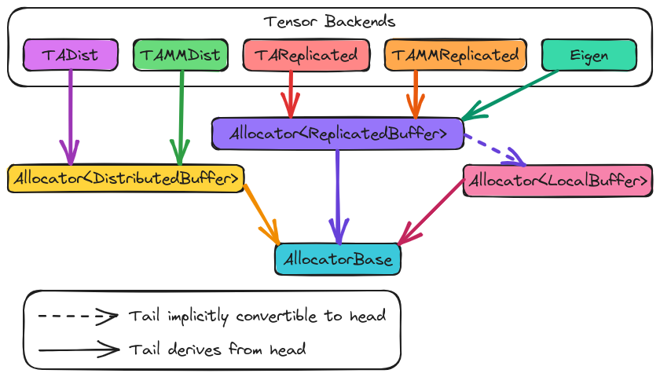

.. Copyright 2023 NWChemEx-Project
..
.. Licensed under the Apache License, Version 2.0 (the "License");
.. you may not use this file except in compliance with the License.
.. You may obtain a copy of the License at
..
.. http://www.apache.org/licenses/LICENSE-2.0
..
.. Unless required by applicable law or agreed to in writing, software
.. distributed under the License is distributed on an "AS IS" BASIS,
.. WITHOUT WARRANTIES OR CONDITIONS OF ANY KIND, either express or implied.
.. See the License for the specific language governing permissions and
.. limitations under the License.

.. _tw_designing_the_allocator:

#######################
Designing the Allocator
#######################

The point of this page is to capture the design process of the allocator
component of TensorWrapper.

*********************
What is an Allocator?
*********************

In C++, allocators are objects used by containers to secure uninitialized
storage for the elements of the container. Optionally, the allocator may also
initialize the storage. In TensorWrapper, an allocator is responsible for
securing a (possibly uninitialized) instance of the backend's tensor object.

**************************************
Why do We Need an Allocator Component?
**************************************

Using TensorWrapper, users will create objects for describing a tensor's shape,
symmetries, and sparsity. Those objects will then be converted into a layout.
Given the target layout, TensorWrapper will then create a tensor object from
one of the available backends. Since each of these libraries has their own
tensor class (or classes), with their own construction methods, the allocator
component is needed to hide the process of constructing the backend's buffer
objects.

************************
Allocator Considerations
************************

.. _a_backend_aware:

Backend aware
   The allocator's primary purposes are to provide a mechanism for selecting
   the tensor backend and to wrap the process of creating instances for that
   backend.

   - Eventually we would like to automate the backend selection process.
     Ideally, TensorWrapper would know which backend works best in which
     situations and would choose it for the user. This can be done by having a
     super allocator which delegates to the individual backend allocators.

.. _a_runtime_aware:

Runtime aware
   The ``Allocator`` is charged with literally allocating ``Buffer`` objects.
   In order to do this in a performant manner, the ``Allocator`` will need
   access to runtime information such as the number of processes and the
   amount of available memory.

   - Tracking the state of the runtime is the responsibility of ParallelZone.
   - Not all backends resource manage, TensorWrapper will have to do it for
     them.

.. _a_initialization:

Initialization
   Before any tensor operations can be performed some tensors will need to be
   filled in with values. Sometimes the tensor is simply an identity or zero
   tensor, but more often the initial value of an element depends on its
   indices. The ``Allocator`` must have a mechanism for filling in blocks of the
   ``Buffer`` with arbitrary values.

.. _a_propagation:

Propagation
   Tensors contain the ``Allocator`` used to create their ``Buffer``. Reuse of
   that ``Allocator`` will create additional ``Buffer`` objects which rely on
   the same backend. In turn, by grabbing the ``Allocator`` associated with a
   tensor, users can create additional ``Buffer`` objects which are guaranteed
   to be compatible with the tensor backend. This requires the ``Allocator`` to
   propagate through expressions.

   - Like other components, propagating the ``Allocator`` through the expression
     layer is natural.
   - When allocators are not mixed (all allocators make buffers of the same
     type). Propagation is straightforward (assume the same allocator).
   - When allocators are mixed, will need heuristics to determine which one to
     use for the product.

.. _a_rebind:

Rebind
   C++ allocators are associated with a specific type. If you want to use the
   allocator to allocate memory for a different type, you have to "rebind" the
   allocator (the mechanism for doing this changed in C++20, but boils down to
   using template meta-programming to work out the type of the other allocator).
   In TensorWrapper's use case, many of the various backends will be able to
   make different types of buffers (*e.g.*, distributed libraries will usually
   be able to minimally make ``DistributedBuffer`` and ``ReplicatedBuffer``
   objects). Being able to rebind TensorWrapper allocators thus allows us to
   create other buffer types which are still compatible with the backend.

.. _a_downcasting:

Downcasting
   Since allocators are tied to a particular type, given the allocator which
   made a buffer, the allocator should know what the actual (not type-erased)
   type of the buffer is.

   - The main use case here is for converting between backends by using the
     allocators to establish which backends the buffers contain.
   - Possible with visitor pattern?

****************
Allocator Design
****************

.. _fig_allocator:

   The major components of the allocator. Classes in the diagram are meant to
   be representative of the backends and will not be kept up to date as
   support is added.

:numref:`fig_allocator` shows the major components of the allocator component.
At the base of the hierarchy is ``AllocatorBase`` which is primarily meant to
serve as code factorization and a means of type-erasing the buffer type the
allocator actually produces. Deriving from ``AllocatorBase`` is ``Allocator``
which is templated on the buffer type it creates. The various tensor backends
then derive from as many ``Allocator`` specializations as they support. For
example, TiledArray (TA) supports both distributed and replicated buffers so
it would derive two allocators, one for making ``DistributedBuffer`` objects
and one for making ``ReplicatedBuffer`` objects.

*************
Proposed APIs
*************

For the most part we expect that the bulk of interactions with ``Allocator``
objects will be construction and allocation:

.. code-block:: c++

   // Most allocators will only require a RuntimeView for construction
   parallelzone::RuntimeView rv = get_runtime();
   Allocator<ReplicatedBuffer> alloc(rv);

   Layout l = get_tensor_layout();

   // Create an uninitialized buffer
   auto ui_buffer = alloc.allocate(l);

   // Create a buffer initialized with 0s
   auto zero_buffer = alloc.construct(l, 0);

   // Fill buffer in using a function. The function should take a Shape (which
   // describes where the buffer goes in the overall tensor) and a LocalBuffer
   // object. The body of the function should fill the LocalBuffer in, and then
   // return the LocalBuffer object. The buffer may be left empty if it's zero.
   auto fxn =  {
      return fill_buffer(s, buffer);
   };
   auto fxn_buffer = alloc.construct(l, fxn);

Here we note that names of the methods, ``allocate`` and ``construct`` are
taken from the analogously named methods comprising the C++ allocator concept.
The difference is that ``allocate`` only allocates, whereas ``construct``
allocates and initializes.

Allocators are used to create additional buffers which are compatible with the
associated backend. Consideration :ref:`a_rebind` raised the use case of
needing to make buffers with different properties, but still maintain backend
compatibility. For example, say we want to make a distributed TiledArray buffer
into a replicated TiledArray buffer:

.. code-block:: c++

   // Somehow get a TADist object
   TADist dist_alloc(get_runtime());

   // Get an allocator, compatible with TA, that can make ReplicatedBuffer
   // objects
   auto replicated_alloc = dist_alloc.rebind<ReplicatedBuffer>();

   // Use the allocators to convert a distributed buffer to a replicated buffer
   auto dist_buffer = dist_alloc.construct(get_layout(), get_values());

   // This would copy dist_buffer into rep_buffer
   auto rep_buffer = replicated_alloc.construct(dist_buffer);

   // This would reuse dist_buffer to the extent possible
   rep_buffer = replicated_alloc.construct(std::move(dist_buffer));

The motivation for relying on ``construct`` for conversions is that conceptually
we are just calling conversion constructors of the new buffer.

*******
Summary
*******

:ref:`a_backend_aware`
   This consideration is addressed by having the most derived classes in the
   hierarchy backend specific. All such classes will actually be passed around
   via base classes, which type-erases the backend choice.

:ref:`a_runtime_aware`
   The constructor for non-default ``AllocatorBase`` objects requires a
   ``RuntimeView`` object. This provides the allocator with access to the
   runtime environment.

:ref:`a_initialization`
   Allocators can allocate uninitialized buffers or they can allocate and
   initialize buffers. The latter can be done by setting all elements to
   a single value or by running a function on local buffers.

:ref:`a_propagation`
   Like other TensorWrapper components, ``Allocator`` objects will propagate
   through the expression layer.

:ref:`a_rebind`
   ``Allocator`` objects have a method ``rebind`` which allows users to get
   pointers to allocators for different buffer types.

:ref:`a_downcasting`
   Converting between buffers can be done by passing an existing buffer into
   the ``construct`` function.
