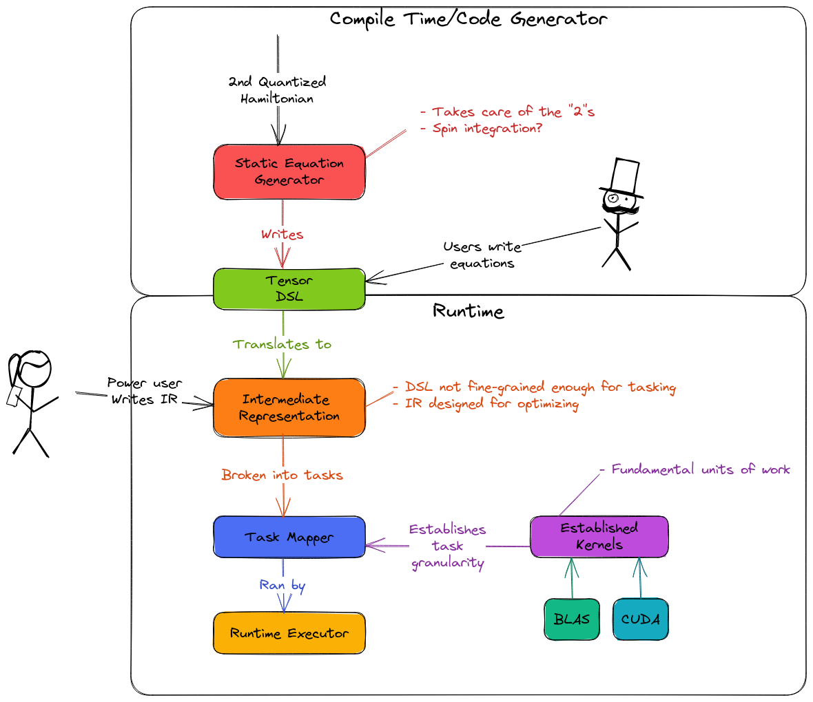

.. Copyright 2023 NWChemEx-Project
..
.. Licensed under the Apache License, Version 2.0 (the "License");
.. you may not use this file except in compliance with the License.
.. You may obtain a copy of the License at
..
.. http://www.apache.org/licenses/LICENSE-2.0
..
.. Unless required by applicable law or agreed to in writing, software
.. distributed under the License is distributed on an "AS IS" BASIS,
.. WITHOUT WARRANTIES OR CONDITIONS OF ANY KIND, either express or implied.
.. See the License for the specific language governing permissions and
.. limitations under the License.

#####################
Proposed Tensor Stack
#####################

TensorWrapper was motivated by the needs of electronic structure theory (EST).
EST involves a number of complicated equations expressed in terms of high-rank 
tensors. Thus a large part of EST boils down to preparing the initial tensor 
state and then consuming the resulting tensor equations. This view places a
large performance burden on the underlying tensor stack, which must be able to 
solve the equations subject to the considerations raised in 
Section :ref:`tw_considerations`. To this end we envision the full tensor stack 
as having several layers, which are shown in Fig. :numref:`fig_tensor_stack`.

.. _fig_tensor_stack:

   Proposed tensor stack. TensorWrapper is envisioned as living in the box
   labeled "Tensor DSL".

At the top of Fig. :numref:`fig_tensor_stack` is a box labeled "Compile Time/
Code Generator" which includes any mechanism for writing tensor
expressions. In EST, many tensor expressions are auto-generated given the
second-quantized forms of the equations. Other expressions are simple enough
that they are written out by hand. Other physics disciplines may have other
means of generating tensor equations, regardless of what those means are, they
fall in this top-box and we assume the output is the tensor DSL. While not a
strict requirement, given that the equations are relatively static, we assume
that many users will prefer to generate/write the equations once and store the
result as source code.

The tensor DSL, is the entry point into the bottom box labeled "Runtime". As
the title suggests, the contents of the bottom box are envisioned as executing
at runtime. This is because many of the optimizations which happen in the
bottom box need runtime information (*e.g.*, the size of the tensors, what
hardware is available, or sparsity information). TensorWrapper is envisioned as
providing the features which reside in the "Tensor DSL" box. The tensor
DSL will serve as the buffer between most end users and the underlying
optimizations. This means that the tensor DSL must be expressive enough that 
users can provide it with all of the parameters it needs so that the underlying
layers can execute the operations in an optimal manner.

The remaining boxes in the "Runtime" box will be implemented by libraries other
than TensorWrapper. To our knowledge no libraries exist for any of the
remaining boxes (aside for established kernels). Historically this has been 
because developers have tried to go directly from the tensor DSL to kernels 
(with optimizations occurring in the tensor DSL). In our experience the problem
with this approach is that there are a large number of optimizations which
need to occur between how the user writes the expressions and how they are
actually executed.

The first layer under the tensor DSL is the intermediate representation (IR)
layer. The tensor DSL is meant to be user-friendly, which admittedly comes at
the cost of being developer friendly. The IR is envisioned as being a
developer friendly, portable representation of what the user wants the
tensor to do. The IR is assumed to be a directed graph where the edges are 
tensors and the nodes are operations. The IR should be easy to optimize, 
reorder, etc.

Once the IR has been optimized, it needs to be converted to actual tasks. This
is the job of the "task mapper" layer. Based on a pool of established kernels,
the task mapper layer maps the IR to kernels. The kernels (along with the 
inputs to the kernels) result in a series of tasks which are then run by the
last layer, the "runtime executor" layer.

