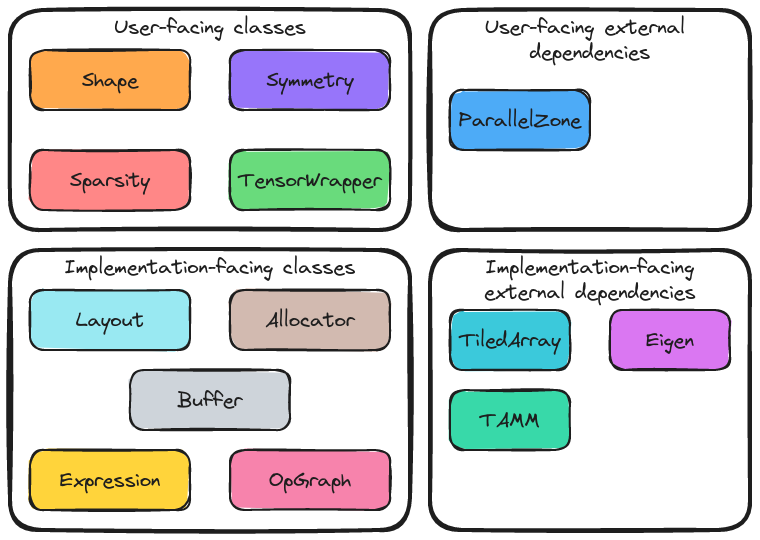

.. _tensor_wrapper_overview:

#########################
Overview of TensorWrapper
#########################

This section provides a high-level overview of TensorWrapper's architecture.

**********************
What is TensorWrapper?
**********************

There are a number of existing tensor libraries, with a variety of useful
features; however, to our knowledge no existing tensor library has all the
tensor features a high-performance physics code may encounter. TensorWrapper is
designed to provide a high-level, user-friendly, :ref:`term_dsl` on top of
existing tensor libraries, while abstracting away as much complexity as
possible.

*****************************
Why do we need TensorWrapper?
*****************************

Tensors are the "DSL of physics" because nearly every law of physics is
succinctly summarized by a tensor equation. That said, naively creating arrays
of floating-point values and then subjecting them to the mathematical operations
implied by the equations often leaves much performance on the table.
Nonetheless we argue that having a tensor-based DSL is important for
physics-based codes because:

- Facilitates translating theory to code.
- Encapsulates mathematical optimizations.
- Code is easier to read/rationalize about.

Most existing tensor libraries are capable of achieving high-performance, but
in many cases can only do so in certain cases or by "breaking API". The need to
break API complicates the use of those libraries and places much onus on the
programmer. The goal of TensorWrapper is to provide a middle layer between
existing tensor libraries and the user. By adding a middle layer we can better
decouple the interface from the details.

.. _atw_architecture_considerations:

***************************
Architecture Considerations
***************************

TensorWrapper's overall architecture is motivated by the workflow we expect
our users to adopt and the workflow we expect TensorWrapper to actually follow
in order to performantly meet our user's needs.

At the highest level, end users of TensorWrapper want to do four things. In
order:

.. _atw_set_tensor_properties:

Set tensor properties
   Before we even fill in a tensor we need to specify the properties of the
   tensor, *i.e.*, its :ref:`term_shape`, permutational symmetries it may have,
   and its sparsity pattern.

   - In this step we are really looking to specify "intrinsic" properties of
     the tensor. These properties define how the user is thinking of the tensor.
   - Performance considerations will modify how the requested tensor is actually
     implemented and are discussed below (see
     :ref:`atw_performance_considerations`).
   - Sparsity is also sometimes enforced after the fact by "knocking out zeros".
     Such a process can be thought of starting the four steps over after we
     have created the tensor.
   - For performance reasons, the tensor will need to know about the runtime
     it will live in.
   - Much of this information is optional, but not supplying it will have
     performance implications.

.. _atw_create_a_tensor:

Create a tensor
    Once we have specified the properties of the tensor. We can allocate and
    fill in the elements of the tensor.

    - Elements of a tensor usually result from an operation which takes the
      element's indices as input.
    - There are a number of notable "special" tensors like the zero and identity
      tensors which users will sometimes need to create too.

.. _atw_compose_with_tensors:

Compose with tensors
   With a series of initialized tensors the user then expresses tensor
   operations.

   - Standard mathematical operations: add, subtract, and contract
   - Element-wise operations, *e.g.*, square each element.
   - Slicing
   - Permuting

Compute results
   After expressing the operations they want to do. The user expects to be
   able to have the operations evaluated.

.. _atw_performance_considerations:

Performance Considerations
==========================

While the end-user considerations afford a nice user workflow, the reality is
more needs to go into the tensor workflow to accomplish what the user wants in
a performant manner. These "performance" steps should be interlaced between
the "user" steps introduced in the previous section. Ideally, with automation,
the "performance" steps can be merged into the "user" steps surrounding it.
In the initial implementation of TensorWrapper, the intermediate steps must
also be done by the user.

.. _atw_runtime_aware_properties:

Runtime aware properties
   The shape, symmetries, and sparsity of the tensor provided by the user will
   ultimately be "logical" and should reflect the problem being modeled.
   Under the hood, the actual properties of the tensor may vary widely depending
   on the runtime conditions.

   - The actual properties depend on the runtime conditions, whereas the
     logical properties only depend on the problem.
   - Actual shapes usually involve some sort of tiling.
   - Will need to figure out how to distribute tiles (if they exist)
   - Sparsity objects will need to be updated to account for the actual shape.

.. _atw_runtime_aware_allocation:

Runtime aware allocation
   Where we put the tensor (*e.g.*, CPU vs. GPU and RAM vs. disk vs. generated
   on-the-fly) can depend on the runtime status. Similarly the back end we
   choose (particular whether it is distributed or replicated) depends on the
   runtime as well as the extents of the tensor.

.. _atw_runtime_expression_optimization:

Runtime expression optimization
   Certain optimizations of an equation (like collecting common terms) can in
   theory be done statically by analyzing the equations and trying to minimize
   the overall computational complexity. Other optimizations are tied to
   runtime conditions and thus can only be done in the context of the current
   runtime (or with a preconceived notion of what the runtime will look like).

   - Order of contraction, depends on the :ref:`term_extent` of each mode.
     Extents aren't known until runtime.
   - Factoring out on-the-fly tensors requires knowing they will actually be
     generated on-the-fly.

Out of Scope Considerations
===========================

Static expression optimization
   :ref:`atw_runtime_expression_optimization` brought up the fact that some
   expression optimizations can happen simply given the equations. Such
   optimizations can be decoupled from TensorWrapper by using code generators
   to write expressions using TensorWrapper's DSL.

Domain-specific optimization
   In electronic structure theory (one of the motivators of TensorWrapper) it
   is possible to simplify equations based on the electron's spin or the
   spatial symmetry of the molecular system. Historically, it has been common
   to build these optimizations into the math layer, but this in turn makes the
   math layer less reusable. Furthermore, things like spin symmetry and spatial
   symmetry often simply result in tensor sparsity. Point being, many of these
   optimizations can be mapped to more general tensor considerations.

*******************
Architecture Design
*******************

.. _fig_tw_workflows:

.. figure:: assets/workflows.png
   :align: center

   Left. The ideal user-based workflow for using TensorWrapper. Right. The
   user-based workflow with performance-inspired steps interjected.

Section :ref:`atw_architecture_considerations` presented two workflows: a
user-based and a performance-based workflow. :numref:`fig_tw_workflows`
illustrates these workflows using the major pieces of TensorWrapper. As
mentioned in the previous section, the end goal is to have the
performance-focused workflow be an implementation detail. For example, the
:ref:`atw_runtime_aware_properties` and :ref:`atw_runtime_aware_allocation`
steps could occur within the constructor of the ``TensorWrapper`` class.
Similarly, the :ref:`atw_runtime_expression_optimization` step could be
triggered when a ``TensorWrapper`` object is initialized by an ``Expression``
object.

.. _fig_tw_architecture:

   The architecture of TensorWrapper.

:numref:`fig_tw_architecture` shows the major components of TensorWrapper. The
components are organized into four categories, based on whether they are part
of TensorWrapper or a dependency and whether they are user-facing or
implementation-facing.

User-Facing Classes
===================

As motivated by :numref:`fig_tw_workflows`, users of TensorWrapper primarily
interact with four components:

Shape
-----

Main discussion: :ref:`shape_design`.

Tensors are thought of as hyper-rectangular arrays of elements. The ``Shape``
component is responsible for describing this array of values. In particular
the ``Shape`` component is responsible for representing:

- rank of the tensor
- extent of the tensor
- nesting structure of the hyper-rectangular arrays
- converting indices from one shape to indices in another shape

Symmetry
--------

Main discussion: :ref:`tw_designing_the_symmetry_component`.

In practice many of the tensors commonly encountered have some sort of
permutational symmetry. While such symmetry could be discovered by inspecting
the tensor, it is more common to have the user specify it. The ``Symmetry``
component is charged with storing the symmetry relationships and providing
helpful tools for exploiting it. In particular the ``Symmetry`` component is
responsible for:

- Symmetry and antisymmetry (real elements)
- Hermitian and anti-Hermitian (complex elements)

Sparsity
--------

Main discussion: :ref:`sparsity_design`.

While symmetry deals with telling us which elements must be the same (up to a
sign), sparsity deals with telling us which elements are zero. The ``Sparsity``
component is responsible for dealing with:

- tracking element-wise sparsity
- switching among sparsity representations

TensorWrapper
-------------

Main discussion: :ref:`designing_tensor_wrapper_class`.

The ``TensorWrapper`` class is the tensor-like object that users interact with.
The DSL uses ``TensorWrapper`` objects as the leaf nodes of the
abstract syntax tree. To users, the main responsibilities of the
``TensorWrapper`` component are:

- storing the data
- providing an entry point into the DSL.

User-Facing External Dependencies
=================================

TensorWrapper additionally needs a description of the runtime. For this
purpose we have elected to build upon
`ParallelZone <https://github.com/NWChemEx-Project/ParallelZone>__`.

Implementation-Facing Classes
=============================

As shown in :numref:`fig_tw_workflows`, the
:ref:`atw_performance_considerations` lead ``TensorWrapper`` to have several
additional components. These components are required to convey additional
state necessary for performance.

Layout
------

Main discussion: :ref:`layout_design`.

The ``Shape`` provided by the user is the shape of the tensor's values based on
the problem. The ``Symmetry`` object tells us which of those values are
independent. And the ``Sparsity`` object tells us which values are zero.
Missing still is where in the runtime we should literally put the values, and
how we should store those values. The ``Layout`` component is charged with
modeling the mapping of the user-provided tensor state to the physical machine.
This includes:

- Vectorization strategy (row-major vs. column-major)
- Value location: RAM, disk, on-the-fly, GPU
- Actual shape of the tensor (including tiling)
- Distribution for multi-process tensors.

Allocator
---------

Main discussion: :ref:`designing_the_allocator`.

With the ``Layout`` object we know how to physically lay the tensor out in the
runtime, but we need to actually do it. The ``Allocator`` component wraps the
process of going from the ``Layout`` to an object of the backend library.

- Wrap the process of creating an instance of the backend.
-

Buffer
------

Main discussion: :ref:`designing_the_buffer`.

To the extent possible ``TensorWrapper`` strives to avoid needing to reimplement
tensor math routines. Key to these efforts are the already existing tensor
libraries. The ``Buffer`` component is responsible for providing a unified
interface into which the various backends can be attached. The main goals of
the buffer are:

- Type-erase the backend.
- Model data locality

Expression
----------

Main discussion: :ref:`designing_the_expression_component`.

Like most tensor libraries, TensorWrapper will rely on an expression layer for
composing tensor expressions. Strictly, speaking this layer is entered into
in a user-facing manner; however, the expression layer is specifically designed
to appear to the user like they are working with only ``TensorWrapper`` objects,
which is why we consider it an implementation detail.

OpGraph
-------

Main discussion: :ref:`designing_the_opgraph`.

Implementation-Facing External Dependencies
===========================================

TensorWrapper is designed to wrap existing high-performance tensor libraries
into a common DSL and to exploit the advantages of each of these libraries in
an interoperable manner. The interfaces to these various backends live in this
component.
