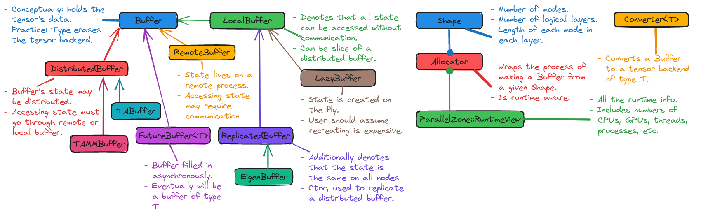

.. Copyright 2023 NWChemEx-Project
..
.. Licensed under the Apache License, Version 2.0 (the "License");
.. you may not use this file except in compliance with the License.
.. You may obtain a copy of the License at
..
.. http://www.apache.org/licenses/LICENSE-2.0
..
.. Unless required by applicable law or agreed to in writing, software
.. distributed under the License is distributed on an "AS IS" BASIS,
.. WITHOUT WARRANTIES OR CONDITIONS OF ANY KIND, either express or implied.
.. See the License for the specific language governing permissions and
.. limitations under the License.

.. _tw_designing_the_buffer:

####################
Designing the Buffer
####################

The point of this page is to record the design process of TensorWrapper's
buffer component.

*******************
What is the Buffer?
*******************

To vastly over simplify, tensors consist of two things: the literal elements of
the tensor and all the additional properties and mathematical structure imposed
on top of those elements. The ``Buffer`` class is responsible for holding the
literal elements of the tensor and being able to describe physically how those
elements are held.

************************
Why do we need a Buffer?
************************

TensorWrapper is ultimately powered by other tensor libraries. The boundary
between those libraries and TensorWrapper is the ``Buffer`` class. The
``Buffer`` class is the interface through which the user's intentions (specified
with the TensorWrapper :ref:`term_dsl`) are conveyed to the backend.

******************
Buffer Terminology
******************

distributed
   A buffer is distributed if it has both local and remote pieces. By contrast
   remote buffers only contain remote data (no local data).

future (to a buffer)
   A future to a buffer is an object which will eventually be a buffer, but at
   the time of creation may not actually have its data yet. Futures to buffers
   typically arise when a task scheduler is creating buffers and we do not want
   to wait for the scheduler to create the buffer. In this case a backgrounded
   task for creating the buffer is added to the scheduler and control
   continues with only a future to the result. Once the backgrounded task
   has completed creating the buffer, the buffer can be accessed directly
   from the future to the buffer. If control requests the buffer before it has
   been created, then control must wait until the buffer is ready before
   continuing.

on demand
   An "on demand" buffer does not store the values which live in it, but
   instead creates them when requested. This differs from a future in that the
   values of an on-demand tensor are "immediately available" (not accounting for
   the delay required to compute them).

local
   A buffer is "local" if the current process can access the state of the
   buffer without communicating with another process. A local buffer is the
   opposite of a remote buffer

remote
   A buffer is "remote" if none of the state can be accessed without
   communicating with another process. A remote buffer has no local piece (if it
   has a local piece it is a distributed buffer).

*********************
Buffer Considerations
*********************

.. _b_wrapping_other_tensor_libraries:

Wrapping other tensor libraries.
   In practice the literal data layouts of a tensor can be very complicated.
   Many existing tensor libraries have already optimized tensor operations on
   their data structures for some particular scenarios. We do not want to
   reinvent those optimizations and suggest ``Buffer`` should actually wrap
   those libraries' data structures.

   - We note that creating those structures is the responsibility of the
     ``Allocator`` component (see :ref:`tw_designing_the_allocator`).

.. _b_type_erasure:

Type erasure
   As consideration :ref:`b_wrapping_other_tensor_libraries` states, the
   ``Buffer`` objects do not just hold ``double*``, but rather tensor-like
   objects from existing tensor libraries. To allow the various tensor libraries
   to be somewhat interoperable we propose that the ``Buffer`` objects type-
   erase the backend they hold.

   - We will need to be able to unwrap the type-erased object too.
   - The set of methods exposed by the ``Buffer`` class needs to be very
     general so as to have analogs in every possible backend.

.. _b_data_location:

Data location
   How a user interacts with a ``Buffer`` depends on where the data lives.
   Data that can only be seen by the current process is usually treated
   differently than data which all processes can see.

   - Need to know if data is distributed, local, or replicated.
   - For distributed data, need to be able to replicate, get handles to remote
     data, and access local data.

.. _b_on_demand_data:

On demand data
   Particularly for high-rank tensors, we often do not store data explicitly.
   The ``Buffer`` must be able to work seamlessly when data is computed
   on demand.

   - In practice, tensors which are computed on demand still usually store some
     state.

.. _b_asynchronous_support:

Asynchronous support
   We want the creation of a distributed tensor to be asynchronous. For this
   to work, we need the ability to have proxy ``Buffer`` objects. Such objects
   will eventually be filled in, but in the meantime control can continue to
   use them to build up an operation queue. Attempting to access such a
   ``Buffer`` results in waiting until the ``Buffer`` has been filled in.

.. _b_basic_operations:

Basic operations
   Collectively, the various tensor backends expose many possible operations.
   The operations exposed by the ``Buffer`` classes should be very basic
   operations which should be present in each backend.

   - ``Buffer`` objects should contain their layouts, users should be able to
     inspect those layouts.
   - The ``Buffer`` should have access to the runtime it belongs to.
   - Slices and chips for moving data around.
   - Actually executing an ``OpGraph`` accounts for any additional operations
     the backend needs to run.

Out of Scope
============

Tensor math
   While mathematical operations on tensors are arguably fundamental, the
   reality is each backend is going to approach those operations in a different
   manner. Attempting to unify these operations would be difficult. In our
   opinion a better solution is to queue up a set of operations to be done and
   then tell the backend to do them.

   - Evaluating a set of operations is in scope and is covered by
     :ref:`b_basic_operations`

Backend Allocation
   Literally making an object of the backend is a fundamental tensor operation;
   however, like "Tensor math" above, the creation of a backend object is
   going to be heavily dependent on the identity of the backend.

   - The responsibility for allocating ``Buffer`` objects is punted to the
     ``Allocator`` component. See :ref:`tw_designing_the_allocator` for
     more details.

*************
Buffer Design
*************

.. _fig_buffer:

   Design of the buffer component of TensorWrapper.

:numref:`fig_buffer` shows the major components of TensorWrapper's buffer
component. In addressing the :ref:`b_wrapping_other_tensor_libraries`
consideration we made the decision to have each tensor library derive one or
more buffer types. The backend-specific classes are responsible for implementing
the interfaces of the classes they derive from. Additionally, the backend-
specific classes will allow users to retrieve the native data structure if need
be. The classes that the backend-specific classes derive from do not contain
reference to the various backends, in particular TensorWrapper will pass most
buffer objects around by pointers to the ``Buffer`` base class, thus
satisfying the :ref:`b_type_erasure` consideration.

For writing generic algorithms we usually need more information. Deriving from
``Buffer`` we have several classes including: ``LocalBuffer``,
``OnDemandBuffer``, ``ReplicatedBuffer``, ``FutureBuffer``, and
``DistributedBuffer``. Together these classes address :ref:`b_data_location`,
:ref:`b_on_demand_data`, and :ref:`b_asynchronous_support`.

*************
Proposed APIs
*************

Creating a Buffer
=================

Creating a ``Buffer`` is done through an allocator. For now we treat allocators
as largely opaque objects (design details for the allocator component can be
found in the :ref:`tw_designing_the_allocator` section). Using an allocator,
the typical process for creating a buffer looks like:

.. code-block:: c++

   auto alloc = get_allocator(); //N.B. allocators know about the runtime
   Layout l   = get_layout(); // Figure out the tensor's shape, symmetry, etc.

   // This constructs a 0-initialized buffer. Other constructions are possible
   auto pbuffer = alloc.construct(l, 0);

Since buffers are polymorphic objects, allocators return smart pointers to base
classes of the actual object (the exact base class returned depends on the
allocator).

Retrieving the Wrapped Tensor
=============================

Until TensorWrapper is fleshed out we anticipate that users will need to
unwrap the buffer somewhat regularly. We propose that this is done by:

.. code-block:: c++

   // Get a pointer to a buffer object we want to unwrap
   auto pbuffer = make_buffer();

   // Declare the allocator for the appropriate backend, here we use the TADist
   // allocator
   TADist alloc(pbuffer->runtime());

   // This call will create a DistributedBuffer with TA as the backend by
   // copying *pbuffer. Moving *pbuffer would (potentially) avoid the copy
   auto converted = alloc.construct(*pbuffer);

Generally speaking, conversions work best if the layout of the input buffer is
also supported by the output buffer. If the layouts are not compatible it is
left up to the allocator how to deal with this.

Working with Distributed Buffers
================================

``DistributedBuffer`` extends the ``Buffer`` class to the scenario when the
underlying ``Buffer`` object has data potentially distributed across multiple
processes.

.. code-block:: c++

   auto dist_buffer = get_buffer();

   // Gets a handle to the part of the distributed buffer which is local to
   // the current process
   LocalBuffer my_buffer = dist_buffer.local_buffer();

   // Gets a handle to a part of the distributed buffer whose state is not
   // local to the current process. N.B. this does NOT make the data local
   // yet. We do assume that every process knows how to do this with no
   // communication though (chips work too)
   auto shape_of_slice = get_shape_of_the_slice();
   RemoteBuffer a_buffer = dist_buffer.slice(shape_of_slice);

   // Actually pulls the data
   auto now_its_local = a_buffer.local_buffer();

   // To make the distributed buffer replicated
   auto rep_alloc = dist_buffer.allocator().rebind<ReplicatedBuffer>();
   auto preplicated = rep_alloc.construct(std::move(dist_buffer));

We note that ``DistributedBuffer`` objects will have ``Nested`` shapes. The
outer layer of the shape will describe the block boundaries so that users can
avoid choosing slices/chips that cross said boundaries.

Other Buffer Methods
====================

Once you have a ``Buffer`` basic operations include:

.. code-block:: c++

   auto buffer = get_buffer();

   // Get the shape, symmetry, or sparsity of the buffer
   auto shape    = buffer.shape();
   auto symmetry = buffer.symmetry();
   auto sparsity = buffer.sparsity();

   // Request slices and chips
   auto a_slice = buffer.slice(shape);
   auto a_chip  = buffer.chip(shape);

The expression layer (see :ref:`designing_the_expression_component`) results in
a :ref:`term_cst`. TensorWrapper will convert the CST into an :ref:`term_ast`,
which is then passed to the backend via:

.. code-block:: c++

   // Somehow get the buffer the result will be assigned to
   auto buffer = get_buffer();

   // Get the AST, which is an OpGraph object
   auto graph = get_op_graph();

   // Use the AST to update the buffer's state accordingly
   buffer.compute(graph);

*******
Summary
*******

:ref:`b_wrapping_other_tensor_libraries`
   For each tensor backend we define one or more buffers. Each buffer derives
   from the TensorWrapper buffer type which best summarizes the storage
   strategy of the backend.

:ref:`b_type_erasure`
   The ``Buffer`` class is a common base class for all components of the
   ``Buffer`` component. Passing objects via the ``Buffer`` base class
   type-erases the backend.

:ref:`b_data_location`
   In the design of the buffer component, we derive several classes
   including: ``LocalBuffer``, ``OnDemandBuffer``, and ``DistributedBuffer``,
   which represent the storage strategy of the backend. Additional classes can
   be added as needed to, for example, distinguish between buffers living in
   RAM versus on the GPU.

:ref:`b_on_demand_data`
   The ``OnDemandBuffer`` class has been introduced to cover this consideration.

:ref:`b_asynchronous_support`
   The ``FutureBuffer`` class template has been introduced to cover this
   consideration.

:ref:`b_basic_operations`
   The example APIs given demonstrate how basic operations may be performed.
