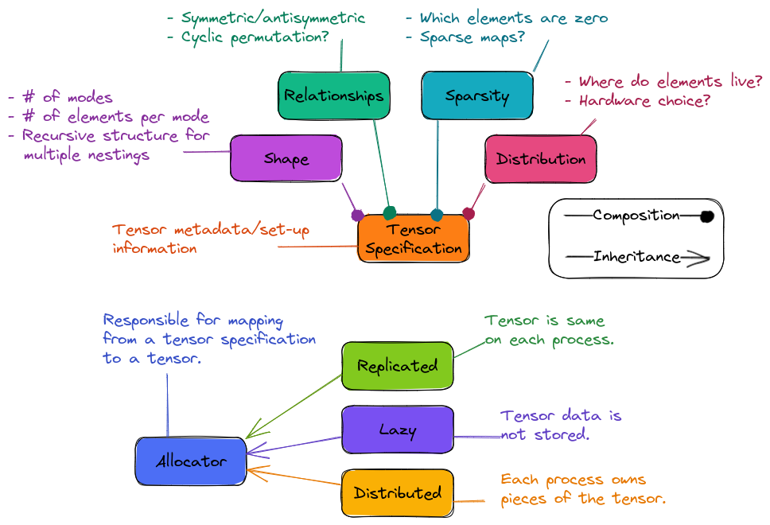

.. Copyright 2023 NWChemEx-Project
..
.. Licensed under the Apache License, Version 2.0 (the "License");
.. you may not use this file except in compliance with the License.
.. You may obtain a copy of the License at
..
.. http://www.apache.org/licenses/LICENSE-2.0
..
.. Unless required by applicable law or agreed to in writing, software
.. distributed under the License is distributed on an "AS IS" BASIS,
.. WITHOUT WARRANTIES OR CONDITIONS OF ANY KIND, either express or implied.
.. See the License for the specific language governing permissions and
.. limitations under the License.

.. _creating_a_tensor:

#################
Creating a Tensor
#################

The entry point into TensorWrapper is creating a tensor. We break tensor
creation into two pieces:

#. Specifying the details of the tensor.
#. Filling in the literal tensor object.

*************************
Specifying Tensor Details
*************************

The relevant pieces for specifying the details of the tensor are summarized
in Fig. :numref:`fig_tensor_creation`.

.. _fig_tensor_creation:

   Pieces needed to create a tensor.

Before a tensor can be created, the user must specify the tensor's properties.
The most fundamental of these properties is the shape. The shape
includes:

#. The number of modes.
#. The extent of each mode.
#. The tiling of the modes.
#. The substructure of the elements.

For more details on the shape see :ref:`shape_design`.

Strictly speaking, the shape is the only required information for making a
tensor. All other information is for performance reasons only. Arguably the
next most fundamental properties of the tensor are what we call "relationships".
Relationships include mathematical symmetries of the tensor such as whether or
not two modes are symmetric/antisymmetric with respect to index permutations.
Generally speaking, properly accounting for symmetry can reduce memory
consumption and the number of floating-point operations needed. For more
details on designing the relationships component see
:ref:`relationships_design`.

In physics many tensors exhibit sparsity, that is elements which are, or
approximately are, zero. Implicitly storing the zero elements greatly reduces
the memory overhead. Similarly using the facts that: a zero block plus a
non-zero block is the no-zero block, and a zero block times a non-zero block is
a zero block can greatly speed-up evaluation of tensor expressions. Specifying
the zero/non-zero elements is the responsibility of the sparsity component,
which is described in more detail in :ref:`sparsity_design`.

The last component of the tensor's layout is the physical location of the
elements. This falls to the distribution component.

*******************
Tensor construction
*******************

In general users will specify this state in the order: shape, relationships,
sparsity, and finally distribution. This is because one needs shape
information to specify relationships (specifically how many modes there are),
shape and relationship info to specify sparsity (how many total, unique,
elements are there), and shape, relationships, and sparsity to specify the
distribution (how many unique, non-zero, elements do we need to distribute).
