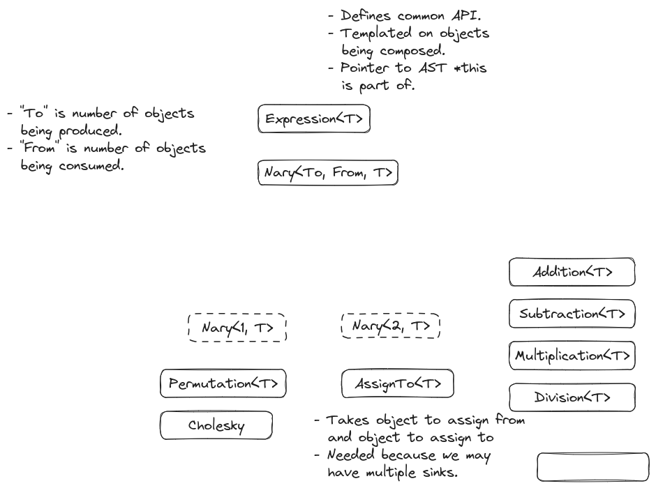

.. Copyright 2023 NWChemEx-Project
..
.. Licensed under the Apache License, Version 2.0 (the "License");
.. you may not use this file except in compliance with the License.
.. You may obtain a copy of the License at
..
.. http://www.apache.org/licenses/LICENSE-2.0
..
.. Unless required by applicable law or agreed to in writing, software
.. distributed under the License is distributed on an "AS IS" BASIS,
.. WITHOUT WARRANTIES OR CONDITIONS OF ANY KIND, either express or implied.
.. See the License for the specific language governing permissions and
.. limitations under the License.

.. _designing_the_expression_component:

##################################
Designing the Expression Component
##################################

This page documents the process of designing the expression component of
TensorWrapper.

*********************************
What is the expression component?
*********************************

Users of a tensor library have two main needs: to create tensors and to solve
tensor expressions involving those tensors. The expression component contains
the pieces of the :ref:`term_dsl` required to write succinct tensor expressions.

***************************************
Why do we need an expression component?
***************************************

Most libraries tend to be eagerly evaluated, meaning code is evaluated as it is
encountered. For simple, easily optimized code such a strategy is fine.
Unfortunately, tensor expressions tend to be significantly harder to optimize,
plus the optimal evaluation tends to be highly runtime dependent. A potential
solution to this problem is to evaluate the code lazily, instead of eagerly.
Lazily evaluated code is "recorded" until it is needed. Once it is needed it
is played back.

Most tensor operations are steps in a bigger algorithm. By lazily
evaluating tensor computations we can register the user's intention and
optimize our evaluation strategy accordingly. The point of the expression layer
is to provide a user-friendly DSL for lazy evaluation of tensors.

.. _ec_considerations:

***********************************
Expression Component Considerations
***********************************

.. _ec_compose_multiple_objects:

compose multiple objects
   While our goal is to ultimately be able to compose ``TensorWrapper`` objects,
   we can decompose the work needed to do so by ensuring we can compose the
   pieces of the ``TensorWrapper`` object. In particular we want to be able to
   compose objects from the shape, symmetry, sparsity, and allocator components.

.. _ec_generalized_einstein_notation:

generalized Einstein notation
   Many of the most common tensor operations are succinctly specified using
   generalized Einstein notation (indices appearing on the right side of
   an equation, but not the left are summed over).

   - There are some gotchas (see :ref:`einstein_summation_convention`).
   - Math operations include: addition, subtraction, scaling, multiplication,
     and division. The latter is missing from a number of existing tensor
     libraries.
   - Note that multiplication actually covers a number of operations including:
     element-wise product, matrix multiplication, contraction, trace, and direct
     product.
   - Could actually enable an alternative syntax with explicit summations.

.. _ec_non_einstein_math:

non-Einstein math
   There are a number of tensor operations which are not easily expressed using
   generalized Einstein notation, but are still important for tensor algebra.
   In particular:

   - Eigen system and linear equation solvers.
   - Factorizations/decompositions: Cholesky, QR, SVD.
   - Slicing/chipping
   - Matrix powers

.. _ec_template_meta_programming_cost:

template meta-programming cost
   In C++ lazy evaluation is typically implemented by using the template meta-
   programming technique known as expression templates. Ultimately expression
   templates map different expressions to different types. The type of an
   expression is usually a heavily nested instantiation of a template class,
   which can lead to significant compiler overhead (as well as nearly
   undecipherable compiler errors, though C++20 concepts helps a lot in this
   regard).

.. _ec_reusable_intermediates:

reusable intermediates
   In most tensor libraries the expression layer goes from a series of sources
   to a single sink. Along the way a series of temporary, unnamed intermediates
   is created. If any of these intermediates is common to more than one
   expression we want to make sure those intermediates are only formed once.

   - *N.b.* while an expression like ``A("i,j,k") + B("i,j,k")`` is clearly an
     intermediate, so is ``A("i,j,k")``. This is because ``A("i,j,k")``
     corresponds to tensor access of the "i,j,k"-th element and may be
     non-trivial (also note that behind the scenes, for performance,
     TensorWrapper may map the element access to "slice access followed by
     element access").

.. _ec_sparse_maps:

sparse maps
   The sparsity component :ref:`sparsity_design` realized that sparse maps are
   a mechanism for creating sparsity objects and thus should live above the
   sparsity component. Sparse maps are most naturally expressed as
   relationships among dummy indices, that is given an expression like
   ``C("i,j") = A("i,j,a,b") * B("i,j,b,a");`` we would define a sparse map, say
   which maps a given ``i,j`` pair to a set of corresponding, non-zero ``a,b``
   pairs. From that sparse map we can work out the sparsity of ``A``, ``B``,
   and ``C``. The trick is we need to know how the sparse map's modes map to
   the modes of ``A``, ``B``, and ``C``. This information is
   available in the expression layer.

   - The design of the sparse map objects is punted to the sparse map component
     of TensorWrapper (see :ref:`tw_designing_the_sparse_map_component`).
   - The API needs to work for sparse maps which map from one or more modes to
     one or more modes, *i.e.*, we should not assume that we are always mapping
     a single mode to a single mode.

.. _ec_linked:

linked
   Ultimately all expressions which are to be treated together will need to be
   linked so they can share information. Linked in this context means that they
   share common state.

   - The lifetime of the common state will likely need to be managed by a shared
     pointer.

Out of Scope
============

expression optimization
   The goal of the expression layer is simply to capture the information needed
   to perform the calculation, not to optimize the calculation, or to perform
   it. Optimizing the calculation can be done using the OpGraph component (see
   :ref:`tw_designing_the_opgraph`). Running the calculation is done by the
   backend of the Buffer component, given an OpGraph object (see
   :ref:`tw_designing_the_buffer`).

finding common intermediates
   While consideration :ref:`ec_reusable_intermediates` concerns the expression
   layer being able to annotate common intermediates, actually finding said
   common intermediates is much harder. For now it is the user's job to identify
   common intermediates.

filling in the sparse maps
   Sparse maps are an alternative means of specifying sparsity. As with the
   objects in the sparsity component (see :ref:`sparsity_design`) filling in
   the sparse map is left to the user.

***************************
Expression Component Design
***************************

.. _fig_expression_component:

   Overall inheritance diagram for the classes comprising the expression
   component of TensorWrapper.

:numref:`fig_expression_component` shows the classes involved in TensorWrapper's
expression component and how they are related. The following subsections
describe the main highlights of the hierarchy in more detail.

Expression
==========

The base of the class hierarchy
is ``Expression<T>`` which is templated on the type of object being composed.
For example viable options for ``T`` are ``Shape`` and ``TensorWrapper``.
Templating on the object being composed addresses
:ref:`ec_compose_multiple_objects`. The ``Expression<T>`` object will also
contain a pointer to the linked state (see consideration :ref:`ec_linked`).

The main motivation for this class is to define the API all derived classes
must obey and then to interact with those classes through the base class. In
particular this approach relies on dynamic polymorphism, not the static
polymorphism usually leveraged in expression templates. This paves the way for
addressing :ref:`ec_template_meta_programming_cost`.

As a note, since the API for composing expression objects will involve
taking objects by their base class and returning them wrapped in a derived
class, to avoid loops in the hierarchy where the base class depends on the
derived class, most operations will need to be defined as free functions. For
example:

.. code-block:: c++

   Addition<T> operator+(const Expression<T>& lhs, const Expression<T>& rhs);
   CholeskyVectors<T> cholesky(const Expression<T>& A);

The definitions will
One of the key properties of any ``Expression<T>`` object is that when assigned
to an object of type ``Indexed<T>`` it can produce an object of type ``T``.

.. note::

   Because assigning to ``Indexed<T>`` has to be treated specially care needs
   to be taken in defining copy/move assignment operators.

Nary
====

Deriving from ``Expression<T>`` is the ``Nary<N,T>`` class (n-ary being the
generalization of unary, binary, trinary, etc. to n objects). This class serves
as code-factorization for objects which must hold pointers/references to ``N``
objects of type ``T``. We have opted to specify ``N`` statically since it is
almost always known ahead of time. While ``N==1`` and ``N==2`` scenarios are
most common, we can envision optimizations which may be enabled by having
higher values of ``N`` (for example triple products).

Unary
=====

Most of the tensor algebra falling under the :ref:`ec_non_einstein_math`
consideration involves operations on a single object.

- For taking slices/chips of the object we respectively have the ``Slice<T>``/
  ``Chip<T>`` classes.
- ``Permuation<T>`` represents permutations of the modes.
- ``EigenVectors<T>`` and ``EigenValues<T>`` respectively represent the
  eigenvectors and eigenvalues resulting from an eigen decomposition.
- Similarly, ``CholeskyVectors<T>`` represents the Cholesky vectors resulting
  from a Cholesky decomposition.
- ``Scale<T>`` scales an ``Expression<T>`` by a constant.
- ``Pow<T>`` represents taking a matrix power (could template on the power too
  since I think it's usually known at compile time also).

The last unary class is ``Indexed<T>`` which is a bit of a special class. Given
a series of objects of type ``T``, the objects are promoted to the
expression layer by annotating the modes (providing string labels). The object
which results from annotating the modes is an instance of ``Indexed<T>``. The
reason this class is special is that the only way to get back to objects of type
``T``, *i.e.*, to leave the expression layer is by assigning an
``Expression<T>`` object to an ``Indexed<T>`` object.

Binary
======

Members of the binary series of classes involve combining two objects. Most
tensor algebra which can be expressed using generalized Einstein summation
convention (consideration :ref:`ec_generalized_einstein_notation`) falls under
this category.

- ``Addition<T>`` results from adding two ``Expression<T>`` objects together.
- ``Subtraction<T>`` results from subtracting two ``Expression<T>`` objects.
- ``Multiplication<T>`` results from multiplying two ``Expression<T>`` objects
- ``Division<T>`` results from dividing two ``Expression<T>`` objects
- ``AssignTo<T>`` results from assigning an ``Expression<T>`` to an
  ``Indexed<T>`` object. These objects are only ever created for generating
  nodes of the :ref:`term_ast`.

.. _expression_user_api:

********
User API
********

This section focuses on what the user actually writes. The next section looks
at how the DSL works in more detail, by filling in the blanks regarding the
many unnamed temporary objects these code snippets hide.

Construction
============

Most tensor operations will look like tensor math written using the generalized
Einstein summation convention. Some examples:

.. code-block:: c++

   auto [a, b] = fill_in_a_and_b();
   T c, d, e, g; // No "f" to make connection to the example API section

   c("i,j,k") = a("i,j,k") + b("i,j,k");
   d("i,j,k") = a("i,j,k") * b("i,j,k");
   e("i,j,k") = a("i,j,k") - b("i,j,k");
   g("i,j,k") = a("i,j,k") / b("i,j,k");

Since these lines all involve unnamed temporary intermediates, each line must
be treated as a separate expression, *i.e.*, there is no way to preserve the
lifetime of the intermediates from one line to another. Hence, in order to
satisfy :ref:`ec_reusable_intermediates`, we require that the user assigns at
least one of the common intermediates (recall an intermediate is as simple as
``a("i,j,k")``) to a named variable, *e.g.*:

.. code-block:: c++

   {
      auto aijk = a("i,j,k");
      c("i,j,k")  = aijk * b("i,j,k");
      d("i,j,k")  = aijk / b("i,j,k");
   }

In practice the way this will work is that the ``Buffer`` objects actually
assigned to ``c`` and ``d`` are ``FutureBuffer`` objects (see
:ref:`tw_designing_the_buffer`). The ``FutureBuffer`` objects will be tied to
the lifetime of the expression layer which generated them. When all expression-
layer objects involved in creating the ``FutureBuffer`` objects go out of scope
evaluation begins. So if we want to ensure that the above two equations are
treated as a set of equations, and not two individual equations, we need to make
sure at least one of the expression-layer objects is present in each equation
(the ``{}`` are needed to establish a scope for ``aijk``, ensuring it goes out
scope after the second equation).

While it is theoretically possible for TensorWrapper to correctly identify the
two temporary objects in the previous code block that result from ``b("i,j,k")``
as identical, it is unlikely that TensorWrapper will contain such optimizations
in the near future. Hence best practice will be to assign each common
intermediate to a named variable, *i.e.*, the above code block should really be
written as:

.. code-block:: c++

   {
      auto aijk = a("i,j,k");
      auto bijk = b("i,j,k");
      c("i,j,k")  = aijk * bijk;
      d("i,j,k")  = aijk / bijk;
   }

so that the expression layer will identify ``b("i,j,k")`` as evaluating to the
same intermediate.

Non-Einstein Algebra
====================

In order to perform operations which involve tensor algebra that can not be
expressed using generalized Einstein summation convention, we still require
the user to annotate the modes of the tensor (this is so we can generate and
track an CST). Proposed user APIs are:

.. code-block:: c++

   T L, Lt, v, λ, a10_10, a2;
   {
       auto Aij = A("i,j");

      // disclaimer, I'm not 100% sure the cholesky/eigen_solve APIs will work
      // as shown, but it should be possible to get something close.

      // A = LLt
      L("i,j") = cholesky(Aij);

      // Av = λBv (no argument needed if B is 1)
      std::make_pair(v("i,j"), λ("j")]  = eigen_solve(Aij, B("i,j"));

      // Get the  slice of A starting a 0,0 and extending to 10,10 exclusive.
      a10_10("i,j") = slice(Aij, {0, 0}, {10, 10});

      // Raise A to the power 2
      a2("i,j") = pow(Aij, 2);
  }

The above code actually would create one set of expressions since ``Aij`` is
used in all of the expressions.

Sparse Maps
===========

Each element of a particular set of expressions will necessarily have access to
the same graph. The user should thus be able to set the sparse maps through
any element of the expression layer, *e.g.*,

.. code-block:: c++

     {
      auto Lij = get_sparse_map_from_mode_i_to_mode_j();
      auto Lik + get_sparse_map_from_mode_i_to_mode_k();

      auto aijk = a("i,j,k");
      auto bijk = b("i,j,k");
      c("i,j,k")  = aijk * bijk;
      d("i,j,k")  = aijk / bijk;
      aijk.set_sparse_map("i", "j", Lij);
      aijk.set_sparse_map("i", "k", Lik);
   }

The above registers two sparse maps: one which for a given offset along modes
labeled with ``"i"`` gives non-zero offsets along modes labeled with ``j"`` and
a similar sparse map for modes labeled with ``"i"`` to modes labeled with
``"k"``. Note that for this API to work the user MUST use indices consistently,
which is to say ``i"``, ``"j"``, and ``"k"`` must be indexing the same modes
each time they appear.

***********
Example API
***********

.. note::

   The examples in this section purposely use the real types from the expression
   layer. This is NOT what we expect a user to do. What a user sees is shown
   later (see :ref:`expression_user_api`).

The expression layer works basically the same for every composable object of
type ``T`` (``T`` being things like ``Shape``, ``Symmetry``, ``TensorWrapper``)
so we avoid specifying the value of ``T``. The APIs shown in this section are
more to flesh out how the unnamed temporaries actually interact.

.. _expression_construction:

Construction
============

Following from the :ref:`ec_generalized_einstein_notation` consideration we
expect that most users will enter into the expression layer by adding dummy
indices to an object. This looks like:

.. code-block:: c++

   // Assume we have some T objects
   T a, b, c, d, e, g; // No f b/c variable would be "if"

   Indexed<T> ia = a("i,j,k");
   Indexed<T> ib = b("i,j,k");
   Indexed<T> ic = c("i,j,k");
   Indexed<T> id = d("i,j,k");
   Indexed<T> ie = e("i,j,k");
   Indexed<T> ig = g("i,j,k");

The ``Indexed<T>`` objects will then be composed pair-wise to form
``BinaryExpression<T>`` objects.

.. code-block:: c++

   // continues from last code block
   Addition<T> iapib = ia + ib;
   Multiplication<T> iatib = ia * ib;
   Subtraction<T> iasib = ia - ib;
   Division<T> iadib = ia / ib;

Note that unlike traditional expression templates which would end up with
types like ``Addition<Indexed<T>, Indexed<T>>`` we rely on the fact
the all of the pieces derive from ``Expression<T>``, which helps us address
consideration :ref:`ec_template_meta_programming_cost`.

Once we have built up terms they get assigned to an ``Indexed<T>`` object like:

.. code-block:: c++

   // continues from last two code blocks

   ic = iapib; // Assigns results of addition to C
   id = iatib; // Assigns results of multiplication to C
   ie = iasib; // Assigns results of subtraction to C
   ig = iadib; // Assigns results of division to C

It is worth noting, that it is somewhat trivial to satisfy consideration
:ref:`ec_reusable_intermediates` when interacting with the expression layer
directly. This is because each expression object is actually a node in the
:ref:`term_cst`, so by reusing the literal nodes we reuse the intermediates.

From this we can see that ``c("i,j") = a("i,j") + b("i,j");`` actually works
by:

- ``a("i,j,k")`` creates an unnamed temporary ``Indexed<T>`` object,
- ``b("i,j,k")`` creates  another unnamed temporary ``Indexed<T>`` object,
- the ``Indexed<T>::operator+`` method is then called on the previous two
  temporary objects resulting in a third temporary of type ``Addition<T>``
- ``c("i,j,k")`` creates yet another temporary ``Indexed<T>`` object.
- Finally ``Indexed<T>::operator=`` is called assigning the ``Addition<T>``
  object to the the temporary resulting from ``c("i,j,k")``.

Non-Einstein Algebra
====================

The previous section showed how to write tensor algebra for operations which can
be expressed using generalized Einstein summation convention. Consideration
:ref:`ec_non_einstein_math` means that the expression layer must be able to
support other tensor algebra operations as well. In terms of expression-layer
objects:

.. code-block:: c++

   auto [A, B] = get_filled_matrices();
   T L, Lt, v, λ, a10_10, a2;

   // A = LLt
   CholeskyVectors<T> L = cholesky(Aij);

   // Av = λBv (argument only needed for generalized eigen_solves)
   std::pair<EigenVectors<T>, EigenValues<T>> vλ = Aij.eigen_solve(Bij);

   // Get the  slice of A starting a 0,0 and extending to 10,10 exclusive.
   Slice<T> a10_10 = slice(Aij, {0, 0}, {10, 10});

   // Raise A to the power 2
   Pow<T> a2 = pow(Aij, 2);

The trick to satisfying :ref:`ec_non_einstein_math` consideration is that we
require the various operations to involve tensors which are already wrapped in
expression-layer constructs. While this is a bit more verbose, it also allows
us to, in some cases (like the ``slice`` operation), support transposing the
result.

Obtaining an OpGraph
====================

The trick to avoid the nasty nested expression templates is to obtain the final
``OpGraph`` object via the base class's ``Expression<T>`` API. This can be
done via the visitor pattern and looks something like:

.. code-block:: c++

   // In practice e would be a pointer b/c Expression is an abstract base class
   Expression<Shape> e = get_expression();

   auto [graph, node] = e.add_to_graph(OpGraph{});

Then internally the ``add_to_graph`` method of the most derived class,
``Derived<T>``, is implemented something like:

.. code-block:: c++

   std::pair<OpGraph, Node> Derived<T>::add_to_graph(OpGraph g){
       // Assume Derived<T> inherits from Base<T>
       auto [subgraph, parent_node] = Base<T>::add_to_graph(g);

       // Create node corresponding to Derived<T> add to parent_node

       // Return new graph and new node
   }

This works because ``Expression<T>`` defines a virtual function
``std::pair<OpGraph, Node> add_to_graph(OpGraph g)`` which is overridden by each
of the derived classes. Each derived class calls the base class's
``add_to_graph`` method, which in turn returns the graph and the node just
added. Exactly what the nodes look like, and what information they contain is
punted to the OpGraph component (see :ref:`tw_designing_the_opgraph`).

.. _ec_understanding_the_linked_state:

******************************
Understanding the Linked State
******************************

Pursuant to the :ref:`ec_linked` consideration, expression component objects
belong to the same set of expressions must share a common state. The purpose of
this section will be to work out the lifetime semantics and shared behavior of
this state.

TODO: We can punt on this until we're ready to implement it.

*******
Summary
*******

The above design satisfies the considerations raised in :ref:`ec_considerations`
by:

:ref:`ec_compose_multiple_objects`
   The entire expression layer is templated on the type of the object being
   composed. This allows the expression layer to be reused with various pieces
   of the ``TensorWrapper`` class (*e.g.*, the ``Shape`` class) in addition to
   the ``TensorWrapper`` class itself.

:ref:`ec_generalized_einstein_notation`
   The entry pont to the expression layer is, for most operations, is assigning
   indices to a tensor's modes. The resulting objects can then be composed using
   generalized Einstein notation.

:ref:`ec_non_einstein_math`
   Tensor operations which can not be expressed using generalized Einstein
   summation convention are supported, but in order to ensure they interact
   with the expression layer we still require the tensors to have their modes
   annotated.

:ref:`ec_template_meta_programming_cost`
   Instead of templating the various pieces of the expression layer on the
   types of the sub-expressions, as is usually done, we only template the
   expression layer pieces on the types of the object being composed, *e.g.*,
   the template type parameter would be something like ``Shape`` or
   ``TensorWrapper`` instead of say a type like
   ``Addition<Indexed<Shape>, Indexed<Shape>>``.

:ref:`ec_reusable_intermediates`
   Each object in the expression layer is a node of a CST. Reusing the same
   object in multiple places reuses the same node of the CST.

:ref:`ec_sparse_maps`
   The objects associated with a particular set of expressions are linked.
   Using any of these objects the user can set one or more sparse maps which
   will then work out the sparsity for the set of equations.

:ref:`ec_linked`
   The linked state of the expression component is described in the
   :ref:`ec_understanding_the_linked_state` section.

***********
Other Notes
***********

At some point we'll probably need a way of applying arbitrary functions to
slices of one or more tensor. Such an operation could conceivably be built into
the ``Nary<N,T>`` class and the classes which derive from it
