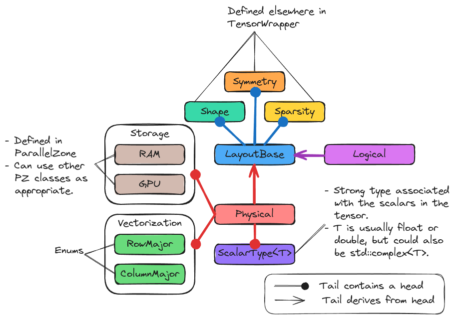

.. Copyright 2023 NWChemEx-Project
..
.. Licensed under the Apache License, Version 2.0 (the "License");
.. you may not use this file except in compliance with the License.
.. You may obtain a copy of the License at
..
.. http://www.apache.org/licenses/LICENSE-2.0
..
.. Unless required by applicable law or agreed to in writing, software
.. distributed under the License is distributed on an "AS IS" BASIS,
.. WITHOUT WARRANTIES OR CONDITIONS OF ANY KIND, either express or implied.
.. See the License for the specific language governing permissions and
.. limitations under the License.

.. _layout_design:

##############################
Designing the Layout Component
##############################

This page records the process of designing the layout component of
TensorWrapper.

**************************
What is a (tensor) layout?
**************************

Tensors contain (hyper-) rectangular arrays of elements. The user interacts with
the tensor object as if those arrays really exist; however, this is usually a
software abstraction since modern memory is vector-based. Point being, providing
users with software abstractions for tensors can require a fair bit of mental
gymnastics to actually map the abstraction to the hardware. The layout
component is responsible for representing those mental gymnastics.

*********************************
Why do we need a (tensor) layout?
*********************************

As mentioned in the previous section, only scalars and vectors map trivially to
hardware (and even for vectors the user may opt for non-trivial layouts). The
layout describes the mapping process, and will have substantial performance
consequences as certain layouts favor certain operations. While we strive to
ultimately isolate the user from the layout details, for the foreseeable
future users will likely want some control over the layout, thus we need a
user-friendly abstraction to represent the layout.

****************************
Tensor Layout Considerations
****************************

.. _l_reshape:

Reshape
   One of the most fundamental layout considerations is being able to
   :ref:`term_reshape` the tensor. Reshaping is minimally needed to store
   tensors in memory/on disk.

   - Tiling a tensor is also a reshape, albeit one that increases the rank.
   - As tiling suggests, reshapes can be logical and need not be physical.
   - The sparsity and symmetry of the tensor will need to be updated to match
     the new shape.
   - TensorWrapper will store the data in objects provided by the backend,
     the "physical" shape TensorWrapper stores may therefore still be logical
     as the true physical shape is left to the backend.
   - Multiple vectorization strategies exist (row-major, column-major being
     the most natural). Even if this is handled by the backend, the backend may
     require us to choose.

.. _l_representation:

Representation
   Elements of a tensor can have a variety of types (in a C++ sense). Even if
   the user provides us values in single-precision, they may want the algebra
   to be done in double-precision to mitigate against finite-arithmetic errors.

   - In theory, it is possible to have uncertainty models for each kernel which
     allow us to predict the error resulting from dropping precision. In
     practice such models are not readily available and users typically use
     intuition.
   - Representations could conceivably vary by tile.

.. _l_ownership:

Ownership
   Where do the literal values live? In RAM? On the GPU? On disk? Implicit via
   a generating function? Which process owns which tiles?

   - Cost to recompute tiles may vary, meaning we may want different ownership
     strategies per tile.
   - May want the same tile to be owned by multiple processes.

.. _l_distinction:

Distinction
   A large motivation for the layout component is simply to distinguish how
   the tensor is actually laid out from how the user declared it.

   - The classes in the layout component serve somewhat like a strong type to
     tell the physical/logical layouts apart (with classes in the layout
     component containing the actual layout).

.. _l_basic_operations:

Basic operations
   We anticipate that users will minimally want to be able to retrieve the
   state stored in the classes. Aside from that we anticipate use cases
   involving:

   - Composition. As tensors are composed into expressions, so too will be
     their layouts.
   - Toggle the on-the-fly nature of tiles
   - Change the representation/ownership

Out of Scope
============

Tiling Process
   The actual process of tiling a shape is assumed to be done elsewhere. The
   layout component will hold the resulting tiled shape.

   - The best tilings rely on properties of the basis set. Often these
     properties are not readily available to the tensor, which is why tiling
     will likely need to occur outside TensorWrapper for the foreseeable
     future.

Backend Selection
   Arguably part of laying out the tensor is also choosing the backend to hold
   the data. The layout component tries to factor out as many of the layout
   considerations as possible into a backend independent layer. The actual
   selection of the backend is done in the allocator component
   (see :ref:`tw_designing_the_allocator`).

*************
Layout Design
*************

.. _fig_layout:

   The major pieces of the layout component.

:numref:`fig_layout` illustrates the major pieces of the layout component. The
base class of the component is the ``Tiled`` class. We have opted to
make ``Tiled`` the base because a non-tiled layout can be viewed as having
a single tile, whereas viewing a legitimately tiled layout as a single tile may
hide information. Consistent with the :ref:`l_reshape` consideration, the
``Tiled`` object contains ``Shape``, ``Symmetry``, and ``Sparsity``
objects. To address the :ref:`l_representation` consideration the
``Tiled`` class holds the desired representation per inner-most tile.
Similarly, to address :ref:`l_ownership`, ``Tiled`` holds ParallelZone
objects per tile to denote the process, memory bank, or accelerator where the
tile lives.

*************
Proposed APIs
*************

Since TensorWrapper will in general be used in distributed contexts we assume
that users will typically be constructing ``Tiled`` objects, which are
constructed by:

.. code-block:: c++

   // Determining the actual shape is outside the concern of layout
   auto shape = get_actual_shape();

   // as is computing the symmetry and sparsity associated with it
   auto [symmetry, sparsity] = update_symmetry_and_sparsity(shape);

   // We anticipate that most users will create a Tiled object then set
   // the tile properties
   Tiled tl(shape, symmetry, sparsity);
   tl.set_all_tiles(RowMajor); // All tiles will be vectorized in row-major
   tl.set({0, 1}, ScalarType<float>{}); // Only tile 0,1 will use floats
   tl.set({0, 1}, {10, 10}, GPU); // The {0,1} to {10,10} slice of tiles will be

   // By default all tiles are stored, *i.e.*, they are NOT thrown away after
   // use. To switch a tile (or tiles) to being built on-the-fly:
   tl.do_not_store({0, 1});
   tl.store({0, 2});

   // We note that most backends do not actually support tile by tile layouts
   // so the above operations are likely to lead to runtime errors when
   // attempting to allocate the backend until support for mixed tile layouts
   // is built into TensorWrapper itself.

By default all tiles will be stored, row major, ``ScalarType<double>``, and RAM
based. The distribution of the tiles (which process gets which tile is left to
the backend for now, but could eventually be set by mapping
``ParallelZone::ResourceSet`` objects to tile indices/ranges).

Declaring a ``MonoTile`` object is conceptually similar except that the ``set``
member does not need tile indices or ranges:

.. code-block:: c++

   // Like TiledLayout construction, shape, symmetry, and sparsity must be made
   // in advance for the Layout class
   auto [shape, symmetry, sparsity] = get_inputs();

   MonoTile l(shape, symmetry, sparsity);
   l.set(RowMajor);
   l.set(ScalarType<std::complex<double>>);
   l.set(GPU);

*******
Summary
*******

:ref:`l_reshape`
   The ``Tiled`` object holds a ``Shape`` object and is capable of storing
   an enum representing the vectorization strategy on a per tile basis.

:ref:`l_representation`
   The ``Tiled`` object holds what C++ type the scalars are on a per
   tile basis.

:ref:`l_ownership`
   The ``Tiled`` object allows the user to specify what process owns
   each tile, as well as where the tile is stored (*e.g.*, RAM, disk, or GPU),
   and if it is even stored.

:ref:`l_distinction`
   This consideration is addressed by the existence of the ``Tiled`` and
   ``MonoTile`` classes.

:ref:`l_basic_operations`
   The API examples above demonstrate how users can perform the considered
   operations.
