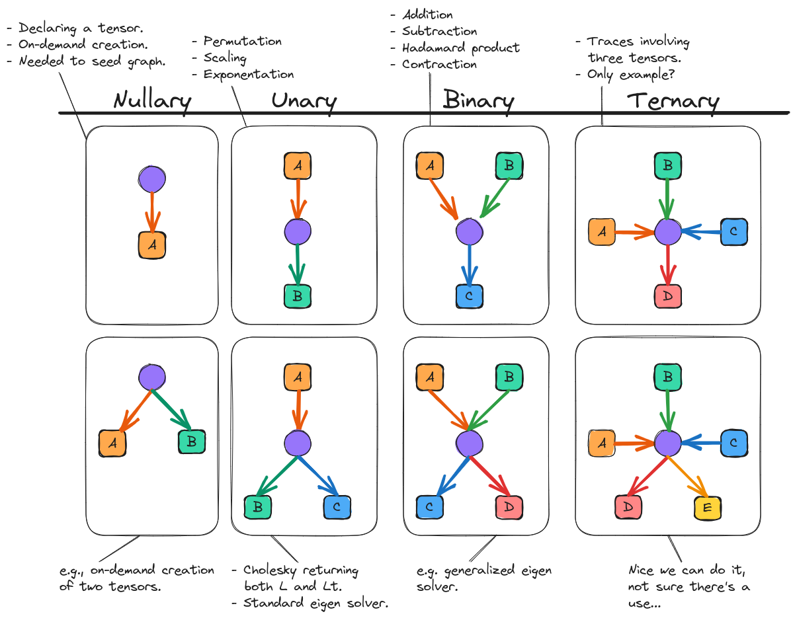
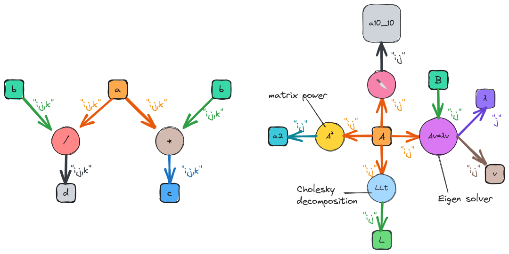
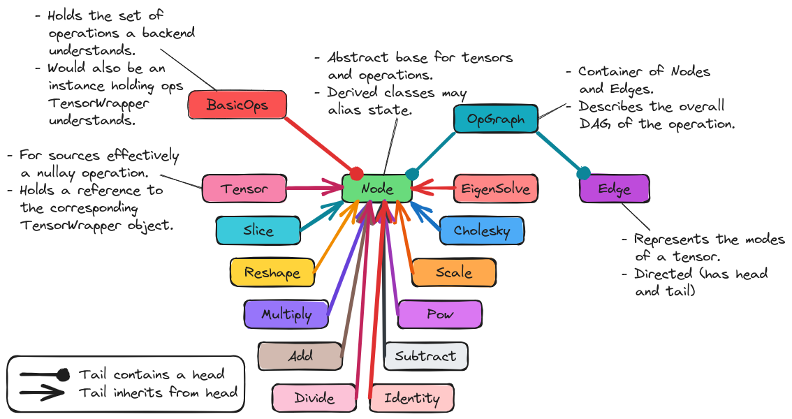

.. Copyright 2023 NWChemEx-Project
..
.. Licensed under the Apache License, Version 2.0 (the "License");
.. you may not use this file except in compliance with the License.
.. You may obtain a copy of the License at
..
.. http://www.apache.org/licenses/LICENSE-2.0
..
.. Unless required by applicable law or agreed to in writing, software
.. distributed under the License is distributed on an "AS IS" BASIS,
.. WITHOUT WARRANTIES OR CONDITIONS OF ANY KIND, either express or implied.
.. See the License for the specific language governing permissions and
.. limitations under the License.

.. _tw_designing_the_opgraph:

#####################
Designing the OpGraph
#####################

.. |m| replace:: :math:`m`
.. |n| replace:: :math:`n`
.. |mn| replace:: :math:`mn`
.. |A| replace:: :math:`\mathbf{A}`
.. |B| replace:: :math:`\mathbf{B}`
.. |C| replace:: :math:`\mathbf{C}`
.. |D| replace:: :math:`\mathbf{D}`

******************************
What is the OpGraph Component?
******************************

Program control flow is usually thought of in terms of graphs (specifically
:ref:`term_dag`\ s). Each node of the DAG is a task and edges indicate data
dependencies/flow. Once the user has told TensorWrapper what they want to do,
TensorWrapper converts that request into a DAG. The DAG is then passed to the
backend which is then charged with traversing the DAG and executing the tasks
it represents. Since the DAG generated by TensorWrapper will be comprised of
tensor algebra operations, we term this DAG the "OpGraph".

**************************
Why do we need an OpGraph?
**************************

Performing tensor algebra in a performant manner requires careful planning of
the order tasks are done in, how they are done, and where they are done. In
computer science we usually tackle this problem with DAGs. The OpGraph component
is needed so that we can have a DAG representation of the user's request.
Thinking of the user's inputs as a :ref:`term_dsl` the OpGraph component is then
the :ref:`term_ast` resulting from parsing the DSL (strictly speaking a
:ref:`term_cst` actually results from parsing the DSL, which is then mapped to
an AST, but that intermediate step is immaterial here). The association of the
OpGraph component with an AST suggests another use: an intermediate
representation of the calculation.

Expression Layer vs. OpGraph
============================

Perhaps what is less clear is why do we need the expression layer AND the
OpGraph component? This question is brought on by the fact that there is a fair
amount of redundancy in the classes. Ultimately, the answer is a separation of
concerns. The expression layer is purely meant to capture what the user wants to
do. The OpGraph component is supposed to represent what TensorWrapper wants the
backend to do. Generally speaking what the user wants to do will be expressed in
terms of much coarser operations than what TensorWrapper wants the backend to
do.

On a related note, another key difference between the Expression layer and the
OpGraph component is the the Expression layer is designed so that it is easy for
the user to express their intent, whereas the OpGraph is designed to be easy
for a backend to traverse. Thus the Expression layer is equation-based whereas
the OpGraph component is graph-based.

**********************
OpGraph Considerations
**********************

.. _og_data_flow:

data flow
   The graph needs to be capable of distinguishing between inputs and
   outputs. There conceivably could be cycles if loops are involved.

.. _og_multi_appearance:

tensors appear multiple times
   It is not uncommon for the same tensor to appear multiple times in a graph.
   For example many matrix decompositions are expressed in terms of a tensor
   and its transpose or a common intermediate may be used in several equations.
   The point is, we can not assume that all tensors in the graph are unique.

.. _og_multi_sources:

multiple sources
   The graph may have multiple inputs. The most obvious examples of this are
   binary operations, like addition, which map two input tensors to a single
   output tensor.

.. _og_multi_sinks:

Multiple sinks
   The graph may have multiple results. A somewhat common example of this is
   an eigen solver which takes an input matrix, diagonalizes it, and returns
   the eigenvectors and the eigenvalues.

.. _og_data_references:

data references
   The ``OpGraph`` must either have handles to the actual data, or somehow be
   associated with the actual data in order for backends to translate the AST
   into results. But plainly, if we want the backend to add two tensors, we
   better give the backend the two tensors.

.. _og_expression_compatibility:

expression compatibility
   The ``OpGraph`` object will ultimately be filled in by the objects in the
   expression component. Thus the interface of the ``OpGraph`` class needs to
   be designed so that it is compatible with the ``Expression`` component's
   implementation (see :ref:`designing_the_expression_component`).

   - As a corollary, this means that each ``Expression`` object must be
     representable as part of the resulting ``OpGraph``.

.. _og_extensible:

extensible
   While we will propose an initial set of basic operations, this set is not
   unique, nor will all backends agree that the operations are actually "basic".
   An excellent example is tensor contraction, which most backends will actually
   further decompose into permutations and a gemm (the BLAS routine for general
   matrix multiplication). If at a later time we decide that we would like
   the ``OpGraph`` to be able to express tensor contraction as permutations and
   a gemm, instead of a single operation, we will need to be able to add the
   ability to denote a gemm in the ``OpGraph``.

.. _og_backend_specific_basic_ops:

backend specific basic operations
   Somewhat related to :ref:`og_extensible` not every backend will expose
   interfaces for every basic operation TensorWrapper knows about. We will need
   a mechanism of somehow knowing which basic operations a backend supports and
   a mechanism for rewriting an ``OpGraph`` in terms of different operations.

Out of Scope
============

Identifying unique/repeat tensors
   The OpGraph component works with what it is given. If the OpGraph component
   is told that there are two tensors in the graph, the OpGraph component is
   going to assume there are two different tensors in the graph, and not a
   single tensor used twice. Identifying common intermediates should happen
   before forming the ``OpGraph`` (or should be done as a transformation of
   the ``OpGraph``).

Optimizing the OpGraph
   Along the lines of identifying unique/repeat tensors, the OpGraph layer will
   not be responsible for optimizing the computations an ``OpGraph`` object
   represents. Optimizing the computations can be done by a layer which takes
   an ``OpGraph`` object, analyzes it, and creates a new optimized ``OpGraph``
   object.

***************
Tensor Networks
***************

The idea that tensor algebra can be expressed as a graph is not something new
that we just stumbled on to. Mathematicians have known this for years. The
graphical representation of tensor algebra is usually termed a "tensor network".
Here's the basics (see :ref:`og_references` for background/where I took this
from):

- Nodes of a graph are tensors, edges are contractions.
- The shape of the node can be used to convey properties of the tensor.

  - There seems to be several conventions in the wild.
  - Squares or circles are usually the default symbol and are drawn with the
    same area (*vide infra*).
  - Use of the default symbol indicates that no additional properties for the
    tensor are known/specified.
  - Tensors which result from combining other tensors are denoted with
    rectangles or ovals whose area reflects the total number of "default"
    tensors which were consumed.

- Edges denote tensor modes.
- The number of edges connected to a node equals the rank of that tensor.
- Reshaping a tensor (typically flattening it) is done by combing edges into a
  single edge.

  - The thickness of the resulting edge is proportional to the number of
    modes comprising it. For example, reshaping a matrix into a vector would
    result in an edge which is twice as thick as the edges which were combined.

- Edges can be labeled with dummy indices to make referring to a particular
  edge easier.

- Contraction over multiple indices is denoted with parallel edges.
- The trace of a tensor (or product of tensors) is denoted with a loop.

- Additional operations, such as tensor products, addition, element-wise
  addition, etc. are usually specified with rectangles/ovals labeled
  with the operation.

  - The area rules specified above apply to the resulting node.

- Tensor decompositions are usually represented by left and right pointing
  triangles (the left pointing triangle being the adjoint of the right pointing
  triangle). If the decomposition also results in "values", *e.g.*, eigenvalues
  or the singular values from a singular value decomposition, those values are
  represented by a square/circle between the triangles.

Why not use tensor networks for the OpGraph?
============================================

Tensor networks really seem to be geared at expressing contractions involving
a number of tensors. While this is a very important use case for the OpGraph
component, consideration :ref:`og_expression_compatibility` requires that our
graph also be capable of expressing other operations too. While tensor networks
have a mechanism for this (recursive or hierarchical nodes, *i.e.*, nodes which
actually
represent entire tensor networks themselves) this representation makes it hard
to address consideration :ref:`og_multi_appearance`. In particular, if the same
tensor is involved in a contraction and say an addition, then it is difficult
to express that it is indeed the same tensor (which in graph notation is
naturally done by having it be literally the same node).

Another large problem with directly using a tensor network is tracking
permutations. Tensor networks treat modes of a tensor as if only the number of
modes (and the number of those modes which are contracted) matters. In practice,
having to permute modes can have huge performance consequences and it must be
considered (this is part of consideration :ref:`og_expression_compatibility`).
In theory this could be worked into the tensor network by enforcing an order to
the edges (*e.g.*, by requiring the edge for mode 0 to be the left most edge,
the edge for mode 1 to be the second left most edge, etc.). Then permutations
would manifest as edge crossings.

Ultimately, tensor networks were not designed to be task graphs, which is really
what the OpGraph component is after. Tensor networks are useful for expressing
the part of the task graph which maps to a specific tensor contraction, but
beyond that they are cumbersome to manipulate when multiple terms are equations
are involved. For this reason we have opted to generalize tensor networks.

****************
OpGraph Notation
****************

The graph represented by an ``OpGraph`` object can be considered a
generalization of a tensor network, with extensions to accommodate the extended
set of use cases the OpGraph component must deal with. The need for being able
to visualize an ``OpGraph`` object graphically is useful for design, and is
expected to also be useful for code analysis/optimization. To that end we
propose the following notation:

- Nodes of the graph depict either tensors or operators.

  - Tensors are denoted with square nodes.
  - Operations with circles.
  - Nodes will be labeled with the name of the tensor or the operation.
  - Unlike traditional tensor networks, most operations are treated the same.
    The key exception is permutations which are carried on the edges instead
    of the nodes.

- Edges denote modes.

  - Parallel edges are avoided by fusing indices, *i.e.*, each edge is labeled
    with all indices participating in that operation.
  - The number of fused modes is tracked by annotating the modes.
  - The annotations are used to express permutations (and for the multiplication
    operation convey generalized Einstein summation convention).

- Edges are directed.

  - The direction indicates data flow. Sources are input tensors. Sinks are
    outputs.
  - The rank of a tensor can be determined from the number of unique
    indices associated with it.

OpGraph Structure
=================

.. _fig_narity:

   Overview of how operations of different :ref:`term_arity` look using OpGraph
   graphical notation. For simplicity, mode annotations and operation labels are
   not specified.

:ref:`fig_narity` illustrates how an ``OpGraph`` representation looks for
operations of various :ref:`term_arity`. Graphs are grouped into a matrix such
that for row |m| (|m| is 1-based) the |n|-th column (|n| is 0-based) denotes an
operation returning |m| tensors given |n| tensors (|m| and |n| have different
bases because operations returning no tensors are not interesting).

The simplest, non-null, ``OpGraph`` stems from simply declaring a tensor. The
resulting "nullary" graph for a tensor |A|, is shown in :ref:`fig_narity`. From
the perspective of the OpGraph component, the actual declaration of a tensor
requires performing some opaque operation (such operations are denoted by purple
circles in :ref:`fig_narity`). For declaring a tensor this operation simply
returns the tensor (and does not require any input to do so, hence it is a
nullary operation). From the perspective of ``OpGraph``, the nullary operations
which create the source tensors must always be present and they are not usually
interesting (effectively being lambdas like `{return A;}`). Thus by
convention, and in an effort to simplify the representation of ``OpGraph``
objects, the nullary operations giving rise to the source tensors will usually
be implicit. The exception being when those nullary operations are interesting
(usually because they are on-demand generator functions). For the remaining
columns in :ref:`fig_narity` this convention applies. As shown in row 2 of
:ref:`fig_narity`

The next simplest ``OpGraph`` requires mapping an input tensor to an output
tensor via some intermediate operation. Such operations are "unary" and examples
include permuting the modes of a tensor, scaling a tensor, and raising a tensor
to a power. It is also possible that a unary operation returns multiple tensors,
*e.g.*, a standard eigen solver which returns the eigenvectors and the
eigenvalues. At this point, the basic structure of an operation should be clear,
nonetheless :ref:`fig_narity` shows examples of some other arities.

Basic Operations
================

.. _fig_basic_operations:

.. figure:: assets/opgraph_basic_ops.png
   :align: center

   Pictorial representations of the fundamental operations of the OpGraph
   component.

:ref:`fig_basic_operations` shows some of the basic operations which will be
comprise actual ``OpGraph`` instances. For simplicity we have focused on matrix
operations (most input/output edges have two annotations), but much of what is
in :ref:`fig_basic_operations` generalizes to other rank tensors in a
straightforward manner. Ignoring nullary operations, all operation nodes have
one or more inputs and one or more outputs. The goal is to establish a small set
of "fundamental" operations and to write all other operations in terms of these
operations. For example, we do not define a chip operation, but a chip operation
can be defined by a slice followed by a reshape.

As shown in :ref:`fig_basic_operations`, tensors acting as inputs to an
operation have their annotations associated with the edge connecting them to
the operation. Tensors resulting from an operation have their annotations
associated with the edge connecting the the operation to the tensor. In turn
permutations are signified by reordering the output indices relative to the
input indices.

The most questionable choice we have made is the "multiplication" operator. The
multiplication operator actually stands in for a number of operations including
trace, contraction, tensor product, and element-wise multiplication (though we
have also defined an element-wise multiplication operator for consistency with
the other element-wise operations). Our motivation here is that many of the
backend tensor libraries have already invested in infrastructure for handling
generalized Einstein summation convention (and/or tensor networks) and in the
first pass we intend to dispatch to the backend's implementations.

More Complicated OpGraphs
=========================

Ultimately, the state of an ``OpGraph`` is obtained by combining basic
operations from the previous subsection into larger graphs. From the
:ref:`designing_the_expression_component` section the first our more complicated
code examples was:

.. code-block:: c++

   {
      auto aijk = a("i,j,k");
      c("i,j,k")  = aijk * b("i,j,k");
      d("i,j,k")  = aijk / b("i,j,k");
   }

.. _fig_complicated_graphs:

   Graphs resulting from the "complicated" code snippets.

The graph resulting from this code is shown on the left of
:ref:`fig_complicated_graphs`. The graph expresses that after creation ``a`` is
used in two equations, which in turn result in two outputs. As was discussed
in :ref:`designing_the_expression_component` TensorWrapper will not be able to
identify common intermediates at first, so it treats ``b`` as two separate
tensors. The next most complicated code example we showed in
:ref:`designing_the_expression_component` was:

.. code-block:: c++

   T L, Lt, v, λ, a10_10, a2;
   {
       auto Aij = A("i,j");

      // disclaimer, I'm not 100% sure the cholesky/eigen_solve APIs will work
      // as shown, but it should be possible to get something close.

      // A = LLt
      L("i,j") = cholesky(Aij);

      // Av = λBv (no argument needed if B is 1)
      std::make_pair(v("i,j"), λ("j")]  = eigen_solve(Aij, B("i,j"));

      // Get the  slice of A starting a 0,0 and extending to 10,10 exclusive.
      a10_10("i,j") = slice(Aij, {0, 0}, {10, 10});

      // Raise A to the power 2
      a2("i,j") = pow(Aij, 2);
  }

The graph resulting from this code snippet is shown on the right of
:ref:`fig_complicated_graphs`. Here the intermediate ``A`` is used in four
different expressions including some expressions with multiple return values.

**************
OpGraph Design
**************

.. _fig_opgraph_classes:

   The classes comprising

So far we have focused exclusively on the graph representation of the OpGraph
and not the programmatic design. :ref:`fig_opgraph_classes` shows the classes
comprising the OpGraph component of TensorWrapper. The classes are summarized
in more detail in the following subsections

``OpGraph``
===========

This is a container-like class which stores the actual DAG. The elements of the
``OpGraph`` class are ``Edge`` and ``Node`` objects. The ``OpGraph`` object
additionally knows the connectivity of the graph and properties of the graph
(*e.g.*, the number of sinks or sources).

``Edge`` / ``Node``
===================

The fundamental elements of the ``OpGraph`` class are ``Edge`` and ``Node``
objects. ``Edge`` objects represent tensor modes and the directionality of the
edge indicates whether a tensor is an input or an output. ``Node`` objects
represent either a tensor or an operation with tensors only being connected to
operations and operations only being connected to tensors (*i.e.*, every
``OpGraph`` is a bipartite graph).

``BasicOps``
============

Pursuant to consideration :ref:`og_backend_specific_basic_ops` the OpGraph
component needs a way to be able to know what basic operations a backend can
handle. To this end we introduce the ``BasicOps`` class. The ``BasicOps`` class
is envisioned as being more or less a strong type over a ``std::set<Node>``.
For each backend, TensorWrapper would maintain a ``BasicOps`` filled with the
operations that backend can parse. Before calling the backend with a specific
``OpGraph`` TensorWrapper will ensue that the ``OpGraph`` is comprised entirely
of operations the backend understands. If it is not, TensorWrapper will either
rewrite the ``OpGraph`` in terms of operations the backend can understand or
error out.

Operations
==========

The remaining classes in :ref:`fig_opgraph_classes` represent the basic
operations TensorWrapper knows about. Many of these classes are simply strong
types, although some, like ``Scale``, will also contain state. By having the
various operations each have their own class we can address
:ref:`og_data_references`. New operations can be added, thus satisfying the
:ref:`og_extensible` consideration, by
deriving new classes. The operations will only affect backends whose
corresponding ``BasicOps`` object is updated (thus preserving backwards
compatibility).

In satisfying :ref:`og_expression_compatibility` we note that many classes in
the Expression component have an analogous class in the OpGraph component. For
those that don't we explicitly note the mapping from the Expression component
to the OpGraph component in the following list:

- ``Indexed`` essentially maps to a ``Tensor`` node plus an ``Edge`` object.
- ``Chip`` is ``Slice`` followed by a reshape.
- ``Permutation`` is determined by comparing the input and output ``Edge``
  objects.
- ``EigenVectors`` and ``EigenValues`` become ``EigenSolve``
- ``AssignTo`` maps to an edge stemming from a operation ``Node``.

***********
OpGraph API
***********

Before discussing the API of the OpGraph component we want to remind the reader
that OpGraph objects will in general be generated by the expression layer. Hence
we fully expect users to interact with TensorWrapper through the expression
layer and will rely on the expression layer to generate ``OpGraph`` objects. In
turn, while the following code snippets are verbose we feel that is okay because
users will not be writing them.

The API of the ``OpGraph`` component is modeled after the Boost Graph Library
(see `here <https://www.boost.org/doc/libs/1_83_0/libs/graph/doc/>`__). This
is to lower the barrier to entry in case the user is already familiar with that
library and so that an actual graph library (like Boost Graph Library) can be
wrapped by ``OpGraph`` if needed for performance.

The ``OpGraph`` class serves the role of an overall container for the graph. A
similar role to say ``boost::adjacency_matrix`` or ``boost::adjacency_list``
classes.

.. code-block:: c++

   using namespace opgraph; // OpGraph component lives in opgraph namespace

   // Will be graph for A + B = C
   OpGraph g;     // Default graph, no nodes

   // Will be graph for pow(A, 2) = C
   OpGraph g3(3); // Graph which will pre-allocate room for 3 nodes.

   TensorWrapper A, B, C; // Assume these are set up already

   // Creates three nodes which respectively represent tensor A, B, and C
   g.add_node(Tensor{A}); // Will be node 0,
   g.add_node(Tensor{B}); // node 1,
   g.add_node(Add{});     // node 2,
   g.add_node(Tensor{C}); // and node 3

   g3.add_node(Tensor{A});
   g3.add_node(Pow{2});  // Operation which squares a matrix
   g3.add_node(Tensor(C));

   g.add_edge(0, 2, "i,j"); // Adds an edge from node 0 to node 2 labeled "i,j"
   g.add_edge(1, 2, "i,j"); // Similar, but edge goes from 1 to 2
   g.add_edge(2, 3, "i,j"); // Similar, but edge goes from 2 to 3

   g3.add_edge(0, 1, "i,j");
   g3.add_edge(1, 2, "i,j");

Since Nodes can in general have the same value we can't use the value of a node
as a "key" and we must refer to nodes by offset. For example, while an API like
``g.add_edge(Tensor{A}, Add{}, "i,j");`` would be user-friendly, if there were
say two add operations we wouldn't know which ``Add`` instance to connect to
``Tensor{A}``. While it's tempting to say that all ``Add`` instances are the
same, and thus we should just be connecting all addition operations to the same
node, doing so sacrifices the data dependency order (assume we only have a
single ``Add`` node, then if we add the output from an ``Add`` operation to
another tensor the resulting graph has a loop).

After we have created an ``OpGraph`` we can inspect it:

.. code-block:: c++

   // Assume it's the same g from above

   // Returns a pair of iterators over the nodes in the graph
   auto [node_begin, node_end] = g.nodes();

   // Returns a pair of iterators over the edges in the graph
   auto [edge_being, edge_end] = g.edges();

   // Number of nodes/edges
   auto nnodes = g.num_nodes();
   auto nedges = g.num_edges();

   // The degree of a node is the total number of edges connected to it
   assert(g.degree(0) == 1);
   assert(g.degree(1) == 1);
   assert(g.degree(2) == 3);
   assert(g.degree(3) == 1);

   //The in degree of a node is the number of nodes which feed into it
   assert(g.in_degree(0) == 0);
   assert(g.in_degree(1) == 0);
   assert(g.in_degree(2) == 2);
   assert(g.in_degree(3) == 1);

   // The out degree is the number of nodes a node feeds in to
   assert(g.out_degree(0) == 1);
   assert(g.out_degree(1) == 1);
   assert(g.out_degree(2) == 1);
   assert(g.out_degree(3) == 0);

   // Returns a pair of iterators over the edges connected to the specified
   // node. Here node 0
   auto [edges0_begin, edges0_end] = g.edges(0);
   assert((*edges0_begin) == Edge(0, 1, "i,j")); // One edge going from 0 to 1

   // Only the edges going in to node 0
   auto [in_edges0_begin, in_edges0_end] = g.in_edges(0);
   assert(in_edges0_begin == in_edges0_end); // There are none

   // Only the edges going out of node 0
   auto [out_edges0_begin, out_edges0_end] = g.out_edges(0);
   assert((*out_edges0_begin) == Edge(0, 1, "i,j"));

   // Returns a pair of iterators over the nodes connected to the specified
   // node, here node 0
   auto [nodes0_begin, nodes0_end] = g.adjacent_nodes(0);
   assert((*nodes0_begin) == 2);

   // OpGraph is a DAG so a pair of numbers maps to exactly one edge, *i.e.* :
   assert(g.source(0, 2) == 0);
   assert(g.source(2, 0) == 0);
   assert(g.sink(0, 2) == 2);
   assert(g.sink(2, 0) == 2);

While not shown, we anticipate that a series of free functions will be needed
for computing properties of ``OpGraph`` objects or running say depth-first
searches on them. We anticipate the such functions will wrap existing algorithms
supplied by the backend of the ``OpGraph`` component.

*******
Summary
*******

The design of the OpGraph component satisfies the above considerations by:

:ref:`og_data_flow`
   Edges are directed and indicate whether the tensor connected to the edge
   is going into the operation or coming from it.

:ref:`og_multi_appearance`
    The same ``Tensor`` object can be reused when an intermediate appears
    multiple times. Alternatively, different ``Tensor`` objects can be created
    which point to the same intermediate.

:ref:`og_multi_sources`
   Operations may have inputs which come from different tensors.

:ref:`og_multi_sinks`
   Operations may point to (*i.e.* return) more than tensor.

:ref:`og_data_references`
   The nodes of the graph are ultimately classes. Each operation is its own
   class and thus can store additional state if need be.

:ref:`og_expression_compatibility`
   The initial design of the OpGraph component includes operations for most of
   the classes defined in the Expression component. For the remaining Expression
   component objects simple straightforward mappings to two or more OpGraph
   components exist.

:ref:`og_extensible`
   Additional operations can be added by deriving from the ``Node`` class.

:ref:`og_backend_specific_basic_ops`
   Each backend will be associated with a ``BasicOps`` object which details the
   basic operations the backend can parse. Maintainers of TensorWrapper will be
   responsible for maintaining the ``BasicOps`` object.

.. _og_references:

**********
References
**********

For the tensor network background we primarily relied on sources found in the
README of Google's
`TensorNetwork <https://github.com/google/TensorNetwork#readme>`__ project,
specifically:

- `https://iopscience.iop.org/article/10.1088/1751-8121/aa6dc3/pdf`
- `https://arxiv.org/pdf/1306.2164.pdf`
