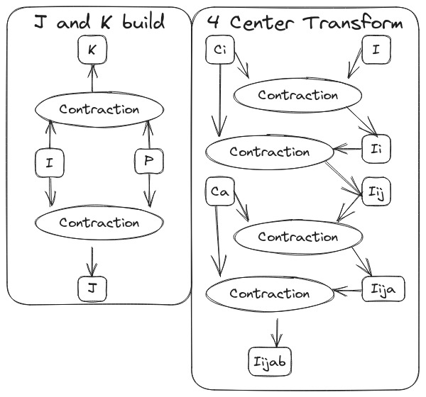

.. _tw_designing_the_opgraph:

#####################
Designing the OpGraph
#####################

**********************
OpGraph Considerations
**********************

Multiple source nodes
   The graph may have multiple inputs. Each input is assumed to be a
   ``TensorWrapper`` object.

Multiple sink nodes
   The graph may have multiple results. We assume the results have different
   types based on whether or not they are terminating the graph. The graph
   terminates on a ``TensorWrapper`` object.

*******************
OpGraph Motivations
*******************

   Examples of some tensor graphs arising in electronic structure theory.
