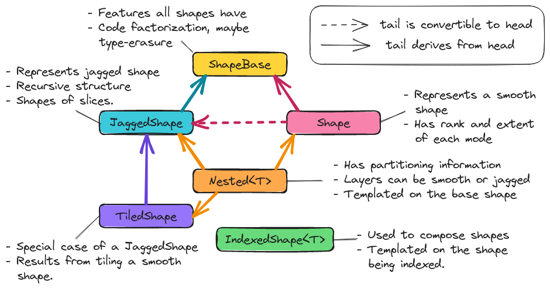

.. Copyright 2023 NWChemEx-Project
..
.. Licensed under the Apache License, Version 2.0 (the "License");
.. you may not use this file except in compliance with the License.
.. You may obtain a copy of the License at
..
.. http://www.apache.org/licenses/LICENSE-2.0
..
.. Unless required by applicable law or agreed to in writing, software
.. distributed under the License is distributed on an "AS IS" BASIS,
.. WITHOUT WARRANTIES OR CONDITIONS OF ANY KIND, either express or implied.
.. See the License for the specific language governing permissions and
.. limitations under the License.

.. _shape_design:

###################
Tensor Shape Design
###################

This page captures the design process of TensorWrapper's ``Shape`` class.

*************************
What is a tensor's shape?
*************************

.. |n| replace:: :math:`n`
.. |r| replace:: :math:`r`

For computing purposes, tensors are really nothing more than a bunch of floating
point values and meta-data associated with those values. Conceptually, the
floating point values are typically arranged into |n|-dimensional rectangular
arrays, where |n| is the number of :ref:`term_mode` s in the tensor. A tensor's
shape describes this hyper-rectangular array's layout.

********************************
Why do we need a tensor's shape?
********************************

A tensor's shape is arguably the most primitive meta-data associated with the
tensor. Without the shape of the tensor we do not know how to access elements
or lay them out in memory.

********************
Shape Considerations
********************

.. _shape_rank_and_extents:

Basic operations
   The unifying theme of objects in the shape component is that they are
   shapes. It is common to not This means they have:

   - rank
   - extents
   - sub-shapes (a sub-shape can be either a :ref:`term_slice` or a
     :ref:`term_chip`)
   - *N.B.*, some, all, or none of these properties may be known at compile
     time and we need a mechanism for setting them at runtime.

.. _shape_nested:

Nested
   While a :ref:`term_nested` tensor may seem exotic, in practice, distributed
   tensors are often implemented by nesting (ideally the user need not be aware
   of such nesting aside from possibly specifying it at construction). Nesting,
   also occurs naturally when discussing sparsity.

   - Nestings may be :ref:`term_smooth`  or :ref:`term_jagged`.
   - While nestings can be flattened (*e.g.*, a smooth matrix of matrices
     can just be treated as a rank 4 tensor and a smooth matrix of jagged
     matrices can be treated as a single jagged rank 4 tensor) doing so
     destroys the mode partitioning information.
   - Mode partitioning information is needed for providing hints to the backend
     pertaining to slicing operations and hierarchical memory layouts.

.. _shape_jagged:

Jagged-ness
   A truly jagged shape (one where slices along the same mode have different
   shapes) require special treatment.

   - Requires the tensor be at least rank 2 to be truly jagged.
   - Must have smooth slices of at least rank 1, but could have higher-rank
     smooth slices, *e.g.*, a jagged rank 3 tensors could have smooth matrices
     as elements.
   - A jagged tensor of rank |r|, which has smooth slices of rank
     :math:`s` must minimally be viewed as having :math:`r-s` layers
   - A key use of jagged shapes is for tiling tensors.

.. _shape_combining_shapes:

Combining shapes
   As we do tensor operations we will need to work out the resulting shapes.
   This in general requires knowing how the modes of the inputs map to the
   modes of the output.

.. _shape_iterable:

Iterable
   A natural use case of a shape is to iterate over the indices in the shape.

   - For iterating, it is useful to be able to set the origin. This allows
     iterating over slices using the original tensor's indices.
   - Sometimes we want the absolute indices (starting from the origin) and
     other times we only want the offsets (always relative to zero).

Not in Scope
============

Sparsity
   The ``Shape`` component is targeted at describing the conceptual layout of
   the hyper-rectangular array of values. The conceptual layout is independent
   of the values of the elements. Sparsity is concerned with knowing which
   elements are zero.

   - Sparsity is punted to :ref:`sparsity_design`.

Permutational Symmetry
   In many cases the elements of a tensor are not all linearly-independent and
   optimizations are possible by avoiding redundant computation.

   - Antisymmetry, Hermitian, and anti-Hermitian all fall into this
     consideration too.
   - Symmetry is punted to :ref:`tw_designing_the_symmetry_component`.

Logical vs actual
   The user declares the tensor with some shape. That shape usually reflects the
   physical problem being modeled. Internally we may need to store the tensor
   as a different shape, for performance reasons. The shape describing how the
   user wants to interact with the tensor is the "logical" shape.

   - Both the logical and actual shapes are ``Shape`` objects.
   - It is the responsibility of the user creating ``Shape`` objects to track
     if they represent logical or actual shapes.

Masks
   Shapes are index contiguous. Masks allow you to view a non contiguous set
   of indices as if they were contiguous. Masks can be implemented on top of
   the shape component and are therefore not in scope for this discussion.

************
Shape Design
************

In designing the class hierarchy we note the following:

- An algorithm which works for a jagged shape should work for a smooth shape
  as well. The reverse, smooth algorithms with jagged shapes, will in general
  not work.
- Nestings are logically imposed over an existing shape. The resulting nested
  shape is still an instance of the underlying shape.
- Tiled shapes are a subcategory of jagged shapes.

.. _fig_shape_design:

   The architecture of TensorWrapper's Shape component.

:numref:`fig_shape_design` shows the classes primarily responsible for
implementing the shape component. Most end users will deal with the ``Shape``
class.

ShapeBase
=========

The unifying features of all shapes were summarized in the
:ref:`shape_rank_and_extents` consideration. ``ShapeBase`` provides the API
that all shapes must minimally satisfy because they are shapes. The actual
class serves primarily as code factorization.

Shape
=====

The ``Shape`` class describes a (smooth) hyper-rectangular array of data and
can be used for "traditional" tensors (those which are not nested or jagged).
Most end users will simply create ``Shape`` objects and pass them on to
``TensorWrapper``. We expect that manipulations of ``Shape`` objects will be
aimed at TensorWrapper developers.

JaggedShape
===========

To satisfy the :ref:`shape_jagged` consideration we introduce ``JaggedShape``.
``JaggedShape`` is similar to ``Shape`` except that users must explicitly
provide the shape of the slices. Generally speaking ``JaggedShape`` objects of
rank |r| will contain a series of rank :math:`s` ``Shape`` objects. The
actual ``JaggedShape`` object serves as a map from an index with :math:`(r-s)`
indices to the ``Shape`` of that slice. Like ``Shape`` we expect users to
primarily be concerned with construction. Again, manipulations of the
``JaggedShape`` will be primarily of interest to TensorWrapper developers.

TiledShape
==========

Introduced primarily as a convenience for constructing ``JaggedShape`` objects
by tiling.

Nested
======

To address the :ref:`shape_nested` consideration, we have added a ``Nested``
class.

With objects like ``Shape`` TensorWrapper can't tell how the user is thinking
of the tensor. For example, they could be thinking of a matrix as a matrix or
as a vector of vectors. The point of the ``NestedShape`` object is to partition
the ranks of the tensor into layers, so we know how many layers the user is
viewing the tensor as, and how many ranks each layer has. Mathematically
the various ways of a viewing a tensor do not change the properties of the
tensor; however, when we are physically laying the tensor out on the computer
how we view the tensor can affect physical layout.

IndexedShape
============

Consideration :ref:`shape_combining_shapes` requires us to be able to compose
the various shape objects. To do this, we rely on the same mechanism used for
``TensorWrapper``, *i.e.*, an expression layer. More specifically,
``IndexedShape`` objects result from indexing a shape like ``s("i,j,k")``. While
``IndexedShape`` is technically exposed to the user, user can be somewhat
oblivious to its existence.

*******************
Proposed Shape APIs
*******************

Constructing a ``Shape``
========================

Creating a non-nested shape just requires knowing the extent of each mode:

.. code-block:: c++

   Shape null_shape;              // No rank and no elements
   Shape rank0_shape{};           // A scalar
   Shape rank1_shape{10};         // 10 element vector
   Shape rank2_shape{10, 20};     // 10 by 20 matrix
   Shape rank3_shape{10, 20, 30}; // 10 by 20 by 30 tensor

Note that following usual C++ rules the first two lines actually call
different constructors (default ctor vs. initializer list). Using an initializer
list requires us to know the rank at compile time. If we want to determine the
rank at runtime we can use iterators:

.. code-block:: c++

   // Somehow create a vector of extents
   using size_type = Shape::size_type;
   std::vector<size_type> extents = get_extents();

   // Construct Shape from iterator pair
   Shape runtime_rank_shape(extents.begin(), extents.end());

Jagged Shape Construction
=========================

For a ``Shape`` we need to specify the extents of each mode. ``JaggedShape``
declaration is done in terms of ``Shape`` objects and looks like:

.. code-block:: c++

   // For brevity define variables
   Shape s10{10}, s20{20}, s30{30};
   Shape s10_20{10, 20}, s30_40{30, 40}, s50_60{50, 60};
   Shape s10_20_30{10, 20, 30}, s40_50_60{40, 50, 60};

   // No elements, no rank
   JaggedShape null_shape;

   // Smooth scalar viewed as a JaggedShape (note () not {})
   JaggedShape smooth0_shape(Shape{});

   // Smooth vector viewed as a JaggedShape (note () not {})
   JaggedShape smooth1_shape(Shape{10});

   // Smooth matrix viewed as a JaggedShape (note () not {})
   JaggedShape smooth2_shape(Shape{10, 20});

   // A "jagged" vector with no elements
   JaggedShape rank0_shape{};

   // A jagged matrix with 1 row, note the {}
   JaggedShape rank2_shape{s10};

   // A jagged matrix with 3 rows; row 0 has 10 elements, row 1 has 20, row 2 30
   JaggedShape rank2_shape2{s10, s20, s30};

   // A jagged rank 3 tensor with smooth matrices. Matrix 0 is 10 by 20,
   // matrix 1 is 30 by 40, and matrix 2 is 50 by 60
   JaggedShape rank3_shape{s10_20, s30_40, s50_60};

   // A jagged rank 3 tensor where elements are jagged matrices. Matrix 0 is
   // 1 by 10, matrix 2 has 20 columns in row 0 and 30 columns in row 2, and
   // matrix 3 has 30 columns in row 0, 10 columns in row 1, and 20 columns in
   // row 2
   JaggedShape rank3_shape2{{s10},
                            {s20, s30},
                            {s30, s10, s20}};

    // A jagged rank 4 tensor where the 0-th element of the 0-th mode is a
    // 10 by 20 by 30 smooth tensor and the 1-st element is a 40 by 50 by 60
    // smooth tensor
   JaggedShape rank4_shape{s10_20_30, s40_50_60};

   // A jagged rank 4 tensor where the elements are jagged rank 3 tensors.
   // Taking slices along the 0 and 1-st modes, the (0,0)-th slice is a 10 by 20
   // matrix, the (0,1)-th slice is a 30 by 40 matrix, the (1,0)-th slice is
   // a 30 by 40 matrix, the (1,1)-th slice is a 10 by 20 matrix, and the
   // (1,2)-th slice is a 50 by 60 matrix
   JaggedShape rank4_shape2{{s10_20, s30_40},
                            {s30_40, s10_20, s50_60}};

   // A jagged rank 4 tensors where the elements are jagged rank 3 tensors,
   // which have jagged matrices for elements. Taking slices along the 0, 1, and
   // 2 modes we have:
   // - (0,0,0) is a 10 element vector,
   // - (0,1,0) is a 20 element vector,
   // - (0,1,1) is a 30 element vector,
   // - (1,0,0) is a 10 element vector,
   // - (1,0,1) is a 30 element vector,
   // - (1,1,0) is a 20 element vector,
   // - (1,2,0) is a 10 element vector,
   // - (1,2,1) is a 20 element vector,
   // - (1,2,2) is a 30 element vector
   JaggedShape rank4_shape{{{s10}, {s20, s30}},
                           {{s10, s30}, {s20}, {s10, s20, s30}}};

Consider the shape of the (0,1) slice of ``rank4_shape``. This slice is a
vector of vectors where the outer vector has two elements, element 0 of the
outer vector is a 10-element vector and element 1 is a  30-element vector. In
other words the shape of the (0,1) slice of ``rank4_shape`` describes a jagged
matrix, which could have been initialized by ``JaggedShape{s20, s30}``. In turn
the above construction of ``rank4_shape`` is actually equivalent to:

.. code-block:: c++

   JaggedShape e00{s10};
   JaggedShape e01{s20, s30};
   JaggedShape e10{s10, s30};
   JaggedShape e11{s20};
   JaggedShape e12{s10, s20, s30};
   JaggedShape e0{e00, e01};
   JaggedShape e1{e10, e11, e12};
   JaggedShape rank4_shape{e0, e1};

And we see that ``JaggedShape`` is a recursive structure and thus the runtime
mechanism for initializing a ``JaggedShape`` is with iterators running over
``JaggedShape`` objects:

.. code-block:: c++

   std::vector<JaggedShape> slice_shapes = get_slices();
   JaggedShape shape(slice_shapes.begin(), slice_shapes.end());

So far we have focused on the most general way to create a ``JaggedShape`` one
of the most common ways to form a ``JaggedShape`` is by tiling. Consider a
30 by 30 matrix where we tile each mode into 5, 15, and 10 element chunks.
Using ``JaggedShape`` this can be done by:

.. code-block:: c++

   JaggedShape js{{Shape{5,5}, Shape{5, 15}, Shape{5,10}},
                  {Shape{15,5}, Shape{15,15}, Shape{15,10}},
                  {Shape{10,5}, Shape{10,15}, Shape{10,10}}};

This is an admittedly verbose declaration. Thus for the special case of crating
``JaggedShape`` objects which result from tiling smooth ``Shape`` objects we
introduce the ``TiledShape`` class. Using ``TiledShape`` the same shape could
be declared via:

.. code-block:: c++

   TiledShape s{{5, 10, 15}, {5, 10, 15}};

Constructing Nested Shapes
==========================

Creating a ``NestedShape`` requires knowing the shape of the tensor and how
the indices are partitioned into layers.

.. code-block:: c++

   // One layer scalar
   Nested<Shape> s0({0}, Shape{});

   // Two layer scalar
   Nested<Shape> s0_0({0, 0}, Shape{});

   // One layer vector
   Nested<Shape> s1({1}, Shape{10});

   // Two layer vector (mode in layer 0)
   Nested<Shape> s1_0({1, 0}, Shape{10});

   // Two layer vector (mode in layer 1)
   Nested<Shape> s0_1({0, 1}, Shape{10});

   // One layer matrix
   Nested<Shape> s1({2}, Shape{10, 20});

   // Two layer matrix (both modes in layer 0)
   Nested<Shape> s2_0({2, 0}, Shape{10, 20});

   // Two layer matrix (one mode per layer)
   Nested<Shape> s1_1({1, 1}, Shape{10, 20});

   // Two layer matrix (both modes in layer 1)
   Nested<Shape> s0_2({0, 2}, Shape{10, 20});

   // One layer rank 3
   Nested<Shape> s3({3}, Shape{10, 20, 30});

   // Two layer rank 3 one mode in layer 0 two in layer 1
   Nested<Shape> s1_2({1, 2}, Shape{10, 20, 30});

   // Three layer rank 3, one mode per layer
   Nested<Shape> s1_1_1({1, 1, 1}, Shape{10, 20, 30});

   // A two-layer shape where modes 0 and 1 are in layer 0 and modes 2 and 3
   // are layer 1
   Nested<Shape> s({2, 2}, Shape{5, 10, 15, 20});

The general syntax for an |n| layer tensor is an |n| element
container where the :math:`i`-th element is the number of ranks in that
layer (ranks from the shape object are assigned to layers left to right; so
permutations may be needed to line up with layering).

Basic Operations
================

All shapes know their total rank and the total number of scalar elements:

.. code-block:: c++

   Shape s{10, 20, 30};
   JaggedShape js{s, Shape{10, 20}};

   // Total rank of the tensor
   assert(s.rank() == 3);
   assert(js.rank() == 3);

   // Total number of elements in the tensor
   assert(s.size() == 6000);  // 10 * 20 * 30 = 6000
   assert(js.size() == 6200); // 6000 + (10*20) = 6200;

``Nested`` additionally allows you to get this information per layer:

.. code-block:: c++

   Nested<Shape> s1_2({1, 2}, s);
   Nested<JaggedShape> js1_2({1, 2}, js);

   assert(s1_2.n_layers() == 2);
   assert(js1_2.n_layers() == 2);

   assert(s1_2.rank_layer(0) == 1);
   assert(s1_2.rank_layer(1) == 2);
   assert(js1_2.rank_layer(0) == 1);
   assert(js1_2.rank_layer(1) == 2);

   assert(s1_2.elements_in_layer(0) == 10);
   assert(s1_2.elements_in_layer(1) == 6000);
   assert(js1_2.elements_in_layer(0) == 2);
   assert(js1_2.elements_in_layer(1) == 6200);

   // Get the shape of the 0,0-th element (returns a std::variant)
   assert(s3_3({0, 0}) == s);

Shape Composition
=================

``Shape`` and ``JaggedShape`` objects are composed similarly (with
``JaggedShape`` objects having many more checks to ensure slices are of
compatible sizes).

.. code-block:: c++

   Shape s0{10, 20, 30}, s1;
   JaggedShape js0{Shape{10}, Shape{20}}, js1;

   // Addition, subtraction, and element-wise multiplication do nothing without
   // a permutation
   s1("i,j,k") =  s0("i,j,k") + s0("i,j,k");
   assert(s1 == s0);

   js1("i,j") = js0("i,j") + js0("i,j");
   assert(js1 == js0);

   // Permuting modes
   s1("j,i,k") = s0("i,j,k") + s0("i,j,k");
   assert(s1 == Shape{20,10,30});

   js1("j,i") = js0("i,j") + js0("i,j");
   assert(js1 == JaggedShape{Shape{20}, Shape{10}});

   // Contraction
   s1("i,k") = s0("i,j,k") * s0("i,j,k");
   assert(s1 == Shape{10, 30});

   js1("i,k") = js0("i,j") * js0("k,j");
   assert(js1 == JaggedShape{Shape{2}, Shape{2}});

   // These would throw since contracted modes aren't the same length
   // s1("i,k") = s0("j,i,k") * s0("i,j,k");

   // js1("i,k") = js0("i,j") * js0("j,k");

   // Direct product
   s1("i,j,k,l") = s0("i,j,k") * s0("i,j,l");
   assert(s1 == Shape{10, 20, 30, 30});

   js1("i,j,k") = js0("i,j") * js0("i,k");
   assert(js1 == JaggedShape{Shape{10,10}, Shape{20,20}});

Combining ``Nested<T>`` objects is conceptually done layer-by-layer. In practice
we just combine the underlying ``T`` objects while preserving the layer
assignments and ensuring layer shapes are compatible:

.. code-block:: c++

   Shape s{10, 20, 30};
   Nested<Shape> s1_2({1, 2}, s), s2_1({2,1}, s), result;

   result("i,j,k") = s1_2("i,j,k") + s1_2("i,j,k");
   assert(result == s1_2);

   // Not allowed because we can't add rank 1 tensors to rank 2 tensors
   // result("i,j,k") = s1_2("i,j,k") + s2_1("i,j,k");

   result("i,j") = s1_2("i,j,k") * s1_2("i,j,k");
   assert(result == Nested<Shape>({1, 1}, Shape{10, 20}));

   result("j,k") = s1_2("i,j,k") * s1_2("i,j,k");
   assert(result == Nested<Shape>({0,2}, Shape{20, 30}));

   // Layers only need compatible, not identical, shapes
   result("j,k") = s1_2("i,j,k") * s2_1("i,j,k");
   assert(result == Nested<Shape>({1, 1}, Shape{20, 30}));

We note that it's quite likely that scenarios will arise where the user will
want the result to be layered different than the default behavior provides. In
practice re-layering a shape is a trivial operation (swapping two small
vectors of integers).

Slicing and Chipping
=====================

Slices of a shape have the same rank, chips have different ranks:

.. code-block:: c++

   Shape s{10, 20};

   // Get the shape of row 0 as a matrix
   auto s0 = s.slice(0);
   assert(s0 == Shape{1, 20});

   // Get the shape of column 0 as a matrix
   auto sx0 = s.slice({0, 0}, {10, 1});
   assert(sx0 == Shape{10, 1});

   // Get the shape of the first five columns of the first five rows...
   auto s05_05 = s.slice({0,0}, {5,5});
   assert(s05_05 == Shape{5, 5});

   // Note that this shape still refers to a rank 2 tensor even though the
   // first mode has a single element
   auto s01_05 = s.slice({0, 0}, {1, 5});
   assert(s01_05 == Shape{1, 5});

   // Get the shape of row 2 as a vector
   auto s2 = s.chip(2);
   assert(s2 == Shape{20});

   // Get the shape of column 2 as a vector
   auto sx2 = s.chip({0, 2}, {10, 3});
   assert(sx2 == Shape{10});

For a rank |r| tensor, the general overload of ``slice`` and ``chip`` takes
two |r|-element vectors. The first vector is the first element in the
slice/chip and the second vector is the first element not in the slice/chip.
For convenience we also provide an overload where the user may provide up to
|r| integers. This overload pins the :math:`i`-th mode to the :math:`i`-th
integer all other modes run their entire span.

It is possible to slice and chip ``JaggedShape`` and ``Nested`` objects too:

.. code-block:: c++

   JaggedShape js0{Shape{10}, Shape{20}};

   auto j0 = js0.chip(0);
   assert(j0 == JaggedShape{Shape10});

   auto j1 = js0.slice(0);
   assert(j1 == JaggedShape({Shape{10}});

   Nested<Shape> s1_2({1, 2}, Shape{10, 20, 30});
   auto s2 = s1_2.chip(0);
   assert(s2 == Shape{10, 20});

Iterating
=========

By default the origin of a freshly constructed shape is the zero vector. For
slices and chips, the origin is the first element in the slice or chip (note
that in the previous section we conveniently chose our slices/chips so the
origin was the zero vector). By default, when iterating over a shape indices are
returned as offsets from the origin, in lexicographical order. For example:

.. code-block:: c++

   auto print_shape = {
      for(const auto& index : s)
         std::cout << "{" << index[0] << "," << index[1] << "} ";
   };

   Shape s{2, 3};
   print_shape(s);  // prints {0,0} {0,1} {0,2} {1,0} {1,1} {1,2}

   auto s01_13 = s.slice({0, 1}, {1, 3});
   print_shape(s01_13); // prints {0,1}, {0,2} NOT {0,0} {0,1}

   // If we wanted {0,0} {0,1}
   print_shape(s01_13.offsets());

   // We can move the origin
   s.set_origin({10, 10});
   print_shape(s); // prints {10,10} {10,11} {10,12} {11,10} {11,11} {11,12}

For completeness we define an overloads of ``Shape`` and ``JaggedShape`` which
also take an origin. For ``JaggedShape`` the origin need only be specified for
the explicitly unrolled ranks.

.. code-block:: c++

   // Makes a shape for a 2 by 3 matrix whose first element is {10, 10}
   Shape s({2, 3}, {10, 10});

   // Outer vector starts at 10, element 0 of the outer vector starts at 5,
   // element 1 of the outer vector starts at 6
   JaggedShape js({{Shape({10}, {5}), Shape({20}, {6})}, {10});

   // Outer vector starts at 10, inner vector starts at 10
   Nested<Shape> s1_1({1, 1}, s);

*******
Summary
*******

The design of the shape component satisfies the considerations raised above
by:

:ref:`shape_rank_and_extents`
   The ``ShapeBase`` class will provide a common API for getting/setting basic
   information and performing common operations.

:ref:`shape_nested`
   The ``Nested`` class tracks how the modes of a tensor are layered.

:ref:`shape_jagged`
   The ``JaggedShape`` class is used to represent jagged shapes.

:ref:`shape_combining_shapes`
   The ``IndexedShape`` class allows us to easily compose shapes.

:ref:`shape_iterable`
   The various classes define iterators which allow users to iterate over the
   indices contained in the shape.
