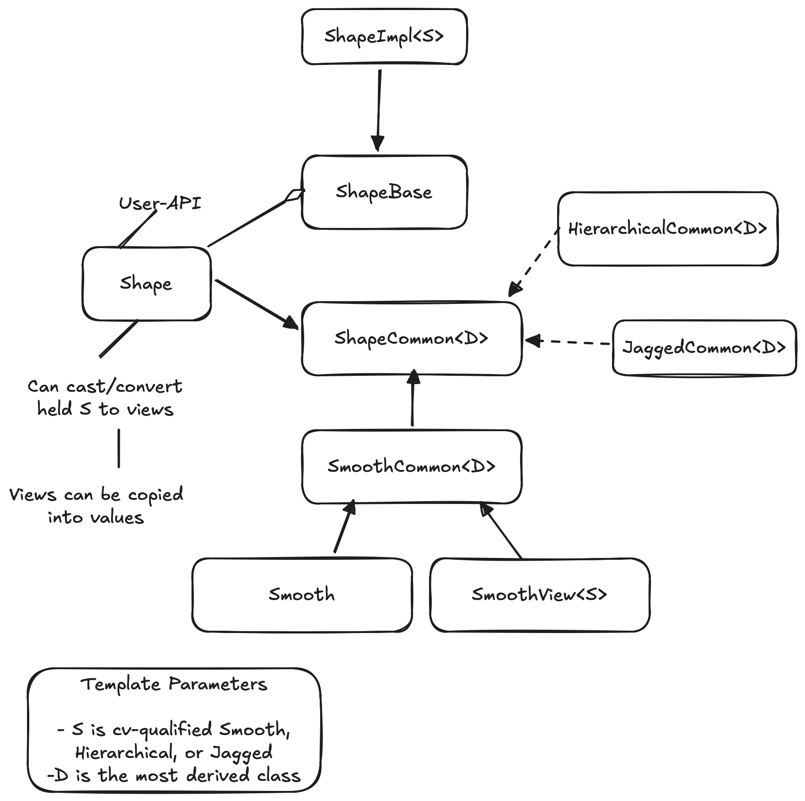

.. Copyright 2023 NWChemEx-Project
..
.. Licensed under the Apache License, Version 2.0 (the "License");
.. you may not use this file except in compliance with the License.
.. You may obtain a copy of the License at
..
.. http://www.apache.org/licenses/LICENSE-2.0
..
.. Unless required by applicable law or agreed to in writing, software
.. distributed under the License is distributed on an "AS IS" BASIS,
.. WITHOUT WARRANTIES OR CONDITIONS OF ANY KIND, either express or implied.
.. See the License for the specific language governing permissions and
.. limitations under the License.

.. _shape_design:

###################
Tensor Shape Design
###################

This page captures the design process of TensorWrapper's ``Shape`` class.

*************************
What is a tensor's shape?
*************************

.. |n| replace:: :math:`n`
.. |r| replace:: :math:`r`

For computing purposes, tensors are really nothing more than a bunch of floating
point values and meta-data associated with those values. Conceptually, the
floating point values are typically arranged into |n|-dimensional rectangular
arrays, where |n| is the number of :ref:`term_mode` s in the tensor. A tensor's
shape describes this hyper-rectangular array's layout.

********************************
Why do we need a tensor's shape?
********************************

A tensor's shape is arguably the most primitive meta-data associated with the
tensor. Without the shape of the tensor we do not know how to access elements
or lay them out in memory.

********************
Shape Considerations
********************

.. _shape_rank_and_extents:

Basic operations
   The unifying theme of objects in the shape component is that they describe
   the layout of the hyper-rectangular array of values. This means they need to
   represent:

   - :ref:`term_rank`
   - :ref:`term_extent`
   - sub-shapes (a sub-shape can be either a :ref:`term_slice` or a
     :ref:`term_chip`)
   - *N.B.*, some, all, or none of these properties may be known at compile
     time and we need a mechanism for setting them at runtime.

.. _shape_nested:

Nested
   While a :ref:`term_nested` tensor may seem exotic, in practice, distributed
   tensors are often implemented by nesting (ideally the user need not be aware
   of such nesting aside from possibly specifying it at construction). Nesting,
   also occurs naturally when discussing sparsity.

   - Nestings may be :ref:`term_smooth`  or :ref:`term_jagged`.
   - While nestings can be flattened (*e.g.*, a smooth matrix of matrices
     can just be treated as a rank 4 tensor and a smooth matrix of jagged
     matrices can be treated as a single jagged rank 4 tensor) doing so
     destroys the mode partitioning information.
   - Mode partitioning information is needed for providing hints to the backend
     pertaining to slicing operations and hierarchical memory layouts.

.. _shape_jagged:

Jagged-ness
   A truly jagged shape (one where slices along the same mode have different
   shapes) require special treatment.

   - Requires the tensor be at least rank 2 to be truly jagged.
   - Must have smooth slices of at least rank 1, but could have higher-rank
     smooth slices, *e.g.*, a jagged rank 3 tensors could have smooth matrices
     as elements.
   - A jagged tensor of rank |r|, which has smooth slices of rank :math:`s`
     must minimally be viewed as having :math:`r-s` layers
   - A key use of jagged shapes is for tiling tensors.
   - Another use of jagged shapes is for when you do not want to pad a mode (add
     zeros for unused basis functions). Put another way, in theory, a jagged
     shape can always be turned into a smooth shape by introducing padding;
     however, doing so may have performance complications if the number of
     padding elements is significant.

.. _shape_combining_shapes:

Combining shapes
   As we do tensor operations we will need to work out the resulting shapes.
   This in general requires knowing how the modes of the inputs map to the
   modes of the output.

.. _shape_iterable:

Iterable
   A natural use case of a shape is to iterate over the indices in the shape.

   - For iterating, it is useful to be able to set the origin. This allows
     iterating over slices using the original tensor's indices.
   - Sometimes we want the absolute indices (starting from the origin) and
     other times we only want the offsets (always relative to zero).

Not in Scope
============

Sparsity
   The ``Shape`` component is targeted at describing the conceptual layout of
   the hyper-rectangular array of values. The conceptual layout is independent
   of the values of the elements. Sparsity is concerned with knowing which
   elements are zero.

   - Sparsity is punted to :ref:`sparsity_design`.

Permutational Symmetry
   In many cases the elements of a tensor are not all linearly-independent and
   optimizations are possible by avoiding redundant computation.

   - Antisymmetry, Hermitian, and anti-Hermitian all fall into this
     consideration too.
   - Symmetry is punted to :ref:`tw_designing_the_symmetry_component`.

Logical vs physical
   See :ref:`logical_vs_physical` for a full description, but the point is that
   the user may declare a tensor to have a shape different from how the tensor
   is actually stored.

   - Both the logical and actual shapes are ``Shape`` objects.
   - It is the responsibility of the user creating ``Shape`` objects to track
     if they represent logical or actual shapes.

Masks
   Shapes are index contiguous. Masks allow you to view a non contiguous set
   of indices as if they were contiguous. Masks can be implemented on top of
   the shape component and are therefore not in scope for this discussion.

Memory allocation.
   The shape simply describes the hyper-rectangular array of values, it does
   not allocate memory for those values. Allocating memory is the responsibility
   of the allocator component (see :ref:`tw_designing_the_allocator`).

************
Shape Design
************

TODO: Express better.

.. note::

   This is a proposal. It has not been fully implemented yet.

The last design had problems:

- Passing things around as ``ShapeBase`` involved holding pointers and needing
  to downcast them. Pointers are "unnatural".
- There was a lot of code duplication between the view and value objects.
- Developers had to manually synchronize the APIs of views/values, i.e., there
  was no check to ensure they interfaces remained equivalent.
- Trying to introduce code factorization became difficult because the value
  inherited from ``ShapeBase``, but the views didn't.
- Exposing the actual polymorphic objects meant users had to be careful to not
  slice the objects.

What this design changes:

- Moves to a "type-erased" architecture.
- Uses CRTP to factor out common APIs.
- Better separation of user-API and performance details.

.. _fig_shape_designv2:

   The architecture of TensorWrapper's Shape component.
