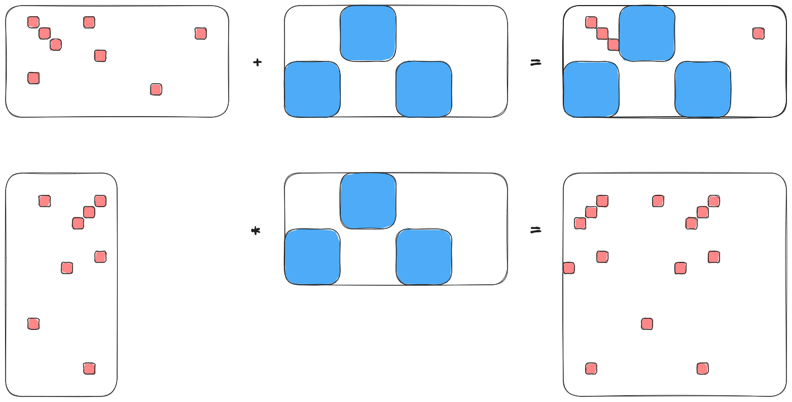

.. Copyright 2023 NWChemEx-Project
..
.. Licensed under the Apache License, Version 2.0 (the "License");
.. you may not use this file except in compliance with the License.
.. You may obtain a copy of the License at
..
.. http://www.apache.org/licenses/LICENSE-2.0
..
.. Unless required by applicable law or agreed to in writing, software
.. distributed under the License is distributed on an "AS IS" BASIS,
.. WITHOUT WARRANTIES OR CONDITIONS OF ANY KIND, either express or implied.
.. See the License for the specific language governing permissions and
.. limitations under the License.

.. _sparsity_design:

######################
Tensor Sparsity Design
######################

This page documents the process of designing the sparsity component of
TensorWrapper.

************************
What is tensor sparsity?
************************

In the context of tensors, sparsity refers to tensors possessing elements which
are effectively zero. Exactly what defines the effective zero is situational
and problem-specific. The sparsity component is responsible for indicating
which elements are zero or non-zero.

*******************************
Why do we need tensor sparsity?
*******************************

If a tensor exhibits a substantial amount of sparsity, then implicitly storing
the zero values leads to a significant space savings. Furthermore, because of
the special properties of zero, *e.g.*, :math:`\mathbf{T}+\mathbf{0}=\mathbf{T}`
and :math:`\mathbf{T}\mathbf{0}=\mathbf{0}`, many tensor operations involving
sparse tensors can be done implicitly.

***********************
Sparsity considerations
***********************

.. |A| replace:: :math:`\mathbf{A}`
.. |B| replace:: :math:`\mathbf{B}`
.. |C| replace:: :math:`\mathbf{C}`
.. |t| replace:: :math:`\tau`
.. |n| replace:: :math:`n`
.. |i| replace:: :math:`i`

.. _sparse_element_sparsity:

Element Sparsity
   Element sparsity is concerned with specifying whether each individual
   element of a tensor is zero/non-zero. An element sparse tensor has isolated
   non-zero elements, each surrounded by a "sea" of zero elements.

   - Effectively exploiting element sparsity requires custom linear algebra
     routines designed to act element-wise, rather than on contiguous blocks.
   - In theory, TensorWrapper could look at a provided element sparsity,
     back out a block-sparsity (vide infra), and use whichever sparsity leads
     to better performance, but for now TensorWrapper assumes the user has
     already done such an analysis.

.. _sparse_block_sparsity:

Block Sparsity
   Block sparsity is concerned with specifying whether multi-element
   :ref:`term_slice` and :ref:`term_chip` of a tensor are zero/non-zero. It
   should be noted that a slice/chip is zero only if every element in the chip
   is zero too.

   - Exploiting block-wise sparsity can only be done with block-wise operations
     (either involving chips or slices).
   - Block-wise operations are either done manually by interacting with
     slices/chips of a tensor, or automatically when an operation involves a
     nested tensor.
   - As a result of the previous point, tensors declared with either a
     ``JaggedShape`` or a ``Nested`` shape benefit most from block sparsity.
     Here it should be noted that the former has an implicit
     nesting resulting from the boundary between the jagged and smooth ranks,
     whereas the latter has explicit nestings.

.. _sparse_effective_sparsity:

Effective Sparsity
   In practice we are not only concerned with hard zeros (elements, slices, or
   chips which are identically zero), but also values which are so small that
   for all intents and purposes they are zero. The sparsity component needs to
   exploit this effective sparsity as well.

.. _sparse_operational_sparsity:

Operational Sparsity
   Given an operation combining two tensors, |A| and |B|, to form |C| we
   need to be able to work out the sparsity of |C| from the sparsity of |A|
   and |B|.

   - To work out the sparsity of |C| we need the shapes of |A| and |B|. Having
     the symmetry makes it potentially more efficient.

.. _sparse_effective_operational_sparsity:

Effective Operational Sparsity
   Given two tensors, |A| and |B|, which are not sparse, it is possible to
   combine |A| and |B| to form |C|, and have |C| be sparse. Of particular note,
   is when |A| and |B| contain values with magnitudes between 0 and 1, in which
   case the elements of |C| will have even smaller magnitudes than those in
   either |A| or |B|.

   - Another important case is subtraction; if |A| and |B| are approximately
     equal then their difference will be approximately zero. This is
     particularly important for iterative methods where converged elements do
     not change among iterations.
   - Sparsity may arise through addition, if |A| and |B| have opposite signs.
     In this case the resulting sparsity is similar to that which results from
     subtraction.
   - Effective operational sparsity can only be exploited by doing the operation
     and inspecting the result. For elemental sparsity this requires doing the
     traditional operation on all of |A| and |B| and inspecting |C|. If |C|
     has additional sparsity, then noting the sparsity can be useful in using
     |C| down the road. For block sparsity, pre-computation with norms can be
     done to avoid forming sparse blocks of |C|.

.. _sparse_dual_problem:

Dual problem
  Since a sparse tensor has a lot of zeros, sparsity specification is usually
  thought of in terms of specifying the non-zero elements. Since a given
  tensor element is either zero or non-zero, we can just as easily think of
  sparsity specification via the dual problem, *i.e.*, specifying the zero
  elements of a tensor. Users will in general prefer to to specify the sparsity
  which ever way is quicker.

  - Even if a tensor is predominantly dense, exploiting sparsity, particularly
    block sparsity, can still lead to major performance improvements.
  - In order to be able to switch between representations we need to know the
    overall shape of the tensor.

.. _sparse_symmetry:

Symmetry
   Sparsity is affected by symmetry. Knowing the symmetry of the tensor allows
   us to know where zero/non-zero elements are with less information.

.. _sparse_basic_operations:

Basic Operations
   In addition to constructing a representation of a tensor's sparsity we also
   need to know:

   - Whether an element/range of elements is zero or not.
   - The fraction of zero/non-zero elements.
   - Unions of two objects.

Not in Scope
============

Storage format
   A number of schemes exist for storing sparse tensors, *e.g.*, compressed
   sparse row and compressed sparse column. While the sparsity component will
   need to adopt one (or possibly multiple) formats, doing so is an
   implementation detail and not explicitly considered in the design.

Sparse Map
   For a matrix, compressed sparse row format is a map from non-zero row
   indices to non-zero column indices. For example, if for a 3 by 3 matrix,
   row 0 has two non-zero elements, in columns 1 and 2, row 1 is only non-zero
   at column 0, and row 2 is zero. We can express this with the map
   ``{0 : {1, 2}, 1 : {0}}``. For higher rank tensors, it is possible to compose
   these maps. For example, say that we want to map the rows in our original
   matrix to products of the columns, we then know that we only need to consider
   the components ``{0 : {{1, 1}, {1, 2}, {2, 1}, {2,2}}, 1 : {0.0}}``.

   - The real power of sparse maps comes in when you compose them over a series
     of expressions. In particular, given an expression and a series of sparse
     map objects, sparse maps can be used to create the element/block sparsity
     of the expression.
   - As such, sparse maps are a mechanism for creating objects which live in the
     sparsity component and are not considered further here. Sparse maps are
     punted to :ref:`designing_the_expression_component`.

***************
Sparsity Design
***************

.. _fig_sparsity:

.. figure:: assets/sparsity.png
   :align: center

   The major classes underlying the sparsity component of TensorWrapper.

:numref:`fig_sparsity` shows the main components of TensorWrapper's sparsity
component. From considerations :ref:`sparse_element_sparsity` and
:ref:`sparse_block_sparsity` we know that we expect users to specify sparsity in
one of two ways. TensorWrapper represents each of these ways with its own
container (respectively ``Element`` and ``Block``). Ultimately these
descriptions all contain the same information (whether pieces of a tensor are
zero or not), just with different representations optimized for the various
limits. In an attempt to treat these representations consistently, and to
introduce code factorization, we have introduced a common base class
``Sparsity``.

From the :ref:`sparse_dual_problem` consideration we know that the user may
wish to fill these containers either with the zero elements of the tensor or
with the non-zero elements of the tensor. We thus introduce two strong types
``Zero`` and ``Nonzero`` which are templated on the container type.

For determining the sparsity of an operation we introduce the
``IndexedSparsity`` class. Like the other indexed quantities,
``IndexedSparsity`` allows sparsity objects to be combined using Einstein
notation.

*************
Proposed APIs
*************

Declaring an Element Object
===========================

Conceptually the simplest sparsity is elemental, which is represented by the
``Element`` class. Declaring a tensor has elemental symmetry requires the
shape of the tensor and the zero/non-zero elements. By default ``Element``
assumes that the provided indices are for non-zero elements, you need to create
``Nonzero<Element>`` objects to denote that the indices are actually for the
non-zero elements:

.. code-block:: c++

   // A null sparsity object (no shape, no elements, no sparsity)
   Element enull;

   // Sparsity for a scalar which is zero
   Element e0(Shape{}, {});

   // Sparsity for a scalar which is non-zero
   Element zero0(Shape{}, {{}});

   // Sparsity for 10 element vector with all zero elements
   Element zero1(Shape{10}, {});

   // Sparsity for a 10 element vector with non-zero elements 3,5,7
   Element e1(Shape{10}, {3, 5, 7});

   // Sparsity for a 10 by 20 matrix with non-zero elements: (1,2), (2,3), and
   // (3,4)
   Element e2(Shape{10, 20}, {{1,2}, {2,3}, {3,4}});

   // Sparsity for a 10 by 20 by 30 rank 3 tensor with non-zero elements:
   // (1,2,3) and (2,3,4)
   Element e3(Shape{10, 20, 30}, {{1,2,3}, {2,3,4}});

   // Sparsity for a rank 4 tensor totally symmetric tensor with non-zero
   // elements (1,2,3,4), (2,3,4,5), and (3,4,5,6)
   Element e4(
      Shape{10, 20, 30, 40},
      {{1,2,3,4}, {2,3,4,5}, {3,4,5,6}},
      TotallySymmetric(4)
   );

   // To instead specify where the zeros are we use the Zero class template.
   // This makes a 10 element vector where elements 3, 5, and 7 are zero:
   Zero<Element> e1_0(Shape{10}, {3, 5, 7});

   // N.B. Declarations of Nonzero<Element> objects are also allowed and are
   // equivalent to just declaring Element objects, e.g. an equivalent way of
   // specifying e2 is by:
   Nonzero<Element> e2_2(Shape{10, 20}, {{1,2}, {2,3}, {3,4}});

   // Shapes can be JaggedShape. This is the sparsity for a 3 row jagged matrix
   // with columns of length 10, 20, and 30, where elements (0,3), (1,2), and
   // (2,4) are non-zero.
   Element je2(
      JaggedShape{Shape{10}, Shape{20}, Shape{30}},
      {{0,3}, {1,2}, {2,4}}
   );

   // Shapes can also be nested, element indices are flattened (if you don't
   // want to flatten them use a sparse map). This is the same sparsity as je2
   // except the corresponding tensor is now being thought of as a vector of
   // vectors instead of a jagged matrix
   Element je1_1(
      Nested<JaggedShape>({1,1}, JaggedShape{Shape{10}, Shape{20}, Shape{30}}),
      {{0,3}, {1,2}, {2,4}}
   );

Initializer lists are nice for tutorials, but we expect most users will
actually initialize sparsity objects from containers filled at runtime. For
example:

.. code-block:: c++

   /// Type Element uses
   using size_type = Element::size_type;

   // For a rank r tensor each index has r components. We will pass each index
   // as a std::vector<size_type>, thus to provide a list of indices we need
   // a vector of vectors.
   std::vector<std::vector<size_type>> non_zeros = get_non_zeros();

   // Sparsity for a 10 by 20 by 30 by 40 by 50 rank 5 tensor with non-zero
   // elements specified by "non_zeros" instance.
   Element e5(Shape{10, 20, 30, 40, 50}, non_zeros);

Declaring a Block Object
========================

After element sparsity, block sparsity is the next simplest. Block sparsity is
represented by the ``Block`` class. ``Block`` objects are created similar to
``Element`` objects except that instead of providing indices we provide the
sub-shapes which are non-zero:

.. code-block:: c++

   // Null block object (no shape, no blocks, no sparsity)
   Block bnull;

   // Sparsity for a zero scalar
   Block b0(Shape{}, {})

   // Sparsity for a non-zero scalar
   Block zero0(Shape{}, {{}});

   // Sparsity for 10 element vector with non-zero elements: 1, 3, 4, 5, and 6.
   Shape s1{10};
   Block b1(s1, {s1.slice({1}, {2}), s1.slice({3}, {7})});

   // Sparsity for a 10 by 20 matrix where the diagonal 5 by 10 blocks are
   // non-zero
   Shape s2{10, 20};
   Block b2(s2, {s2.slice({0, 0}, {5,10}), s2.slice({5,10}, {10,20}));

   // Sparsity for a 10 by 20 by 30 rank 3 tensor with two non-zero blocks:
   Shape s3{10, 20, 30};
   Block b3(
      s3, {s3.slice({0,0,0}, {10, 5, 8}), s3.slice({4, 7, 3}, {8, 9, 10})
   );

   // Shapes can be JaggedShape
   JaggedShape js2{Shape{10}, Shape{20}};
   Block jb2(js2, {js2.slice({0, 2}, {1, 8}), js2.slice({1, 4}, {2, 9})});

   // or Nested<T>
   Nested<Shape> s11({1,1}, Shape{10, 20});
   Block b11(s11, {s11.slice({0, 3}, {1, 4}), s11.slice({1,4}, {6,5})});

Analogous to ``Element``, one can specify the zero blocks by using
``Zero<Block>`` and the constructors also accept iterators over lists of shapes.

Declaring a Sparsity Object with Norms
======================================

As long as a tensor is defined in terms of a ``Nested<Shape>`` or a
``Nested<JaggedShape>`` we can use the norms of the sub-tensors to check for
effective sparsity in operations. This is conceptually a variation on ``Block``
where instead of specifying whether each block is/isn't zero, we instead specify
how zero a block actually is. In practice this requires providing the norms of
the blocks and the effective threshold.

.. code-block:: c++

   Nested<Shape> s1_1({1, 1}, Shape{10, 20});

   TensorWrapper t{norm0, norm1, norm2, norm3.., norm9};
   NormBased e2(t, 10E-10);

It should be noted that this sort of sparsity can only be effectively exploited
in operations with other ``NormBased`` objects (``Block`` and ``Element``
objects implicitly store a norm tensor with elements that are 0 or 1; in turn,
the resulting sparsity is completely determined by the hard-zero norms).

Composing Sparsity Objects
==========================

.. _fig_composing_sparsity:

   An example of combining the sparsities of two 10 by 20 matrices.

:numref:`fig_composing_sparsity` shows two of the basic tensor operations for
two matrices |A| and |B|, each of which is 10 by 20. In code:

.. code-block:: c++

   Shape shape{10, 20};

   Element sparse_a(
      shape, {{1,2}, {1, 7}, {2,3}, {2,17}, {3,4}, {5,8}, {7,2}, {8,13}}
   );
   Block sparse_b(shape,
      {shape.slice({0, 5}, {5, 10}),
       shape.slice({5, 0}, {10, 5}),
       shape.slice({5, 10}, {10, 15})}
   );

   // Addition
   Sparsity c;
   c("i,j") = a("i,j") + b("i,j");
   assert(c == a.union(b));

   // Contraction
   c("i,j") = a("i,k") * b("k,j");
   Element corr(Shape{20,20},
      {{2,3}, {2,8}, {2,13}, {3,2}, {3,12}, {4,1}, {4,11}, {7, 3}, {7,13},
       {8,0}, {8,10}, {13,7}, {18,2}, {18,12}}
   );
   assert(c == corr);

*******
Summary
*******

:ref:`sparse_element_sparsity`
   Specifying a tensor is element sparse is done by making an instance of
   ``Element``.

:ref:`sparse_block_sparsity`
   Specifying a tensor is block sparse is done by making an instance of
   ``Block``.

:ref:`sparse_effective_sparsity`
   The base ``Sparsity`` class contains a threshold parameter which is used to
   determine what the effective zero is/was for the object.

:ref:`sparse_operational_sparsity`
   The ``Sparsity`` objects can be composed using Einstein notation. Sparsity
   can then be propagated to the result by carrying out the expressed operation.

:ref:`sparse_effective_operational_sparsity`
   Key to this effort is a way to estimate the result without fully computing
   it. Norms, are a natural solution and have been added as an optional member
   to the ``Sparsity`` class.

:ref:`sparse_dual_problem`
   To account for the fact that sometimes it is easier to specify the zeros
   rather than the non-zeros, we have respectively introduced the ``Zero`` and
   ``Nonzero`` strong types.

:ref:`sparse_symmetry`
   The ``Sparsity`` base class holds a ``Symmetry`` object and can use it to
   only store the symmetry unique sparsity information/generate the symmetry
   redundant information.

:ref:`sparse_basic_operations`
   Basic operations have been factored out into the ``Sparsity`` base class.
