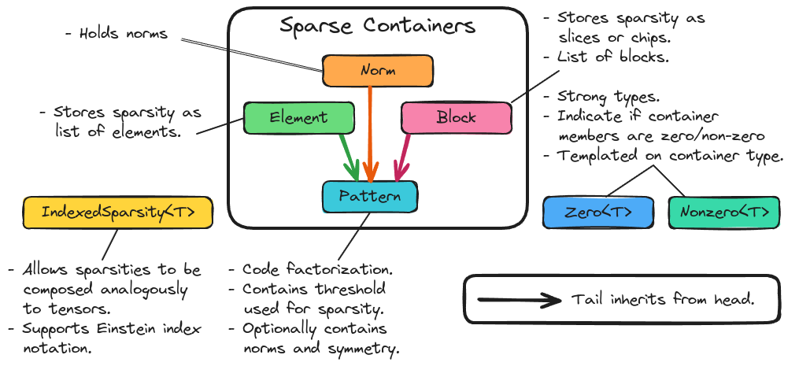

.. Copyright 2023 NWChemEx-Project
..
.. Licensed under the Apache License, Version 2.0 (the "License");
.. you may not use this file except in compliance with the License.
.. You may obtain a copy of the License at
..
.. http://www.apache.org/licenses/LICENSE-2.0
..
.. Unless required by applicable law or agreed to in writing, software
.. distributed under the License is distributed on an "AS IS" BASIS,
.. WITHOUT WARRANTIES OR CONDITIONS OF ANY KIND, either express or implied.
.. See the License for the specific language governing permissions and
.. limitations under the License.

.. _sparsity_design:

######################
Tensor Sparsity Design
######################

This page documents the process of designing the sparsity component of
TensorWrapper.

************************
What is tensor sparsity?
************************

In the context of tensors, sparsity refers to tensors possessing elements which
are effectively zero. Exactly what defines the effective zero is situational
and problem-specific. The sparsity component is responsible for indicating
which elements are zero or non-zero.

*******************************
Why do we need tensor sparsity?
*******************************

If a tensor exhibits a substantial amount of sparsity, then implicitly storing
the zero values leads to a significant space savings. Furthermore, because of
the special properties of zero, *e.g.*, :math:`\mathbf{T}+\mathbf{0}=\mathbf{T}`
and :math:`\mathbf{T}\mathbf{0}=\mathbf{0}`, many tensor operations involving
sparse tensors can be done implicitly.

***********************
Sparsity considerations
***********************

.. |A| replace:: :math:`\mathbf{A}`
.. |B| replace:: :math:`\mathbf{B}`
.. |C| replace:: :math:`\mathbf{C}`
.. |t| replace:: :math:`\tau`

.. _sparse_element_sparsity:

Element Sparsity
   Tensors are element sparse when sparsity is specified on an element by
   element basis. While a small number of zero elements offers little to no
   performance boost, if a significant number of elements are zero the
   potential for increased performance exists.

   - In practice the difference between element sparsity and block sparsity
     (vide infra) comes down to whether the user/implementation deals with
     element indices or element ranges.
   - Conceptually element sparsity is associated with the sparsity of a
     ``Shape`` object.

.. _sparse_block_sparsity:

Block Sparsity
   Block sparsity is concerned with specifying sparsity using :ref:`term_slice`
   or :ref:`term_chip`.

   - Since sparse blocks will in general have different sizes, block sparsity
     is associated with specifying the sparsity of a ``JaggedShape`` object.

.. _sparse_sparse_map:

Sparse Map
   Completing the analogy with the shape component, sparsity associated with
   nested tensors is given by sparse maps. Such sparsity is specified by giving
   the zero/non-zero elements per layer. The resulting structure is map-like
   in that each zero/non-zero element in layer :math:`i` is associated with a
   series of zero/non-zero elements in layer :math:`(i+1)`.

.. _sparse_effective_sparsity:

Effective Sparsity
   In practice we are not only concerned with hard zeros (elements, slices, or
   chips which are identically zero), but also values which are so small that
   for all intents and purposes they are zero. The sparsity component needs to
   exploit this effective sparsity as well.

.. _sparse_operational_sparsity:

 Operational Sparsity
    Given an operation combining two tensors, |A| and |B|, to form |C| we
    need to be able to work out the sparsity of |C| from the sparsity of |A|
    and |B|.

    - To work out the sparsity of |C| we need the shapes of |A| and |B|. Having
      the symmetry makes it potentially more efficient.

.. _sparse_effective_operational_sparsity:

Effective Operational Sparsity
   Given two tensors, |A| and |B|, which are not sparse, it is possible to
   combine |A| and |B| to form |C|, and have |C| be sparse. Of particular note,
   is when |A| and |B| contain values with magnitudes between 0 and 1, in which
   case the elements of |C| will have even smaller magnitudes than those in
   either |A| or |B|.

   - Another important case is subtraction; if |A| and |B| are approximately
     equal then their difference will be approximately zero. This is
     particularly important for iterative methods where converged elements do
     not change among iterations.
   - Sparsity may arise through addition, if |A| and |B| have opposite signs.
     In this case the resulting sparsity is similar to that which results from
     subtraction.
   - Effective operational sparsity can only be exploited by doing the operation
     and inspecting the result. For elemental sparsity this requires doing the
     traditional operation on all of |A| and |B| and inspecting |C|. If |C|
     has additional sparsity, then noting the sparsity can be useful in using 
     |C| down the road. For block and sparse map sparsity, pre-computation with 
     norms can be done to avoid forming sparse blocks of |C|.

.. _sparse_dual_problem:

Dual problem
  Since a sparse tensor has a lot of zeros, sparsity specification is usually
  thought of in terms of specifying the non-zero elements. Since a given
  tensor element is either zero or non-zero, we can just as easily think of
  sparsity specification via the dual problem, *i.e.*, specifying the zero
  elements of a tensor. Users will in general prefer to to specify the sparsity
  which ever way is quicker.

  - Even if a tensor is predominantly dense, exploiting sparsity, particularly
    block sparsity, can still lead to major performance improvements.

.. _sparse_basic_operations:

Basic Operations
   In addition to constructing a representation of a tensor's sparsity we also
   need to know:

   - Whether an element/range of elements is zero or not.
   - The fraction of zero/non-zero elements.

Not in Scope
============

Storage format
   A number of schemes exist for storing sparse tensors, *e.g.*, compressed
   sparse row and compressed sparse column. While the sparsity component will
   need to adopt one (or possibly multiple) formats, doing so is an 
   implementation detail and not explicitly considered in the design.

***************
Sparsity Design
***************

.. _fig_sparsity:

   The major classes underlying the sparsity component of TensorWrapper.

:numref:`fig_sparsity` shows the main components of TensorWrapper's sparsity
component. From considerations :ref:`sparse_element_sparsity`, 
:ref:`sparse_block_sparsity`, and :ref:`sparse_sparse_map` we know there are
three different ways to specify the sparsity of a tensor. TensorWrapper 
represents each of these ways with its own container (respectively ``Element``, 
``Block``, ``SparseMap``). Ultimately these descriptions all contain the
same information, just with different representations, hence we also have
made them convertible among each other. From the :ref:`sparse_dual_problem` 
consideration we know that the user may wish to fill these containers either 
with the zero elements of the tensor or with the non-zero elements of the 
tensor. We thus introduce two strong types ``Zero`` and ``Nonzero`` which are 
templated on the container type.

For determining the sparsity of an operation we introduce the 
``IndexedSparsity`` class. Like the other indexed quantities, 
``IndexedSparsity`` allows sparsity objects to be combined using Einstein
notation. 

*************
Proposed APIs
*************

Declaring an Element Object
===========================

.. code-block:: c++

   // A null sparsity object
   Element enull;

   // Sparsity for a scalar (n.b. use of {})
   Element e0{};

   // Sparsity for a vector with non-zero elements 3,5,7
   Element e1{3, 5, 7};

   // Sparsity for a matrix with non-zero elements: (1,2), (2,3), and (3,4)
   Element e2{{1,2}, {2,3}, {3,4}};

   // Sparsity for a rank 3 tensor with non-zero elements: (1,2,3) and (2,3,4)
   Element e3{{1,2,3}, {2,3,4}};

***********
Other Notes
***********

- Do we need the tensor's overall shape?
- What about symmetry?