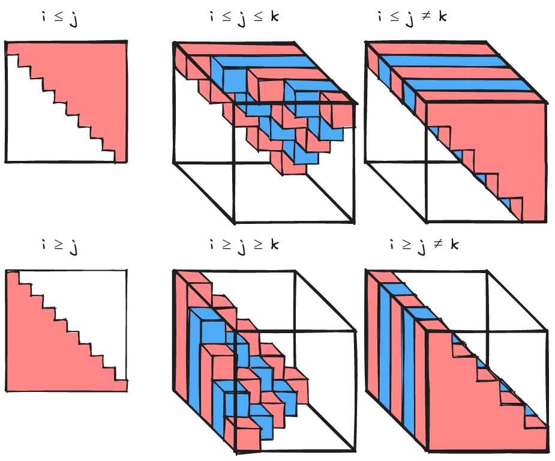

.. Copyright 2023 NWChemEx-Project
..
.. Licensed under the Apache License, Version 2.0 (the "License");
.. you may not use this file except in compliance with the License.
.. You may obtain a copy of the License at
..
.. http://www.apache.org/licenses/LICENSE-2.0
..
.. Unless required by applicable law or agreed to in writing, software
.. distributed under the License is distributed on an "AS IS" BASIS,
.. WITHOUT WARRANTIES OR CONDITIONS OF ANY KIND, either express or implied.
.. See the License for the specific language governing permissions and
.. limitations under the License.

.. _tw_designing_the_symmetry_component:

################################
Designing the Symmetry Component
################################

The point of this page is to capture the considerations which went into
designing the symmetry component of TensorWrapper.

**************************
What is (tensor) symmetry?
**************************

.. |T| replace:: :math:`\mathbf{T}`
.. |tij| replace:: :math:`t_{ij}`
.. |tab| replace:: :math:`t_{ab}`

Consider a matrix |T|, we say |T| has symmetry if given element |tij| we know
the value of a different element of |T|, say |tab|. One of the most common types
of symmetry is when |T| is symmetric, in which case
:math:`t_{ij} = t_{ab} = t_{ji}`. Symmetry also appears in higher-rank tensors.

************************************
Why do we need to consider symmetry?
************************************

Performance. While we can always pad the tensor with the symmetrically
equivalent elements and then subject the tensor to standard tensor operations,
doing so leads to a lot of redundant work.

***********************
Symmetry Considerations
***********************

Symmetric and antisymmetric
   We are primarily concerned with permutational symmetry of a tensor.

   - Modes are sorted into sets. Modes in the same set can be permuted to form
     other elements. Sets are not necessarily disjoint.
   - Generalizes to Hermitian/anti-Hermitian  if elements are complex.
   - The same tensor can have both symmetric and antisymmetric modes.

Translational symmetry
   Sometimes we know that, say, the upper left block of a matrix must be the
   same as the lower right block of a matrix. Storing both blocks leads to an
   increase in memory and computing with both blocks leads to redundant work.

   - Can arise when basis vectors are products and the tensor's elements only
     depend on part of the basis vector.

Symmetry unique elements
   The symmetry component should be able to tell us which elements need to be
   evaluated and which elements can be formed from those elements.

   - There are multiple ways to select the symmetry unique elements.

How many elements are redundant
   For determining if a symmetry is worth exploiting we need to know how many
   elements are actually redundant.

   - Needs the shape of the tensor (which tells us the nesting).

Out of Scope Considerations
===========================

Nesting
   Tensors can be nested and we will need to know the symmetry of each layer.
   In general, the symmetry may vary from element to element of a nested
   tensor (*e.g.*, if we tile a symmetric matrix the outer matrix will also
   be symmetric, but only the diagonal inner matrices are symmetric). That said,
   from the perspective of the symmetry component, nesting presents no
   additional complications beyond needing to store many copies of the symmetry
   object (minimally one per layer).

   - While nesting is out of scope, the internals of the symmetry component
     may need to be aware of nesting.

.. _fig_upper_v_lower:

   Differences between upper-triangular and lower-triangular

*************
Proposed APIs
*************

Constructing Permutational Symmetry Objects
===========================================

Permutational symmetry requires minimally a rank 2 tensor. The ``Symmetry``
object can still be constructed for ranks less than 2, but permutational
symmetry categories (*i.e.*, symmetric, antisymmetric, or asymmetric) can NOT
be provided to it. The relevant constructions are:

.. code-block:: c++

   // Null symmetry (no rank, no modes assigned to symmetry categories)
   Symmetry s;

   // Symmetry object for a scalar (no symmetry)
   Symmetry(0);

   // Symmetry object for a vector (no symmetry)
   Symmetry(1);

Declaring non-trivial symmetric or antisymmetric tensors:

.. code-block:: c++

   // Symmetric rank 2
   Symmetry s01(Symmetric{0, 1});

   // Antisymmetric rank 2
   Symmetry a01(Antisymmetric{0, 1});

   // Totally symmetric rank 3
   Symmetry s012(Symmetric{0, 1, 2});

   // Modes 0 and 1 are symmetric, mode 2 has no symmetry with 0 or 1
   Symmetry s01_2(Symmetric{0, 1}, Asymmetric{0, 2}, Asymmetric{1, 2});

   // Modes 0 and 2 are symmetric, mode 1 has no symmetry with 0 or 2
   Symmetry s02_1(Symmetric{0, 2}, Asymmetric{0, 1}, Asymmetric{1, 2});

   // Modes 1 and 2 are symmetric, mode 0 has no symmetry with 1 or 2
   Symmetry s12_0(Symmetric{1, 2}, Asymmetric{0, 1}, Asymmetric{0, 2});

   // Modes 0 and 1 are antisymmetric, mode 2 has no symmetry with 0 or 1
   Symmetry a01_2(Antisymmetric{0, 1}, Asymmetric{0, 2}, Asymmetric{1, 2});

   // Modes 0 and 2 are antisymmetric, mode 1 has no symmetry with 0 or 2
   Symmetry a02_1(Antisymmetric{0, 2}, Asymmetric{0, 1}, Asymmetric{1, 2});

   // Modes 1 and 2 are antisymmetric, mode 0 has no symmetry with 1 or 2
   Symmetry a12_0(Antisymmetric{1, 2}, Asymmetric{0, 1}, Asymmetric{0, 2});

Here it should be noted that something like:

.. code-block:: c++

   Symmetry s01_2(Symmetric{0, 1}, Asymmetric{0, 1, 2});

is not allowed because the first argument says that modes 0 and 1 are symmetric,
but the second one declares them asymmetric. Having to specify all of the
asymmetric pairs is tedious, following from the declarations of scalars and
vectors, one can also provide ``Symmetry`` with the overall tensor rank. When
provided, ``Symmetry`` assumes all pairs not specified in the ctor are
asymmetric, so we could have declared ``s01_2`` also like:

.. code-block:: c++

   Symmetry s01_2(3, Symmetric{0, 1});

Note that for declaring the ``Symmetry`` object for a rank ``r`` tensor,
specifying ``r`` is only necessary if ``(r-1)`` does not appear in a subset
(which is why it was not needed for say ``s01``). Put another way, ``Symmetry``
assumes a rank of ``(r+1)`` where ``r`` is the highest mode found in any of
the provided symmetry categories.

The remaining possible rank 3 constructions are:

.. code-block:: c++

   // Modes 0 and 1 are symmetric, modes 0 and 2 are antisymmetric
   Symmetry s01_a02(Symmetric{0, 1}, Antisymmetric{0, 2});

   // Modes 0 and 1 are symmetric, modes 1 and 2 are antisymmetric
   Symmetry s01_a12(Symmetric{0, 1}, Antisymmetric{1, 2});

   // Modes 0 and 2 are symmetric, modes 0 and 1 are antisymmetric
   Symmetry s02_a01(Symmetric{0, 2}, Antisymmetric{0, 1});

   // Modes 0 and 2 are symmetric, modes 1 and 2 are antisymmetric
   Symmetry s02_a12(Symmetric{0, 2}, Antisymmetric{1, 2});

   // Modes 1 and 2 are symmetric, modes 0 and 1 are antisymmetric
   Symmetry s12_a01(Symmetric{1, 2}, Antisymmetric{0, 1});

   // Modes 1 and 2 are symmetric, modes 0 and 2 are antisymmetric
   Symmetry s12_a02(Symmetric{1, 2}, Antisymmetric{0, 2});

   // N.B. order of symmetric and antisymmetric in constructor does not matter
   // so the other 6 mixed symmetric/antisymmetric possibilities are the same
   // just with Antisymmetric being the first argument and Symmetric the
   // second.

   // Totally antisymmetric rank 3
   Symmetry a012(Antisymmetric{0, 1, 2});

For the special cases of totally symmetric and totally antisymmetric additional
classes exist which facilitate construction:

.. code-block:: c++

   TotallySymmetric s;     // Null totally symmetric object
   TotallySymmetric s0(0); // Totally symmetric scalar
   TotallySymmetric s1(1); // Totally symmetric vector
   TotallySymmetric s2(2); // Totally symmetric matrix
   TotallySymmetric s3(3); // Totally symmetric rank 3 tensor

   TotallyAntisymmetric a;     // Null totally symmetric object
   TotallyAntisymmetric a0(0); // Totally antisymmetric scalar
   TotallyAntisymmetric a1(1); // Totally antisymmetric vector
   TotallyAntisymmetric a2(2); // Totally antisymmetric matrix
   TotallyAntisymmetric a3(3); // Totally antisymmetric rank 3 tensor

Once we consider rank 4 and higher we can also have multiple symmetric (or
antisymmetric) categories, for example:

.. code-block:: c++

   Symmetry s01_s23(Symmetric{0, 1}, Symmetric{2, 3});

A ``Symmetric``, ``Antisymmetric``, or ``Asymmetric`` object given ``n`` modes,
stands for all ``n`` choose 2 possible mode pairs that can be formed from the
``n`` modes in it, *i.e.*, ``s01_s23`` is NOT the same as:

.. code-block:: c++

   Symmetry s0123(Symmetric{0, 1, 2, 3});

because ``s0123`` additionally has symmetries among 0 and 2, 0 and 3,
1 and 2, and 1 and 3, which are not present in ``s01_s23``.

Constructing Translational Symmetry Tensors
===========================================

The symmetries of a tensor form a group in the mathematical sense. Each
operation of that group takes an element of the tensor and maps it to a
different element. Thus the most general way to specify a tensor symmetry is by
providing the operation. For constructing the translational symmetry of a
tensor we use the base ``SymmetryOp`` API:

.. code-block:: c++

   Translational e00_e11();

****************
Additional Notes
****************

Can we use jagged tensors here? In particular I'm thinking an upper-triangular
matrix without the lower triangle is a jagged matrix.
