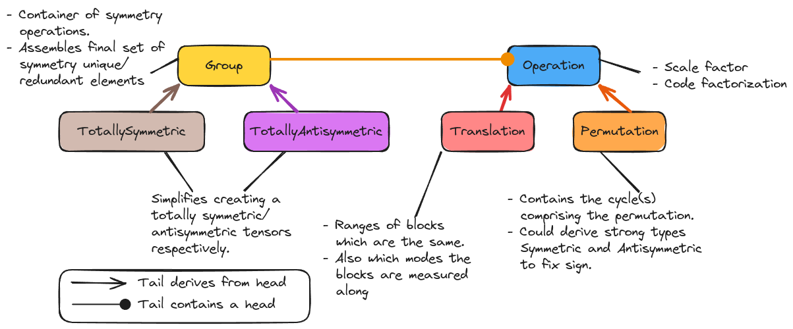

.. Copyright 2023 NWChemEx-Project
..
.. Licensed under the Apache License, Version 2.0 (the "License");
.. you may not use this file except in compliance with the License.
.. You may obtain a copy of the License at
..
.. http://www.apache.org/licenses/LICENSE-2.0
..
.. Unless required by applicable law or agreed to in writing, software
.. distributed under the License is distributed on an "AS IS" BASIS,
.. WITHOUT WARRANTIES OR CONDITIONS OF ANY KIND, either express or implied.
.. See the License for the specific language governing permissions and
.. limitations under the License.

.. _tw_designing_the_symmetry_component:

################################
Designing the Symmetry Component
################################

The point of this page is to capture the considerations which went into
designing the symmetry component of TensorWrapper.

**************************
What is (tensor) symmetry?
**************************

.. |T| replace:: :math:`\mathbf{T}`
.. |tij| replace:: :math:`t_{ij}`
.. |tab| replace:: :math:`t_{ab}`
.. |t| replace:: :math:`\mathbf{t}`
.. |tp| replace:: :math:`\mathbf{t'}`
.. |S| replace:: :math:`S`

Consider a matrix |T|, we say |T| has symmetry if given element |tij| we know
the value of a different element of |T|, say |tab|. One of the more common types
of symmetry is when |T| is a symmetric matrix, in which case
:math:`t_{ij} = t_{ab} = t_{ji}`.

For our purposes, given a tensor |T|, a symmetry |S| is a mapping of the
elements comprising a slice of |T|, |t|, to those same elements (up to a sign)
in another slice |tp|. We are specifically interested in non-trivial mappings
where |t| and |tp| are not given by the same offsets. In the common scenario of
permutational symmetry, |t| and |tp| will be slices containing a single element,
but for other symmetries |t| may contain more
than one element. Strictly speaking :math:`\mathbf{t}=\mathbf{0}` satisfies
our definition of a symmetry; however, such symmetries are usually treated
differently on account of the special properties of zero (namely its trivial
multiplication and addition). The case when :math:`\mathbf{t}=\mathbf{0}` is
usually referred to as "sparsity" and is considered in :ref:`sparsity_design`.

************************************
Why do we need to consider symmetry?
************************************

Performance. While we can always fill the tensor with the symmetrically
equivalent elements and then subject the tensor to standard tensor operations
without symmetry,
doing so leads to a lot of wasted memory and also leads to a large amount of
redundant work. By understanding the symmetry of the tensor we can avoid
this additional work.

***********************
Symmetry Considerations
***********************

.. _sym_symmetric_and_antisymmetric:

Symmetric and antisymmetric
   As far as we know, permutational symmetry is the most common type of tensor
   symmetry. Permutational symmetry occurs when the symmetry operation maps
   the input slice to an output slice with the same indices just permuted. A
   common example is a symmetric matrix where an element |tij| is equal to
   :math:`t_{ji}`.

   - In tensors with rank greater than 2, symmetric/antisymmetric modes are
     sorted into sets. The full set of symmetry equivalent elements is generated
     by considering all possible permutations of the set.
   - Sets of symmetric/antisymmetric modes are not necessarily disjoint;
     however, no pair of modes can appear in more than one set.
   - Generalizes to Hermitian/anti-Hermitian  if elements are complex.
   - The same tensor can have both symmetric and antisymmetric modes.
   - Pairwise mode permutations are most common, but it is also possible that
     permutations must be ternary (*e.g.*, cyclic permutations of three-
     dimensional space) or higher.

.. _sym_translational_symmetry:

Translational symmetry
   As a disclaimer, we could not find a name for this sort of tensor symmetry
   and thus coined our own. Thinking of a tensor as a series of tiles,
   symmetries occur when any of those tiles are the same. If we only stored
   one copy of each symmetry unique tile, we could then form the entire tensor
   by translating the symmetry unique tiles to each of the symmetry redundant
   positions. For permutational symmetry, the indices of the symmetry redundant
   tiles must be the same as the the indices of the symmetry unique tile, up
   to a permutation. However, our translation algorithm suggests that in
   general other translations will be needed, specifically translations where
   the input and output indices are not related by permutations. We term such
   symmetries as translational.

   - Can arise when basis vectors are products and the value of the tensor's
     elements only depend on part of the basis vector.
   - In general are specified by providing the input slice and the output
     slice.

.. _sym_basic_properties:

Basic properties
   Users interacting with classes in the symmetry component will want access to:

   - Which elements are symmetry unique/redundant.
   - Whether an element is symmetry unique/redundant.
   - For a given shape, how many elements are symmetry unique/redundant.
   - The sign of the resulting element.

.. |A| replace:: :math:`\mathbf{A}`
.. |B| replace:: :math:`\mathbf{B}`
.. |C| replace:: :math:`\mathbf{C}`

.. _sym_composition:

Composition
   When combining two tensors |A| and |B| to form |C|, the symmetry of |C| is
   determined from the symmetry of |A| and |B|. The symmetry component should
   be able to compose symmetries using Einstein notation, just like the
   tensors the symmetries describe.

Out of Scope Considerations
===========================

Sparsity
   Based on our definition of symmetry, sparsity is a symmetry; however, users
   typically think of it differently, plus it internally is used differently.
   For these reasons we consider sparsity separately from symmetry. For full
   design details of the sparsity component see :ref:`sparsity_design`.

Exploiting symmetry
   The point of the symmetry component is to provide the user a mechanism for
   expressing the symmetry of the tensor. Choosing what elements to store is
   part of the physical layout (see :ref:`layout_design`) and actually
   exploiting the symmetry of the tensor is left to the backend.

***************
Symmetry Design
***************

.. _fig_symmetry:

   The major classes involved in the symmetry component.

:numref:`fig_symmetry` shows the classes primarily responsible for defining
the symmetry component. Ultimately the user assembles a ``Symmetry`` object,
which describes all of the tensor's overall symmetries. It is the ``Symmetry``
object which is used by the rest of TensorWrapper. The remaining classes of
the ``Symmetry`` class hierarchy exist primarily to help the user create the
``Symmetry`` object in a straightforward manner.

- ``TotallySymmetric`` allows a user to declare a tensor as totally symmetric
  simply by providing the rank of the tensor.
- ``TotallyAntiSymmetric`` allows a user to declare a tensor as totally
  antisymmetric simply by providing the rank of the tensor.

Ultimately the symmetry of a tensor is mathematically treated using group
theory. The symmetry operations on the tensor being the members of the group.
``Symmetry`` is thus a container filled with ``SymmetryOp`` objects.
All symmetry operations derive from ``SymmetryOp``, which serves primarily to
provided a consistent API among the various operations and to provide some
code factorization.

Of the symmetry operations provided by TensorWrapper, ``Asymmetric`` is the
simplest. By creating an instance of ``Asymmetric``, the user is stating that
the modes in the resulting object exhibit no symmetry among themselves.
``Asymmetric`` exists primarily to contrast with the other symmetry operations
and is assumed by default.

``Symmetric`` and ``Antisymmetric`` are the next simplest symmetry operations.
When a user creates an instance of the ``Symmetric``/ ``Antisymmetric`` classes
they are stating that the modes in the resulting object are pairwise symmetric
or antisymmetric respectively.

The final symmetry operation is ``Translation``. The inputs to a ``Translation``
object are two or more ``Shape`` objects (``JaggedShape`` and ``Nested`` work
too). The input objects are treated as ranges, and indicate which slices or
chips of the tensor which must have the same values. Conceptually it is
possible to specify any symmetry in this manner, but it is very tedious (*e.g.*,
specifying that an :math:`n` by :math:`n` matrix is symmetric using
``Translation`` objects requires creating :math:`n\choose 2` ``Translation``
objects, one for every pair of symmetry related elements).

*************
Proposed APIs
*************

Constructing Permutational Symmetry Objects
===========================================

Permutational symmetry requires minimally a rank 2 tensor. The ``Symmetry``
object can still be constructed for ranks less than 2, but permutational
symmetry categories (*i.e.*, symmetric, antisymmetric, or asymmetric) can NOT
be provided to it. The relevant constructions are:

.. code-block:: c++

   // Null symmetry (no rank, no modes assigned to symmetry categories)
   Symmetry s;

   // Symmetry object for a scalar (no symmetry)
   Symmetry(0);

   // Symmetry object for a vector (no symmetry)
   Symmetry(1);

Declaring non-trivial symmetric or antisymmetric tensors:

.. code-block:: c++

   // Symmetric rank 2
   Symmetry s01(Symmetric{0, 1});

   // Antisymmetric rank 2
   Symmetry a01(Antisymmetric{0, 1});

   // Totally symmetric rank 3
   Symmetry s012(Symmetric{0, 1, 2});

   // Modes 0 and 1 are symmetric, mode 2 has no symmetry with 0 or 1
   Symmetry s01_2(Symmetric{0, 1}, Asymmetric{0, 2}, Asymmetric{1, 2});

   // Modes 0 and 2 are symmetric, mode 1 has no symmetry with 0 or 2
   Symmetry s02_1(Symmetric{0, 2}, Asymmetric{0, 1}, Asymmetric{1, 2});

   // Modes 1 and 2 are symmetric, mode 0 has no symmetry with 1 or 2
   Symmetry s12_0(Symmetric{1, 2}, Asymmetric{0, 1}, Asymmetric{0, 2});

   // Modes 0 and 1 are antisymmetric, mode 2 has no symmetry with 0 or 1
   Symmetry a01_2(Antisymmetric{0, 1}, Asymmetric{0, 2}, Asymmetric{1, 2});

   // Modes 0 and 2 are antisymmetric, mode 1 has no symmetry with 0 or 2
   Symmetry a02_1(Antisymmetric{0, 2}, Asymmetric{0, 1}, Asymmetric{1, 2});

   // Modes 1 and 2 are antisymmetric, mode 0 has no symmetry with 1 or 2
   Symmetry a12_0(Antisymmetric{1, 2}, Asymmetric{0, 1}, Asymmetric{0, 2});

Here it should be noted that something like:

.. code-block:: c++

   Symmetry s01_2(Symmetric{0, 1}, Asymmetric{0, 1, 2});

is not allowed because the first argument says that modes 0 and 1 are symmetric,
but the second one declares them asymmetric. Having to specify all of the
asymmetric pairs is tedious. Following from the declarations of scalars and
vectors, one can also provide ``Symmetry`` with the overall tensor rank. When
provided, ``Symmetry`` assumes all pairs not specified in the ctor are
asymmetric, so we could have declared ``s01_2`` also like:

.. code-block:: c++

   Symmetry s01_2(3, Symmetric{0, 1});

and we can declare an asymmetric rank 2 tensor like:

.. code-block:: c++

   Symmetry as2(2);

Note that for declaring the ``Symmetry`` object for a rank ``r`` tensor,
specifying ``r`` is only necessary if ``(r-1)`` does not appear in a subset
(which is why it was not needed for say ``s01``). Put another way, ``Symmetry``
assumes a rank of ``(r+1)`` where ``r`` is the highest mode found in any of
the provided symmetry categories.

The remaining possible rank 3 constructions are:

.. code-block:: c++

   // Modes 0 and 1 are symmetric, modes 0 and 2 are antisymmetric
   Symmetry s01_a02(Symmetric{0, 1}, Antisymmetric{0, 2});

   // Modes 0 and 1 are symmetric, modes 1 and 2 are antisymmetric
   Symmetry s01_a12(Symmetric{0, 1}, Antisymmetric{1, 2});

   // Modes 0 and 2 are symmetric, modes 0 and 1 are antisymmetric
   Symmetry s02_a01(Symmetric{0, 2}, Antisymmetric{0, 1});

   // Modes 0 and 2 are symmetric, modes 1 and 2 are antisymmetric
   Symmetry s02_a12(Symmetric{0, 2}, Antisymmetric{1, 2});

   // Modes 1 and 2 are symmetric, modes 0 and 1 are antisymmetric
   Symmetry s12_a01(Symmetric{1, 2}, Antisymmetric{0, 1});

   // Modes 1 and 2 are symmetric, modes 0 and 2 are antisymmetric
   Symmetry s12_a02(Symmetric{1, 2}, Antisymmetric{0, 2});

   // N.B. order of symmetric and antisymmetric in constructor does not matter
   // so the other 6 mixed symmetric/antisymmetric possibilities are the same
   // just with Antisymmetric being the first argument and Symmetric the
   // second.

   // Totally antisymmetric rank 3
   Symmetry a012(Antisymmetric{0, 1, 2});

For the special cases of totally symmetric and totally antisymmetric additional
classes exist which facilitate construction:

.. code-block:: c++

   TotallySymmetric s;     // Null totally symmetric object
   TotallySymmetric s0(0); // Totally symmetric scalar
   TotallySymmetric s1(1); // Totally symmetric vector
   TotallySymmetric s2(2); // Totally symmetric matrix
   TotallySymmetric s3(3); // Totally symmetric rank 3 tensor

   TotallyAntisymmetric a;     // Null totally symmetric object
   TotallyAntisymmetric a0(0); // Totally antisymmetric scalar
   TotallyAntisymmetric a1(1); // Totally antisymmetric vector
   TotallyAntisymmetric a2(2); // Totally antisymmetric matrix
   TotallyAntisymmetric a3(3); // Totally antisymmetric rank 3 tensor

Once we consider rank 4 and higher we can also have multiple symmetric (or
antisymmetric) categories, for example:

.. code-block:: c++

   Symmetry s01_s23(Symmetric{0, 1}, Symmetric{2, 3});

A ``Symmetric``, ``Antisymmetric``, or ``Asymmetric`` object given ``n`` modes,
stands for all ``n`` choose 2 possible mode pairs that can be formed from the
``n`` modes in it, *i.e.*, ``s01_s23`` is NOT the same as:

.. code-block:: c++

   Symmetry s0123(Symmetric{0, 1, 2, 3});

because ``s0123`` additionally has symmetries among 0 and 2, 0 and 3,
1 and 2, and 1 and 3, which are not present in ``s01_s23``.

Constructing Symmetry Objects with Translational Symmetry
=========================================================

For specifying permutational symmetry we needed to state the modes to permute.
For translational symmetry we need to specify which blocks are equivalent:

.. code-block:: c++

   // Block 0 starts at {0,0} and ends at {10,10}
   // Block 1 starts at {10,10} and ends at {20,20}
   // Block 2 starts at {20,20} and ends at {30,30}
   Shape block0{10, 10}, block1({10, 10}, {10, 10}), block2({10, 10}, {20, 20});

   // matrix where block0 is the same as block1
   Symmetry b0b1(Translation{block0, block1});

   // matrix where block0 is the same as block1 and block2
   Symmetry b0b1b2(Translation{block0, block1, block2});

   // Just like permutational symmetry where only some of the modes need to
   // be involved, we can have translational symmetry which only involves a
   // subset of the modes. In this case we need to specify which modes the
   // indices are associated with. The following declares a Symmetry object
   // for a rank 3 tensor where modes 0 and 1 have translational symmetry such
   // that the block0 slice is the same as the block1 slice
   Symmetry b0b1(3, Translation({block0, block1}, {0, 1}));

Translational symmetry can also be declared for more exotic ranges, such as
those involving jagged and/or nested:

.. code-block:: c++

   // Block of a jagged matrix where row 0 is 10 elements long and row 1 is 20
   JaggedShape jblock0{Shape{10}, Shape{20}};

   // Block of a jagged matrix where row 2 is 10 elements long and row 3 is 20
   JaggedShape jblock1({Shape{10}, Shape{20}}, {2});

   // Symmetry for a jagged matrix where block0 and block1 must be the same
   Symmetry b0b1(Translation{jblock0, jblock1});

   // Outer vector 10 elements long, inner are 20
   Nested<Shape> nblock0({1,1}, Shape{10, 20});

   // Same shape, but the first index of the first inner vector is 20 not 0
   Nested<Shape> nblock1({1, 1}, Shape({10, 20}, {0, 20}));

   // Symmetry for a rank 4 tensor where modes 0 and 1 are nested
   Symmetry nb0nb1(4, Translation{nblock0, nblock1}, {0, 1});

Note that the fact that ``Translation`` describes a symmetry operation means
that the shapes in the symmetry operations must be the same up to a translation
of the origin. The shapes will also need to be consistent with the shapes of
the respective modes of the tensor. Finally, we note that it's possible to
combine all of these mechanisms:

.. code-block:: c++

   // two 1 by 1 shapes, one with origin (0, 0) the other with origin (1,1)
   Shape e00{1, 1}, e11({1, 1}, {1, 1});

   // Rank 4 tensor, slice is the same as the (1,1) slice and modes 2 and
   // 3 are symmetric
   Symmetry sym(Translational({e00, e11}, {0, 1}), Symmetric{2, 3});

Basic Properties
================

While I have some idea of what properties will be needed, how to best expose
them is punted until I have a better idea of how they would be used under the
hood.

*******
Summary
*******

:ref:`sym_symmetric_and_antisymmetric`
   The ``Symmetric``, ``AntiSymmetric``, and ``Asymmetric`` classes have been
   introduced to facilitate expressing permutational symmetry. Cyclic
   permutation classes could be added later if needed.

:ref:`sym_translational_symmetry`
   The ``Translation`` class describes slices of the tensor which are the same.

:ref:`sym_basic_properties`
   This is one of the primary responsibilities of the ``Symmetry`` class.

****************
Additional Notes
****************

- Can we use jagged tensors here? In particular I'm thinking an upper-triangular
  matrix without the lower triangle is a jagged matrix.
- I believe that symmetry can be completely implemented without needing to
  store the tensor's overall shape (``Translational`` will need the shapes of
  the blocks, but shouldn't need the overall shape).
