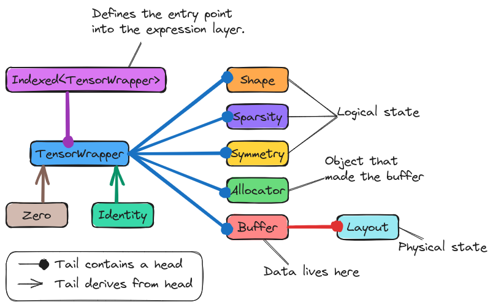

.. Copyright 2023 NWChemEx-Project
..
.. Licensed under the Apache License, Version 2.0 (the "License");
.. you may not use this file except in compliance with the License.
.. You may obtain a copy of the License at
..
.. http://www.apache.org/licenses/LICENSE-2.0
..
.. Unless required by applicable law or agreed to in writing, software
.. distributed under the License is distributed on an "AS IS" BASIS,
.. WITHOUT WARRANTIES OR CONDITIONS OF ANY KIND, either express or implied.
.. See the License for the specific language governing permissions and
.. limitations under the License.

.. _designing_tensor_wrapper_class:

#################################
Designing ``TensorWrapper`` Class
#################################

The point of this page is to document the design process of the
``TensorWrapper`` class. Since ``TensorWrapper`` is the namesake class of the
TensorWrapper project, and since the project and the class are two distinct
entities, we establish the convention that when referring to the class we
will use ``TensorWrapper`` whereas TensorWrapper denotes the project. This
convention is used throughout the documentation not just on this page.

************************************
What is the ``TensorWrapper`` class?
************************************

The ``TensorWrapper`` class is TensorWrapper's tensor class. Assuming most
users of TensorWrapper are using TensorWrapper for tensor algebra, we
anticipate that the bulk of user interactions with TensorWrapper will be
through the ``TensorWrapper`` class (and technically the expression layer).

*******************************************
Why do we need the ``TensorWrapper`` class?
*******************************************

As an object-oriented tensor library, it is perhaps no surprise that
TensorWrapper needs an object to represent a tensor. It is also worth noting
that we have opted for the class to be named ``TensorWrapper`` instead of say
``Tensor`` owning to the fact that almost all of the potential backends will
have a class named ``Tensor`` (or some variation on it).

********************************
``TensorWrapper`` Considerations
********************************

.. _tw_data_storage:

Data storage
   ``TensorWrapper`` objects ultimately hold all of the tensor's state in some
   form or another.

.. _tw_logical_v_physical:

Logical versus physical
   As discussed in :ref:`logical_vs_physical`, we have a need for distinguishing
   between the logical layout of a tensor (how the user thinks of it) and the
   physical layout of the tensor (how it's actually stored on the computer).
   These two, sometimes competing layouts come to a head in the
   ``TensorWrapper`` class. It is the responsibility of the ``TensorWrapper``
   to distinguish between the two layouts and convert as necessary.

.. _tw_dsl_entry_point:

DSL entry point
   In accordance with Einstein summation convention, users label the modes of a
   tensor to describe what they want to compute. This process effectively kicks
   off the creation of the :ref:`term_cst` which is at the heart of implementing
   the :ref:`term_dsl`.

.. _tw_special_tensors:

Special tensors
   When composing tensor expressions we sometimes need tensors like the identity
   tensor or the zero tensor. These tensors formally appear in equations usually
   as a mechanism for performing some other operation such as increasing the
   rank of a tensor or turning off a term. Actually creating, instantiating,
   and computing operations involving these "special" tensors would, in most
   cases, be detrimental to performance.

   - We can rely on strong-typing of identity/zero tensors to identify them in
     the expressions.
   - Private inheritance from ``TensorWrapper`` would prohibit users from
     implicitly converting them to ``TensorWrapper`` objects by mistake (at
     which point the strong-typing would be lost and we would have to evaluate
     them as full tensors).
   - A member function wrapping the upcast to the base would allow the base to
     be publicly accessible, if explicitly wanted.

************************
``TensorWrapper`` Design
************************

.. _fig_tensor_wrapper:

   Illustration of a ``TensorWrapper`` object's state.

As :numref:`fig_tensor_wrapper` illustrates, the state of a ``TensorWrapper``
object is spread out over a number of objects. The :ref:`tw_data_storage`
consideration is ultimately satisfied by ``TensorWrapper`` objects
containing a ``Buffer`` object. The ``Buffer`` object, specifically the
``Layout`` object underlying it, accounts for the "physical" portion of
the :ref:`tw_logical_v_physical` consideration. The "logical" portion of
:ref:`tw_logical_v_physical` is addressed by ``TensorWrapper`` also containing
a ``Shape``, ``Sparsity``, and ``Symmetry`` object. Finally, the
``TensorWrapper`` class can be composed by creating ``Indexed<TensorWrapper>``
objects, satisfying the :ref:`tw_dsl_entry_point` consideration.

To address :ref:`tw_special_tensors` we derive from ``TensorWrapper`` two
classes, ``Zero`` and ``Identity``. Respectively these classes are intended to
be strong types representing a zero tensor and an identity tensor. If needed,
additional special tensors (such as the tensor representing a particular
Levi-Civita symbol) could be added in an analogous manner.

*************
Proposed APIs
*************

Constructing ``TensorWrapper`` Objects
======================================

Particularly for tutorials and unit testing we often want to create objects
quickly. To this end we propose an initializer list constructor which
operates like:

.. code-block:: c++

   // Makes a scalar
   TensorWrapper s(1);

   // Makes a 3 element vector with elements 1, 2, 3
   TensorWrapper v({1, 2, 3});

   // Makes a 1 element vector with element 1
   TensorWrapper v1({1});

   // Makes a 3 by 4 matrix
   TensorWrapper m({{1, 2, 3, 4}, {5, 6, 7, 8}, {9, 10, 11, 12}});

   // A jagged matrix where rows 0, 1, and 2 respectively have 2, 3, and
   // 4 elements each
   TensorWrapper jm({{1, 2}, {3, 4, 5}, {6, 7, 8, 9}});

The generalization to rank 3 tensors and other jagged tensors should hopefully
be clear (we do not forsee initializing nested tensors with initializer lists
to be a prominent use case; nested tensors can be created with the more
general API, *vide infra*). In practice, the above calls actually:

- Create ``Shape``, ``Sparsity``, and ``Symmetry`` objects.
- Initialize a ``Layout`` from the ``Shape``, ``Sparsity``, and ``Symmetry``
  objects.
- Declare a default ``Allocator`` object.
- Use the ``Allocator`` to create and initialize a ``Buffer`` object.

Thus the most general constructor for a ``TensorWrapper`` is:

.. code-block:: c++

   // Note: that the actual constructors have overloads for cv-qualifiers,
   // pointer vs reference semantics, etc.
   TensorWrapper(Shape shape, Symmetry symmetry, Sparsity sparsity,
                 AllocatorBase allocator, Buffer buffer);

Where the first three arguments define the logical layout of the tensor,
``buffer`` is the buffer containing the data, and ``allocator`` is the allocator
which actually made ``buffer``. In the early stages of development we suspect
that actually creating a tensor will look like:

.. code-block:: c++

   // Get runtime and logical layout
   auto rv                          = get_runtime_view();
   auto [shape, symmetry, sparsity] = get_logical_layout();

   // Generate physical layout
   auto layout = compute_layout(rv, shape, symmetry, sparsity);

   // Choose an allocator compatible with the physical layout
   auto allocator = choose_allocator(rv);

   // Use the allocator and a lambda to fill in the buffer
   auto buffer = allocator.construct(layout, {...});

   // Create the TensorWrapper object
   TensorWrapper t(shape, symmetry, sparsity, allocator, buffer);

Where the opaque functions ``get_runtime_view`` and ``get_logical_layout``
respectively wrap the process of getting a handle to the runtime (managed by
ParallelZone) and defining the problem-specific aspects of the tensor. The
remaining two opaque functions, ``compute_layout`` and ``choose_allocator``
will, for the early stages of TensorWrapper development, wrap the user
manually creating the layout and selecting an allocator. The end goal of tensor
wrapper is to automate these two steps and ideally construction of a
``TensorWrapper`` object will actually look like:

.. code-block:: c++

   // Get runtime and logical layout
   auto rv                          = get_runtime_view();
   auto [shape, symmetry, sparsity] = get_logical_layout();

   // Create a TensorWrapper object which has symmetry and sparsity
   TensorWrapper t(shape, symmetry, sparsity, rv, {...});

   // or create a TensorWrapper object which has no symmetry and is dense
   TensorWrapper t2(shape, rv, {...});

We note that the actual signatures of the lambda function are dictated by the
allocator component (see :ref:`a_proposed_apis` for more information).

Composing ``TensorWrapper`` Objects
===================================

We anticipate that after construction, the next most common interaction with
``TensorWrapper`` objects will be composing them. Composition, for the most
part, will rely on generalized Einstein summation convention:

.. code-block:: c++

   // Assume that a and b are rank 3 tensors and extents of all operations below
   // work out
   auto [a, b] = get_initialized_tensor_wrapper_objects();

   // Assignment is usually done into a default-initialized object
   TensorWrapper c;

   // Tensor addition:
   c("i,j,k") = a("i,j,k") + b("j,i,k");

   // Tensor subtraction with summation over k:
   c("i,j") = a("i,j,k") - b("j,i,k");

   // Scaled, element-wise multiplication
   c("i,j,k") = 3.14 * a("i,j,k") * b("i,j,k");

   // Tensor contraction over k
   c("i,j") = a("i,j,k") * b("j,i,k");

   // Element-wise division
   c("i,j,k") = a("i,j,k") / b("i,j,k");

   // Once a tensor has a state, can accumulate into it, e.g.,
   c("i,j,k") += a("i,j,k");

Not all tensor algebra is expressed nicely using generalized Einstein summation
convention, *e.g.*, finding eigenvalues/eigenvectors. Since many of the backends
have their own mechanisms for performantly carrying out such operations it is
important that TensorWrapper wrap those mechanisms too. That said, while the
above code snippet is designed to look like the operations are part of the
``TensorWrapper`` class, they are actually done by the expression component.
More information on the design of the expression component, including how it
extends to other tensor algebra needs is described in
:ref:`designing_the_expression_component`.

*************************
``TensorWrapper`` Summary
*************************

:ref:`tw_data_storage`
   This consideration is addressed by having the ``TensorWrapper`` class contain
   a ``Buffer`` object.

:ref:`tw_logical_v_physical`
   The ``Buffer`` object contains the physical layout of the tensor. The logical
   layout is spread across the ``Shape``, ``Symmetry``, and ``Sparsity`` objects
   which reside inside the ``TensorWrapper`` class.

:ref:`tw_dsl_entry_point`
   Annotating a ``TensorWrapper`` object with indices creates an
   ``Indexed<TensorWrapper>`` object. The ``Indexed<TensorWrapper>`` object
   is part of the expression layer which defines the DSL.

:ref:`tw_special_tensors`
   ``Zero`` and ``Identity`` classes are added which derive from
   ``TensorWrapper``. Since these special tensors are represented by separate
   classes, the expression layer can use template meta-programming to optimize
   them out.
